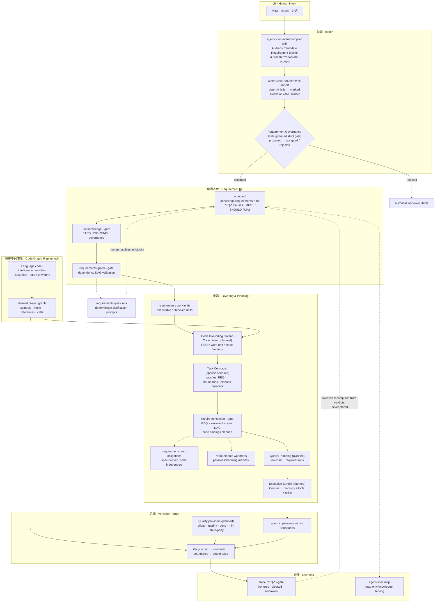

# agent-spec

[](https://crates.io/crates/agent-spec)
[](https://docs.rs/agent-spec)
[](https://github.com/ZhangHanDong/agent-spec/actions/workflows/contract-guard.yml)
[](https://opensource.org/licenses/MIT)

`agent-spec` is an **intent compiler（意图编译器）** for AI agent coding: it compiles
human intent — through structured requirements as the intermediate representation
(IR) — into verifiable Task Contracts, then mechanically verifies the implementation
against them. BDD/spec verification is the backend of that compiler.

The compilation pipeline:

- **intent** (PRDs, issues, conversations) is captured as structured **requirements** — the IR
- requirements lower into **Task Contracts** — the verifiable target
- agents implement against the contract; the machine verifies the code satisfies it
- **liveness tracing** keeps compiled knowledge honest after the fact

The core review loop stays simple: humans review the contract, agents implement
against the contract, the machine verifies whether the code satisfies the contract.

## Architecture: the Intent Compiler

> Current pipeline below; the staged **target architecture** (Requirement Governance Gate, Code Graph IR, Intent-Code Linker, Quality Planning, Execution Bundles) lives in [`docs/intent-compiler/architecture.md`](docs/intent-compiler/architecture.md).



AI participates only at the edges — drafting candidate requirements and implementing
contracts. Every gate in between (`lint-knowledge`, `graph`, `plan`, `lifecycle`,
`trace`) is deterministic and model-free, and human acceptance sits at both ends:
requirement review on the way in, Contract Acceptance on the way out.

The nodes marked `planned` keep two different facts separate:
Requirement IR records what the system must do; Code Graph IR records what the
current program is. A provider-neutral Intent-Code Linker grounds accepted work
units in code without turning derived code facts into KLL truth. Quality Planning
then resolves deterministic tools and required agent skills into an Execution
Bundle. Skills guide generation; tool results provide acceptance evidence.
See [Intent Compiler Architecture](docs/intent-compiler/architecture.md) for the
target-state contracts, state machines, provider roles, and failure semantics.

The primary planning surface is the **Task Contract**. The older `brief` view remains available as a compatibility alias, but new workflows should use `contract`.

## What agent-spec doesn't solve

We want you to know up-front. These are real limits, not roadmap stubs:

- **Cold-start product judgment.** `agent-spec` verifies whether code satisfies a contract; it does not tell you whether the contract describes the right product. You still need product sense to write good Rules and Scenarios. A planned `agent-spec discover --from-codebase` (Phase 9) will help bootstrap a spec library from existing code + tests, but not from a blank page.
- **Architectural taste at the line where it matters.** Lint catches what's expressible in the DSL — boundaries, vague verbs, missing test bindings, dangling selectors. Naming clarity, abstraction choice, the line between "appropriate" and "inappropriate" coupling — these need human review or inferential AI review (Phase 5+).
- **NFR ceiling.** Functional behavior bound to `cargo test` is fully verifiable today. Performance, reliability, scalability — these need specialized runners (criterion, k6, external probes; planned Phase 7) and even then the honest verdict is often `uncertain` or `pending_review`, not `pass`.
- **Test selector maintenance.** The mechanical coverage matrix is the moat, but it comes with a cost: renaming a test function breaks the contract until you update the spec. Tooling can detect dangling selectors, it cannot rename them for you.
- **False sense of security.** A passing `lifecycle` means the contract was satisfied. It does not mean the contract was comprehensive. We recommend coupling `agent-spec lifecycle` with periodic human + AI architectural reviews (Phase 8 `agent-spec audit` will automate part of this).

`docs/comparison-openspec-speckit.md` §9.4 expands these in context; `docs/bdd-spine-end-state.md` shows where each is addressed across Phases 1–9.

## Task Contract

A task contract is a structured spec with four core parts:

- `Intent`: what to do, and why
- `Decisions`: technical choices that are already fixed
- `Boundaries`: what may change, and what must not change
- `Completion Criteria`: BDD scenarios that define deterministic pass/fail behavior

The DSL supports English and Chinese headings and step keywords.

## Example

```spec
spec: task
name: "User Registration API"
tags: [api, contract]
---

## Intent

Implement a deterministic user registration API contract that an agent can code against
and a verifier can check with explicit test selectors.

## Decisions

- Use `POST /api/v1/users/register` as the only public entrypoint
- Persist a new user only after password hashing succeeds

## Boundaries

### Allowed Changes
- crates/api/**
- tests/integration/register_api.rs

### Forbidden
- Do not change the existing login endpoint contract
- Do not create a session during registration

## Completion Criteria

Scenario: Successful registration
  Test: test_register_api_returns_201_for_new_user
  Given no user with email "alice@example.com" exists
  When client submits the registration request:
    | field    | value             |
    | email    | alice@example.com |
    | password | Str0ng!Pass#2026  |
  Then response status should be 201
  And response body should contain "user_id"
```

Chinese authoring is also supported:

```spec
## 意图
## 已定决策
## 边界
## 完成条件

场景: 全额退款保持现有返回结构
  测试: test_refund_service_keeps_existing_success_payload
  假设 存在一笔金额为 "100.00" 元的已完成交易 "TXN-001"
  当 用户对 "TXN-001" 发起全额退款
  那么 响应状态码为 202
```

## Workflow

### 1. Author a task contract

Start from a template:

```bash
cargo run -q --bin agent-spec -- init --level task --lang en --name "User Registration API"
```

For rewrite/parity tasks, start from the parity-aware task template:

```bash
cargo run -q --bin agent-spec -- init --level task --template rewrite-parity --lang en --name "CLI Parity Contract"
```

Or study the examples in [`examples/`](examples).

### AI Agent Skills

This repo ships five agent skills under [`skills/`](skills):

- **`agent-spec-tool-first`**: the default integration path — tells the agent to use `agent-spec` as a CLI tool and drive tasks through `contract`, `lifecycle`, and `guard`.
- **`agent-spec-authoring`**: the authoring path — helps write or revise Task Contracts in the DSL.
- **`agent-spec-estimate`**: the estimation path — maps Task Contract elements (scenarios, decisions, boundaries) to round-based effort estimates.
- **`agent-spec-intent-compiler`**: the intake path — drafts human-reviewed Candidate Requirement Blocks from unstructured PRDs/issues for the deterministic intent-compiler pipeline to import.
- **`agent-spec-wiki`**: the working-memory path — maintains the repo-local code live wiki (stale detection, source-traced articles, architecture inventories).

For rewrite/parity work, the authoring path should explicitly bind observable behavior before coding:

- command x output mode
- local x remote
- warm cache x cold start
- success x partial failure x hard failure

See [`examples/rewrite-parity-contract.spec`](examples/rewrite-parity-contract.spec) for a concrete parity-oriented contract.

#### One-line install (CLI + skills)

```bash
./install-skills.sh
```

This installs the `agent-spec` CLI via `cargo install` (if not already present) and copies all five skills to `~/.claude/skills/`.

#### Manual install for Claude Code

```bash
# Copy to your global skills directory
cp -r skills/agent-spec-tool-first ~/.claude/skills/
cp -r skills/agent-spec-authoring ~/.claude/skills/
cp -r skills/agent-spec-estimate ~/.claude/skills/
cp -r skills/agent-spec-intent-compiler ~/.claude/skills/
cp -r skills/agent-spec-wiki ~/.claude/skills/
```

Or symlink for auto-updates:

```bash
ln -s "$(pwd)/skills/agent-spec-tool-first" ~/.claude/skills/
ln -s "$(pwd)/skills/agent-spec-authoring" ~/.claude/skills/
ln -s "$(pwd)/skills/agent-spec-estimate" ~/.claude/skills/
ln -s "$(pwd)/skills/agent-spec-intent-compiler" ~/.claude/skills/
ln -s "$(pwd)/skills/agent-spec-wiki" ~/.claude/skills/
```

#### Install for Codex

The equivalent guidance for Codex lives in [`AGENTS.md`](AGENTS.md). Copy it to your project root:

```bash
cp AGENTS.md /path/to/your/project/
```

#### Install for Cursor

Copy [`.cursorrules`](.cursorrules) to your project root.

#### Workflow

1. Use `agent-spec-tool-first` to inspect the target spec and render `agent-spec contract`.
2. Run `agent-spec plan <spec> --code . --format prompt` to generate a self-contained implementation prompt with codebase context.
3. Implement code against the Contract + Plan.
4. Run `agent-spec lifecycle` for the task-level gate.
5. Run `agent-spec guard` for repo-level validation when needed.

Before step 2, if the task is a rewrite, migration, or parity effort, use the tool-first workflow to review which observable behaviors are still unbound. If stdout/stderr, `--json`, `-o/--output`, local/remote, cache state, or fallback order are only described in prose, go back to authoring mode and add scenarios first.

This keeps the main integration mode tool-first. Library embedding remains available for advanced Rust-host integration, but it is not the default path.

### 2. Render the contract for agent execution

```bash
cargo run -q --bin agent-spec -- contract specs/my-task.spec
```

Use `--format json` if another tool or agent runtime needs structured output.

### 2b. Generate plan context (Contract + Codebase + Task Sketch)

```bash
cargo run -q --bin agent-spec -- plan specs/my-task.spec --code .
```

`plan` outputs three blocks:

- **Contract** — the full task contract with inherited constraints
- **Codebase Context** — files in Allowed Changes paths with summaries, pub API signatures, and existing test functions
- **Task Sketch** — scenarios grouped by dependency order (topological sort) for implementation sequencing

Use `--format prompt` for a self-contained AI prompt (includes mandatory verification gate and execution protocol). Use `--format json` for machine-parseable output. Use `--depth full` to include pub API signatures in the codebase scan.

### 3. Run the full quality gate

```bash
cargo run -q --bin agent-spec -- lifecycle specs/my-task.spec --code . --format json
```

`lifecycle` runs:

- lint
- verification
- reporting

The run fails if:

- lint emits an `error`
- any scenario fails
- any scenario is still `skip` or `uncertain`
- the quality score is below `--min-score`

### 4. Use the repo-level guard

```bash
cargo run -q --bin agent-spec -- guard --spec-dir specs --code .
```

`guard` is intended for pre-commit / CI use. It lints all specs in `specs/` and verifies them against the current change set.

### 5. Contract Acceptance (replaces Code Review)

```bash
cargo run -q --bin agent-spec -- explain specs/my-task.spec --code . --format markdown
```

`explain` renders a reviewer-friendly summary of the Contract + verification results. Use `--format markdown` for direct PR description paste. Use `--history` to include retry trajectory from run logs.

The reviewer judges two questions: (1) Is the Contract definition correct? (2) Did all verifications pass?

### 6. Stamp for traceability

```bash
cargo run -q --bin agent-spec -- stamp specs/my-task.spec --code . --dry-run
```

Outputs git trailers (`Spec-Name`, `Spec-Passing`, `Spec-Summary`) for the commit message. Currently only `--dry-run` is supported.

## Explicit Test Binding

Task-level scenarios should declare an explicit `Test:` / `测试:` selector.

```spec
Scenario: Duplicate email is rejected
  Test: test_register_api_rejects_duplicate_email
```

If package scoping matters, use the structured selector block:

```spec
Scenario: Duplicate email is rejected
  Test:
    Package: user-service
    Filter: test_register_api_rejects_duplicate_email
```

```spec
场景: 超限退款返回稳定错误码
  测试:
    包: refund-service
    过滤: test_refund_service_rejects_refund_exceeding_original_amount
```

This is the default quality rule for self-hosting and new task specs. The older `// @spec:` source annotation is still accepted as a compatibility fallback, but it should not be the primary authoring path.

## Boundaries And Change Sets

`Boundaries` can contain both natural-language constraints and path constraints. Path-like entries are mechanically enforced against a change set.

Examples:

```spec
## Boundaries

### Allowed Changes
- crates/spec-parser/**
- crates/spec-gateway/src/lifecycle.rs

### Forbidden
- tests/golden/**
- docs/archive/**
```

The relevant commands accept repeatable `--change` flags:

```bash
cargo run -q --bin agent-spec -- verify specs/my-task.spec --code . --change crates/spec-parser/src/parser.rs
cargo run -q --bin agent-spec -- lifecycle specs/my-task.spec --code . --change crates/spec-parser/src/parser.rs
```

Single-task commands also support optional VCS-backed change discovery:

```bash
cargo run -q --bin agent-spec -- verify specs/my-task.spec --code . --change-scope staged
cargo run -q --bin agent-spec -- lifecycle specs/my-task.spec --code . --change-scope worktree
cargo run -q --bin agent-spec -- lifecycle specs/my-task.spec --code . --change-scope jj
```

Available scopes: `none` (default for verify/lifecycle), `staged`, `worktree`, `jj`.

When a `.jj/` directory is detected (even colocated with `.git/`), use `--change-scope jj` to discover changes via `jj diff --name-only`. The `stamp` command also outputs a `Spec-Change:` trailer with the jj change ID, and `explain --history` shows file-level diffs between adjacent runs via jj operation IDs.

## AI Verifier Skeleton

`agent-spec` now includes a minimal AI verifier surface intended to make `uncertain` results explicit and inspectable before a real model backend is wired in.

The relevant commands accept:

```bash
cargo run -q --bin agent-spec -- verify specs/my-task.spec --code . --ai-mode stub
cargo run -q --bin agent-spec -- lifecycle specs/my-task.spec --code . --ai-mode stub
```

Available modes:

- `off`: default, preserves the current mechanical-verifier-only behavior
- `stub`: turns otherwise-uncovered scenarios into `uncertain` results with `AiAnalysis` evidence
- `caller`: the calling Agent acts as the AI verifier (two-step protocol)

`caller` mode enables the Agent running `agent-spec` to also serve as the AI verifier. When `lifecycle --ai-mode caller` finds skipped scenarios, it writes `AiRequest` objects to `.agent-spec/pending-ai-requests.json`. The Agent reads the requests, analyzes each scenario, writes `ScenarioAiDecision` JSON, then calls `resolve-ai --decisions <file>` to merge decisions back into the report.

`stub` mode does not claim success. It is only a scaffold for:

- explicit `uncertain` semantics
- structured AI evidence in reports
- future integration of a real model-backed verifier

Internally, the AI layer now uses a pluggable backend shape:

- `AiRequest`: structured verifier input
- `AiDecision`: structured verifier output
- `AiBackend`: provider abstraction used by `AiVerifier`
- `StubAiBackend`: built-in backend for deterministic local behavior

No real model provider is wired in yet. The current value is that the contract/reporting surface is now stable enough to add a real backend later without redesigning the verification pipeline.

Provider selection and configuration are intentionally out of scope for `agent-spec` itself. The intended embedding model is:

- the host agent owns provider/model/auth/timeout policy
- the host agent injects an `AiBackend` into `spec-gateway`
- `agent-spec` stays focused on contracts, evidence, and verification semantics

`guard` resolves change paths in this order:

1. explicit `--change` arguments
2. auto-detected git changes according to `--change-scope`, if the current workspace is inside a git repo
3. an empty change set, if no git repo is available

`guard` defaults to `--change-scope staged`, which keeps pre-commit behavior stable.

If you want stronger boundary checks against the full current workspace, use:

```bash
cargo run -q --bin agent-spec -- guard --spec-dir specs --code . --change-scope worktree
```

`worktree` includes:

- staged files
- unstaged tracked changes
- untracked files

This makes `guard` practical for both pre-commit usage and broader local worktree validation without forcing users to enumerate changed files manually.

For consistency, `verify` and `lifecycle` use the same precedence when `--change-scope` is provided. The practical default is:

- `verify`: `none`
- `lifecycle`: `none`
- `guard`: `staged`

## Commands

| Command | Purpose |
|---------|---------|
| `parse` | Parse `.spec`/`.spec.md` files and show the AST |
| `lint` | Analyze spec quality (vague verbs, missing test selectors, coverage gaps) |
| `verify` | Verify code against a single spec |
| `matrix` | Render the Rule→Example coverage matrix (text/json/markdown) |
| `promote` | Promote a task-scoped Rule to a capability spec (id-stable) |
| `gen-integrations` | Generate per-tool integration files from a single source |
| `check-structure` | Mechanical structural check: forbid a reference within a file glob |
| `audit` | Audit a spec library's health (unproven rules, open questions) |
| `discover` | Reverse-engineer a draft task spec from a codebase's tests (`--from-codebase`) |
| `init --workspace` | Scaffold the canonical `knowledge/` tree for KLL artifacts |
| `requirements` | Import PRD/issue requirement blocks, validate a requirement graph, generate work units, and draft specs |
| `wiki` | Generate, check, and export a local-first source trace wiki from code, KLL artifacts, specs, traces, and docs |
| `trace` | Trace a decision/requirement id to satisfying specs and report derived liveness |
| `lint-knowledge` | Lint the knowledge corpus and gate malformed or inconsistent artifacts |
| `mcp` | Serve specs, knowledge, guidance, context, and live liveness over read-only MCP |
| `contract` | Render the Task Contract view |
| `plan` | Generate plan context: Contract + Codebase scan + Task Sketch |
| `lifecycle` | Run lint + verify + report (the main quality gate) |
| `guard` | Lint all specs and verify against the current change set |
| `explain` | Generate a human-readable contract review summary (Contract Acceptance) |
| `stamp` | Preview git trailers for a verified contract (`--dry-run`) |
| `resolve-ai` | Merge external AI decisions into a verification report (caller mode) |
| `checkpoint` | Preview VCS-aware checkpoint status |
| `graph` | Generate spec dependency graph (`--format dot` or `svg`) |
| `install-hooks` | Install git hooks for automatic checking |
| `measure-determinism` | [experimental] Measure contract verification variance |
| `brief` | Compatibility alias for `contract` |

## Code Live Wiki

agent-spec can maintain a repo-local code live wiki from code, KLL artifacts,
Task Contracts, docs, archive summaries, and lifecycle trace evidence. The
default location is `.agent-spec/wiki`.

```bash
agent-spec wiki init --code . --wiki .agent-spec/wiki
agent-spec wiki seed --code . --wiki .agent-spec/wiki
agent-spec wiki seed --code . --wiki .agent-spec/wiki --check
agent-spec wiki status --code . --wiki .agent-spec/wiki
agent-spec wiki query "intent compiler" --wiki .agent-spec/wiki
agent-spec wiki inspect src/spec_wiki/live.rs --code . --wiki .agent-spec/wiki
agent-spec wiki inventory --code . --format json
agent-spec wiki inventory --code . --format mermaid
agent-spec wiki project-map --code . --wiki .agent-spec/wiki --format json --out .agent-spec/wiki/architecture/project-map.json
agent-spec wiki project-map --code . --wiki .agent-spec/wiki --format mermaid --out .agent-spec/wiki/architecture/project-map.mmd
agent-spec wiki inspect-project brain-rs --code . --wiki .agent-spec/wiki --format text
agent-spec wiki index --wiki .agent-spec/wiki
agent-spec wiki lint --code . --wiki .agent-spec/wiki
agent-spec wiki check --code . --wiki .agent-spec/wiki
agent-spec wiki meta update --code . --wiki .agent-spec/wiki
```

Wiki pages are maintained agent working memory, not KLL truth and not published
human docs. Track `.agent-spec/wiki/**` in git, but keep `.agent-spec/runs`,
`.agent-spec/trace`, temporary files, and other runtime state ignored. Each
article declares `source_files`; `wiki status` reports stale pages when those
files change, including dirty, staged, and untracked worktree changes. Use
`wiki query` before broad source reading and `wiki inspect <path>` to find the
wiki pages, KLL requirements, and task specs tied to a source or knowledge path.

`wiki seed` creates focused draft module, concept, and decision pages without
overwriting maintained articles. `wiki inventory` emits Rust architecture inventory,
package/module data, and Mermaid graphs from Cargo metadata when available; non-Rust
projects still get generic source inventory, status, index, lint, and metadata
support. `wiki check` combines index freshness, lint, and current worktree stale
status; in CI clean checkouts it acts as the tracked wiki structure gate.

### Cross-Project Wiki

Use project articles when the main repository depends on another important
project. Project articles live under `.agent-spec/wiki/projects/*.md` and use
stable `project_id` values. Use flow articles under `.agent-spec/wiki/flows/*.md`
to document working mechanisms and data flow between projects.
Project and flow articles must be regular Markdown files; symlinks are rejected
so discovery, copying, and stale checks use one deterministic file boundary.
Every field shown in the examples is required and non-empty. Invalid
frontmatter lines, duplicate keys, and incomplete articles fail project-map
validation instead of producing partial architecture records.

`source_files` stay repo-local and participate in stale article checks.
`external_sources` record outside project paths, URLs, or repo identifiers as
evidence labels; agent-spec performs no external repository scan by default.

Project article example:

```md
---
title: "brain-rs"
type: external-project
project_id: brain-rs
repo: rust-agents/brain-rs
role: "Context provider"
interfaces: [cli, json]
protocols: [stdio]
status: active
source_files:
  - src/integration/brain.rs
external_sources:
  - https://example.invalid/rust-agents/brain-rs
---
# brain-rs
```

Flow article example:

```md
---
title: "agent-spec to brain-rs context flow"
type: project-flow
flow_id: agent-spec-to-brain
projects:
  - agent-spec
  - brain-rs
kind: calls
protocols: [stdio, json]
requirements:
  - REQ-CROSS-PROJECT-WIKI
specs:
  - specs/task-cross-project-wiki.spec.md
source_files:
  - src/integration/brain.rs
external_sources:
  - https://example.invalid/rust-agents/brain-rs/src/lib.rs
---
# agent-spec to brain-rs context flow
```

The `projects` list is ordered; each adjacent pair becomes a directed edge.
`requirements` and `specs` resolve inside the current repository. Put paths,
URLs, and repository identifiers from outside the current repository in
`external_sources` only.

The `wiki project-map` command builds project-map JSON or Mermaid output under
`.agent-spec/wiki/architecture/`. The maintained truth remains the project
articles and flow articles; `project-map.json` and `project-map.mmd` are derived
artifacts. Use `wiki inspect-project <project-id>` to list the project article,
related flows, protocols, requirements, specs, and external source labels.
`wiki lint` and `wiki check` also require both derived artifacts to match the
maintained articles exactly.

Archive old wiki material instead of deleting it abruptly. Move obsolete article
content into a `learnings/` or `archive/` summary page that preserves source
links and the reason it is no longer active. Non-goals: no built-in LLM
long-form generation, no web UI, and no replacement for `knowledge/` as the
durable requirements/decision layer.

## Requirements Intake And Work Units

Use the requirements workflow when the source material starts as a PRD or issue, but the implementation should be governed by long-lived KLL requirements and Task Contracts.

If the PRD or issue is unstructured prose, use the `agent-spec-intent-compiler` skill first. The skill drafts human-reviewed Candidate Requirement Block entries with source excerpts, confidence, scenarios, and open questions; the CLI only imports those accepted blocks and never silently interprets raw prose.

```bash
agent-spec requirements import --from docs/prd.md --out knowledge/requirements
agent-spec requirements import --from requirements.yaml --out knowledge/requirements
agent-spec requirements transition REQ-101 --to accepted   # human governance action
agent-spec lint-knowledge --knowledge knowledge --gate
agent-spec requirements graph --knowledge knowledge --format json --gate
agent-spec requirements work-units --knowledge knowledge --out .agent-spec/work_units.json
agent-spec requirements draft-specs --knowledge knowledge --out specs/generated
# Draft specs contain pending Test selectors; this lifecycle command is expected to fail until a human replaces them with real tests.
agent-spec lifecycle specs/generated/task-req-101-user-login.spec.md --code .
agent-spec trace REQ-101 --knowledge knowledge --specs specs --code .
```

Generated drafts are review artifacts. Their `Test:` selectors start with `pending_...`; `agent-spec lifecycle` reports those nonexistent selectors as `fail`. Replace each pending selector with a real test name before treating the draft as executable or using `trace` as acceptance evidence.

PRD/issue import is explicit. Raw prose is not silently reinterpreted; wrap stable requirements in an `agent-spec:requirement` block:

```md
<!-- agent-spec:requirement id=REQ-101 title="User Login" tags=auth,web source=issue:#123 -->
## Problem

Users with existing accounts need to authenticate.

## Requirements

[REQ-101] The authentication service MUST create a login session when valid credentials are submitted.

## Scenarios

Scenario: Valid login
  Given the visitor has a valid persisted account
  When the visitor submits valid credentials
  Then the system establishes a login session

## Open Questions

None.
<!-- /agent-spec:requirement -->
```

## Examples

See [`examples/`](examples):

- [`examples/user-registration-contract.spec`](examples/user-registration-contract.spec)
- [`examples/refactor-payment-service.spec`](examples/refactor-payment-service.spec)
- [`examples/refund.spec`](examples/refund.spec)
- [`examples/no-unwrap.spec`](examples/no-unwrap.spec)

## Current Status

The current system is strongest when the contract can be checked by:

- explicit tests selected from `Completion Criteria`
- structural checks
- boundary checks against an explicit or staged change set

More advanced verifier layers can still be added, but the current model is already sufficient for self-hosting `agent-spec` with task contracts.

## Contributing

agent-spec is self-bootstrapping: the project uses itself to govern its own development. When you contribute, you follow the same Contract-driven workflow that agent-spec teaches.

### The contribution flow

Every change starts with a Task Contract. Before writing code, create a `.spec.md` file in `specs/` that defines what you're building — the intent, the technical decisions that are already fixed, the files you'll touch, and the BDD scenarios that define "done." Then implement against the Contract and verify with `lifecycle`. (Legacy `.spec` files are also supported.)

```bash
# 1. Create a task contract for your change
agent-spec init --level task --lang en --name "my-feature"
# Edit the generated spec: fill in Intent, Decisions, Boundaries, Completion Criteria

# 2. Check that the contract itself is well-written
agent-spec lint specs/my-feature.spec.md --min-score 0.7

# 3. Implement your change

# 4. Verify against the contract
agent-spec lifecycle specs/my-feature.spec.md --code . --change-scope worktree --format json

# 5. Run the repo-wide guard before committing
agent-spec guard --spec-dir specs --code .

# 6. Generate the PR description
agent-spec explain specs/my-feature.spec.md --code . --format markdown
```

The `guard` pre-commit hook is installed via `agent-spec install-hooks`. It checks all specs in `specs/` against your staged changes — your commit will be blocked if any contract fails.

### Project-level rules

The file `specs/project.spec` defines constraints that every task spec inherits. Read it before writing your first Contract — it tells you what the project enforces globally (e.g. "all public CLI behavior must have regression tests," "verification results must distinguish pass/fail/skip/uncertain").

### Roadmap specs

Future work lives in `specs/roadmap/`. These are real Task Contracts but they are not checked by the default `guard` run. When a roadmap spec is ready for implementation, promote it to the top-level `specs/` directory. See `specs/roadmap/README.md` for the promotion rule.

### Using AI agents to contribute

If you use Claude Code, Codex, Cursor, or another AI coding agent, install the skills from the [`skills/`](skills) directory (see [AI Agent Skills](#ai-agent-skills) above).

The `agent-spec-tool-first` skill tells the agent to read the Contract first, implement within its Boundaries, run `lifecycle` to verify, and retry on failure without modifying the spec. The `agent-spec-authoring` skill helps the agent draft or revise Task Contracts in the DSL. The `agent-spec-estimate` skill maps Contract elements to round-based effort estimates for sprint planning.

For agents without skill support, the project includes `AGENTS.md` (Codex), `.cursorrules` (Cursor), and `.aider.conf.yml` (Aider) with the essential command reference.

### What we review

Pull requests are evaluated through Contract Acceptance, not line-by-line code review. The reviewer checks two things: is the Contract definition correct (does it capture the right intent and edge cases), and did all verifications pass (lifecycle reports all-green). If both are yes, the PR is approved.

This means the quality of your Contract matters as much as the quality of your code. A well-written Contract with thorough exception-path scenarios is a stronger contribution than clever code with a thin spec.

## Intent Compiler Workflow

> Terminology: **Intent Compiler（意图编译器）** is what agent-spec as a whole does; this
> workflow is its pipeline. **Requirements are the compiler's intermediate representation
> (IR)** — intent compiles into structured requirements, and requirements lower into Task
> Contracts. That is why the artifact layer keeps the requirement noun
> (`agent-spec requirements`, `knowledge/requirements/`, `REQ-*` ids): they name the IR,
> not the compiler. Historical contract/requirement file stems predating the rename are
> also unchanged.
>
> Acknowledgement: the intent compiler's borrowed validation invariants (requirement tree, dependency DAG, scenario grounding, test-first obligations, traceability) draw on the ARC (Agentic Requirement Compiler) reference project; this note is the repository's only reference to that name, and `docs/intent-compiler/reference-validation-matrix.md` records the invariant mapping.

The requirements workflow is a compiler pipeline. `requirements graph` validates the KLL requirement graph, `requirements work-units` lowers graph nodes into executable or blocked work, `requirements plan` joins requirement, work-unit, and spec nodes into one DAG with explicit `satisfies` and `spec_depends` edges, `requirements test-obligations` emits spec-derived test obligations independently of implementation code, `requirements worktrees` maps ready work units to git worktree execution entries for parallel agents, `requirements trace`/`requirements replay`/`requirements explain-failure`/`requirements trace-graph` expose the latest requirement-to-scenario-to-test-to-code evidence chain, and `requirements questions` emits deterministic clarification prompts for unresolved ambiguity. The CLI does not call an AI model; AI-assisted PRD translation and reverse interviewing live in skills that write reviewed KLL artifacts back to disk.

Compiler inputs are strict trust boundaries. Requirement ids must be safe stable identifiers, frontmatter must begin on the first line and contain no malformed or duplicate keys, declared kind must match the `knowledge/` subdirectory, required roots must exist, and recursive compilation rejects symlinks. Missing or malformed inputs are diagnostics, never an empty successful graph.

DORA-inspired gates: specs may declare `risk: A`, `risk: B`, or `risk: C`. This is the QA class gate. Class A work requires lifecycle, trace, targeted tests, and adversarial review evidence; Class B requires lifecycle and trace; Class C requires lifecycle. Requirements with protocol or lifecycle behavior should use a `## State Machine` section so state-machine lint can check transition coverage.

Requirement replay is evidence replay, not deterministic LLM replay. It reconstructs every scenario in the latest stored run from requirement id to work unit, spec, lifecycle scenario, test selector, code target, worktree, and VCS reference. A single-requirement spec owns all its scenarios; multi-requirement specs use KLL scenario names for disambiguation instead of producing a requirement-by-scenario Cartesian product. When no code target is known, the command reports `unknown` instead of inferring ownership from filenames or natural language.

agent-spec development dogfoods this workflow on its own repository. The self-hosting gate uses `knowledge/requirements/req-requirements-compiler-plan-dag.md` and `specs/task-requirements-compiler-plan-dag.spec.md` as the primary proof that requirements remain guarded by code. Example fixtures demonstrate the workflow for other projects; they do not replace the self-hosting dogfood gate.

Completed specs should eventually leave the active specs scan set. Use `agent-spec archive --spec-dir specs --archive-dir .agent-spec/archive/specs --summary knowledge/context/spec-archives.md --run-log-dir . --dry-run` to preview which completed contracts can be archived and what compressed summary will be written. The archive command requires specs to be tagged `done` or `completed` and to have latest passing lifecycle evidence bound to the current canonical spec path and content fingerprint; missing, failing, or stale evidence blocks archival and appears as an archive diagnostic. Application preflights all sources and targets before moving any spec. Archived specs are historical evidence and are ignored by default active specs scans.

Use `requirements questions` as the deterministic input to the reverse interview workflow. The reverse interview happens in skills or human workflow, not inside CLI code.

```bash
agent-spec requirements plan --knowledge knowledge --specs specs --format json --gate
agent-spec requirements test-obligations --knowledge knowledge --specs specs --format json --out .agent-spec/test_obligations.json
agent-spec requirements worktrees --knowledge knowledge --specs specs --base main --path-prefix ../agent-spec-worktrees --out .agent-spec/worktrees.json
agent-spec requirements replay REQ-123 --format text
agent-spec requirements explain-failure REQ-123 --format json
agent-spec requirements trace-graph REQ-123 --format mermaid
agent-spec requirements questions --knowledge knowledge --specs specs --format json
agent-spec archive --spec-dir specs --archive-dir .agent-spec/archive/specs --summary knowledge/context/spec-archives.md --run-log-dir . --dry-run
```

### Documentation Engineering

agent-spec adopts Lore-style documentation engineering for human-facing docs:
doc types, canon, operational checklists, and docs lint tooling. Use `docs/`
for reader-facing prose and `knowledge/` for machine-consumable truth. Run
`bash scripts/docs-lint.sh` before publishing substantial documentation changes.
KLL gates and docs gates are complementary: docs gates check readability,
structure, English prose style, Chinese project style, and links with Harper,
agent-spec's built-in Chinese docs lint, markdownlint, and lychee; KLL/spec
gates check traceability and behavior. Treat these checks as pre-publish review
for substantial documentation changes. CI uses `DOCS_LINT_REQUIRE_EXTERNAL=all`
so Harper, markdownlint, and lychee must all run.
