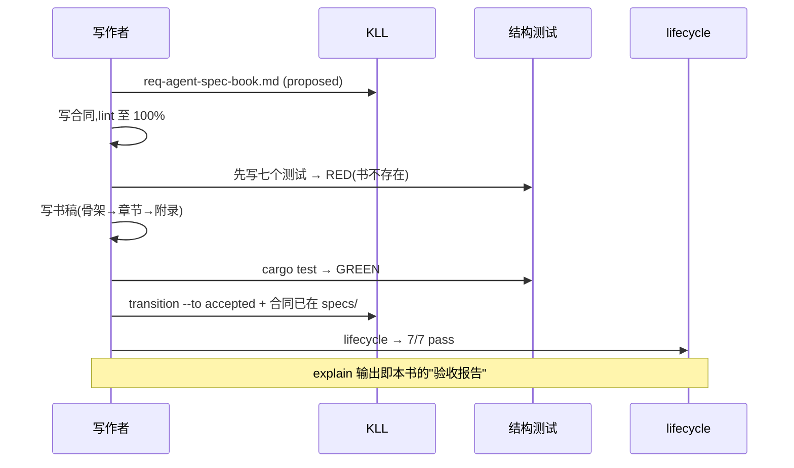

# 附录 C 本书的 Spec（自举）

本书不是"讲"spec 驱动，它**被** spec 驱动。这一页是证据。

## 本书的需求

`knowledge/requirements/req-agent-spec-book.md` 定义了 `REQ-AGENT-SPEC-BOOK`：
mdbook 工程 + mermaid 渲染、SUMMARY 完整性、章章有定位锚与图、前言双阅读路径
与知识地图、自举附录、双 E2E 轨迹、中文先行。它经历了与任何功能需求相同的
生命周期：intake 起草 → 人类确认 → `transition --to accepted` → 计划门检查
配对合同。

## 本书的合同

`specs/task-agent-spec-book.spec.md` 把需求降低为七个可机械验证的场景，每个
绑定一个真实的结构守卫测试：

| 场景 | 绑定测试 |
|------|----------|
| SUMMARY 完整且章节文件齐备 | `test_book_summary_lists_chapters_and_files_exist` |
| 章章有定位锚与 Mermaid 图 | `test_book_chapters_carry_anchor_baseline_and_mermaid` |
| mdbook-mermaid 已配置 | `test_book_toml_configures_mermaid_preprocessor` |
| 前言含阅读路径与知识地图 | `test_book_preface_has_reading_paths_and_knowledge_map` |
| 自举附录收录本书契约 | `test_book_dogfood_appendix_embeds_own_contract` |
| E2E 轨迹跨章且有图 | `test_book_traces_span_chapters_with_diagrams` |
| 缺失章节被机械拒绝 | `test_book_guard_fails_on_missing_chapter_fixture` |

第七个场景是异常路径：给结构校验函数一份引用了不存在文件的 SUMMARY 副本，
断言缺失清单指名该文件——守卫自己也被验证会叫。

## 写作即工作流

有趣的推论：从今往后任何人**删掉一章、忘了画图、改坏目录**，CI 的 Contract
Guard 都会在提交时拦下——这本书的结构质量不靠自觉，靠机器。这正是第 1 章说的
审查点位移在文档工程上的应用。

## 读者可以复刻

给你自己的项目文档立一份这样的合同，只需要：一条需求（写清结构承诺）、几个
文本形状测试（SUMMARY 解析 + grep 锚点）、`satisfies:` 连线。从此文档腐烂
是机械诊断，不是季度回顾时的叹气。
