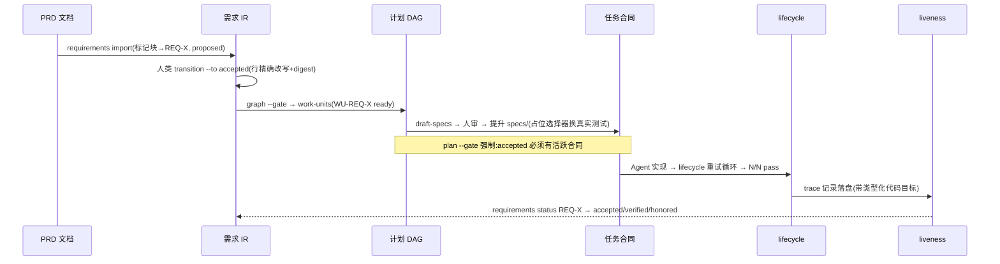
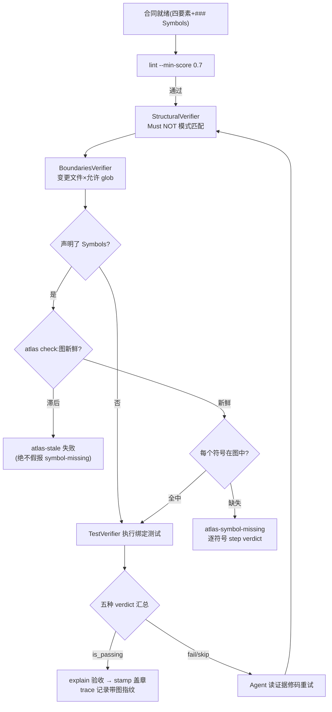

# 附录 D 端到端轨迹

单章讲的是模块，轨迹讲的是系统。两条 E2E trace 把分散的章节串成完整的因果链。

## 轨迹一：一条需求从 PRD 到 honored

**贯穿**：第 10 章（intake）→ 第 11 章（治理）→ 第 12 章（计划）→ 第 7 章
（lifecycle）→ 第 13 章（溯源）→ 第 15 章（liveness）。

每一步的产物都可独立审计：transition 的 JSON 带文档摘要（第 11 章）；plan 的
批次是拓扑序（第 12 章）；lifecycle 的 run log 记录每次重试（第 7 章）；
`traceability` 一个文档投影整条链（第 13 章）；最后 `status` 的三轴回答是
派生的，问一次算一次（第 15 章）。**没有任何一步依赖"某人记得"。**

这条轨迹在真实世界完整跑过：agent-spec 1.0 的三个集成需求
（REQ-COMPILER-MACHINE-SURFACE 等）就是沿着它从 proposed 走到
accepted/verified/honored 的。

## 轨迹二：一次合同验证之旅（含符号与边界）

**贯穿**：第 4 章（四要素）→ 第 6 章（lint）→ 第 7 章（四层管线）→ 第 8 章
（边界与符号）→ 第 16 章（Atlas 图）→ 第 9 章（验收与盖章）。

注意两个设计细节如何在全链路里呼应：**stale 优先**（第 8 章）依赖 Atlas 的
blake3 新鲜度模型（第 16 章）；最终 trace 记录里的图指纹让"当时对着哪个代码
状态验证的"永远可答（第 13 章）。验收时人类读到的 explain 摘要（第 9 章），
背后是这整条机械链的汇总——这就是为什么两个"是"就可以放心批准。

## 轨迹揭示的原则

两条轨迹的共同点：**每个箭头都是一条命令，每个节点都有可校验的产物**。系统的
可信不来自某个环节的聪明，而来自链条上没有一环允许"口头承诺"。
