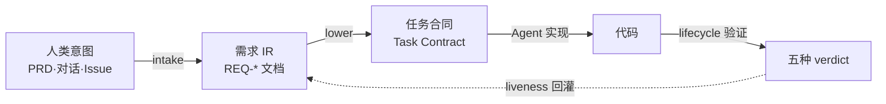

# 第 1 章 意图编译器是什么

> **定位**：本章用一次对比和一张图讲清 agent-spec 的核心命题——审查点位移。
> 无前置依赖。适用于所有读者的第一站。基于 agent-spec 1.0.0。

## 一个熟悉的困境

你让 AI Agent 实现一个用户注册接口。十分钟后它交回 500 行 diff。现在轮到你了：
逐行读代码、猜它有没有处理重复邮箱、担心它偷偷改了不该动的文件。你的时间花在了
**读实现**上，而实现恰恰是 Agent 最擅长产出的东西。

传统协作与 agent-spec 协作的注意力分配对比：

```
传统:       写 Issue (10%) → Agent 写码 (0%) → 读 diff (80%) → 批准 (10%)
agent-spec: 写合同 (60%)  → Agent 写码 (0%) → 读 explain (30%) → 批准 (10%)
```

这就是**审查点位移（Review Point Displacement）**：人类的高价值时间从"读 500 行
代码 diff"移动到"写 50-80 行自然语言合同"。合同定义什么是正确；机器验证代码是否
正确；人类最后做的是**合同验收**，不是代码审查。

## 为什么叫"编译器"

编译器的本质是：把一种表达（源语言）确定性地变换为另一种表达（目标语言），并在
每一步给出可检查的中间产物。agent-spec 对"意图"做同样的事：



- **需求 IR**：人类确认后的结构化需求（`knowledge/requirements/REQ-*.md`），是
  编译器的中间表示——就像编译器的 IR 一样，它是后续一切变换的锚点。
- **任务合同**：需求降低（lower）后的可执行契约，四要素齐备（详见第 4 章）。
- **验证**：lint → 结构 → 边界 → 测试的确定性四层管线（详见第 7 章），零 token
  成本，无假阴性。
- **liveness 回灌**：验证结果实时回答"这条需求现在还被守着吗"——honored /
  violated / unproven，永远重算，从不落盘（详见第 15 章）。

## 它不做什么

诚实是这个工具的性格。agent-spec 不替你判断产品方向（合同写错了它只能证明"错的
被实现了"）；不评审命名品味；不承诺性能验证（NFR 需要专门 runner）；也不托管审批
工作流——谁批准了什么，是编排系统的事，编译器只提供事实与摘要（ADR-001，详见
第 18 章）。

从下一章开始动手。五分钟后你会有第一个被机器证明的合同。
