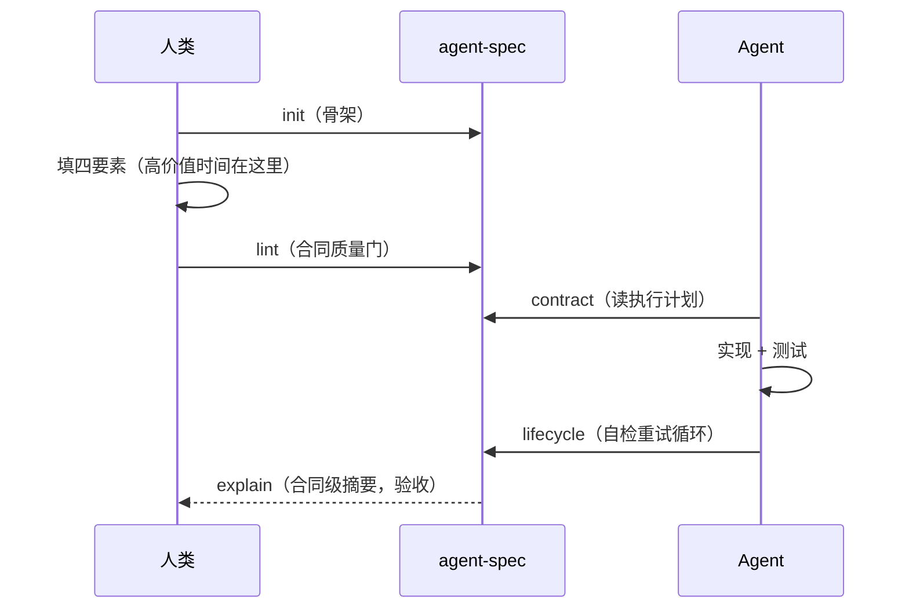

# 第 2 章 安装与第一个合同

> **定位**：本章带你在五分钟内完成安装、初始化第一个合同并跑通第一次验证。
> 前置依赖：第 1 章的心智模型。基于 agent-spec 1.0.0。

## 安装

安装需要 Rust 工具链（[rustup.rs](https://rustup.rs)）；**使用**则不需要任何
Rust 知识——装完就是一个普通 CLI。

```bash
cargo install agent-spec
agent-spec --version
```

```text
agent-spec 1.0.0
```

也可以克隆仓库一键安装 CLI + 全部技能文件（供 Claude Code / Codex / Cursor 等
Agent 使用）：

```bash
git clone https://github.com/ZhangHanDong/agent-spec && cd agent-spec && ./install-skills.sh
```

## 初始化第一个合同

`init` 在**当前目录**生成合同文件（保留你给的大小写），所以先进入 `specs/`：

```bash
mkdir -p specs && cd specs
agent-spec init --level task --lang zh --name "用户注册API"
cd ..
```

生成的 `specs/用户注册API.spec.md` 是一个骨架。合同的完整语法在第 4、5 章展开，
这里先感受最小可用形态：

```markdown
spec: task
name: "用户注册API"
---

## 意图

为认证模块添加注册端点：邮箱+密码注册，成功后发送验证邮件。

## 边界

### 允许修改
- src/auth/**
- tests/auth/**

## 完成条件

场景: 注册成功
  测试: test_register_returns_201
  假设 不存在该邮箱的用户
  当 客户端提交注册请求
  那么 响应状态码为 201

场景: 重复邮箱被拒绝
  测试: test_register_rejects_duplicate
  假设 已存在该邮箱的用户
  当 客户端提交相同邮箱的注册请求
  那么 响应状态码为 409
```

注意两点纪律：**每个场景都绑定一个测试**（`测试:` 行），**异常场景不少于正常场景**
——这两条会被质量门强制（详见第 6 章）。

## 第一次质量门与验证

```bash
agent-spec lint specs/用户注册API.spec.md --min-score 0.7
agent-spec lifecycle specs/用户注册API.spec.md --code . --format json
```

lifecycle 是主质量门：先重跑 lint（防合同被篡改），再依次跑结构、边界、测试三层
验证。此刻测试还没写，你会看到 `skip` verdict——**skip 不等于 pass**，五种 verdict
各司其职（详见第 7 章）。当 Agent（或你）补上实现与测试后，摘要会收敛为（示例，字段与真实输出一致——
真实摘要固定六键，按字母序）：

```text
"summary": { "failed": 0, "passed": 2, "pending_review": 0, "skipped": 0, "total": 2, "uncertain": 0 }
```

## 你刚刚经历了什么



这条链路的完整版就是下一章的七步工作流。
