# 第 3 章 七步工作流

> **定位**：本章给出 agent-spec 协作的全景流程：谁在哪一步做什么、用什么命令。
> 前置依赖：第 2 章。适合建立整体骨架后再深入各章。基于 agent-spec 1.0.0。

## 三个角色，七个步骤

人类定义正确（合同），Agent 实现代码，机器验证正确性。每一步都有明确的所有者：

```mermaid
graph TD
    S1["① 人写合同<br/>agent-spec init"] --> S2["② 合同质量门<br/>agent-spec lint --min-score 0.7"]
    S2 --> S3["③ Agent 读合同<br/>agent-spec contract"]
    S3 --> S4["④ Agent 自检循环<br/>agent-spec lifecycle --code ."]
    S4 -->|fail → 修码重试| S4
    S4 --> S5["⑤ 守卫门<br/>agent-spec guard（pre-commit/CI）"]
    S5 --> S6["⑥ 合同验收<br/>agent-spec explain --format markdown"]
    S6 --> S7["⑦ 盖章归档<br/>agent-spec stamp / archive"]
    style S1 fill:#2a2a35,stroke:#e8a845
    style S6 fill:#2a2a35,stroke:#e8a845
```

琥珀色的两步（①⑥）是人类注意力所在；其余全部机械化。

## 每一步一句话

| 步 | 所有者 | 命令 | 要点 |
|----|--------|------|------|
| ① 写合同 | 人 | `init` 后手写四要素 | 异常场景 ≥ 正常场景 |
| ② 质量门 | 机器 | `lint --min-score 0.7` | 对合同做"代码审查"（详见第 6 章）|
| ③ 读合同 | Agent | `contract <spec>` | 决策、边界、完成条件三重约束 |
| ④ 自检循环 | Agent | `lifecycle --code . --format json` | fail→读证据→修码→重跑，不许改合同 |
| ⑤ 守卫 | 机器 | `guard --spec-dir specs --code .` | 全仓合同一次验证，CI 阻断 |
| ⑥ 验收 | 人 | `explain --format markdown` | 读合同级摘要，不读 diff |
| ⑦ 盖章 | 机器 | `stamp --dry-run` / `archive` | Git trailer 建立合同↔提交溯源 |

## 重试协议（第④步的纪律）

lifecycle 失败时，Agent 的义务是**修代码，不是改合同**：

1. `--format json` 拿到每个场景的 `verdict` 与 `evidence`；
2. `fail`：测试真的跑了且失败——读证据修码；
3. `skip`：测试没找到——检查 `测试:` 选择器是否对得上真实测试名；
4. `uncertain`：需要 AI 或人工评审的场景（详见第 7 章 caller 模式）;
5. 同一场景连续三次失败：停下来，升级给人类。

改合同让验证变绿是谄媚（sycophancy），不是修复——若合同本身错了，显式切回
写作模式修订合同，绝不静默放宽验收标准。

## 何时不用它

探索性原型（还不知道"做完"长什么样）、大型架构重构（边界难以定义）——这些先
自由写码，等能回答"什么是完成"了再立合同。合同适合边界清晰的功能与可复现的
bug 修复。
