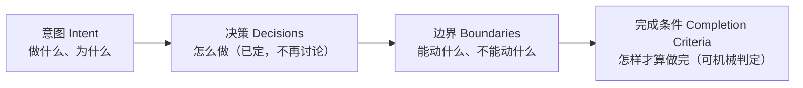

# 第 4 章 合同四要素

> **定位**：本章逐一拆解任务合同的四个组成部分——意图、决策、边界、完成条件。
> 前置依赖：第 3 章。这是全书最值得反复翻的用法章之一。基于 agent-spec 1.0.0。

合同不是模糊的 Issue，而是一份精确的规格。四要素各自回答一个问题：



## 意图（Intent）——2 到 4 句话

聚焦"做什么和为什么"，带上下文（现状、这件事在整体中的位置），不写成小说：

```markdown
## 意图

为现有认证模块添加用户注册端点。新用户通过邮箱+密码注册，成功后发送验证
邮件。这是用户体系的第一步，后续在此基础上添加登录与密码重置。
```

## 决策（Decisions）——已定的技术选择

只写**已经定死**的选择：具体技术、版本、参数。Agent 照做，不再购物：

```markdown
## 已定决策

- 路由: POST /api/v1/auth/register
- 密码哈希: bcrypt, cost factor = 12
- 验证 Token: crypto.randomUUID(), 存数据库, 24h 过期
- 邮件: 使用现有 EmailService，不新建
```

三条纪律（lint 会盯着，详见第 6 章）：每条决策至少被一个场景覆盖
（`decision-coverage`）；说"所有入口/每个二进制"这类全称断言需要成比例的场景
（`universal-claim`）；平台特定的照抄决策要打 `[platform-specific]` 标记。

## 边界（Boundaries）——三重约束

```markdown
## 边界

### 允许修改
- src/auth/**
- tests/auth/**
- migrations/

### 禁止
- 不要添加新依赖
- 不要修改现有登录端点

## 排除范围

- 登录、密码重置、OAuth（后续任务）
```

- **路径 glob 是机械执法的**：BoundariesVerifier 用实际变更文件对照 glob
  （详见第 8 章）。
- **自然语言禁令**由 lint 检查、结构验证器模式匹配，但不做文件级执法——两者
  配合使用。
- **排除范围**防止范围蔓延：Agent 明确知道什么不该碰。
- 1.0 还支持第四个子节 `### Symbols`——把合同钉到真实代码符号上（详见第 8 章）。

## 完成条件（Completion Criteria）——确定性的通过/失败

BDD 场景 + 显式测试绑定。**核心原则：异常场景 ≥ 正常场景**——这逼你在写码之前
想清楚边缘情况：

```markdown
## 完成条件

场景: 注册成功                       ← 1 条正常路径
  测试: test_register_returns_201
  ...

场景: 重复邮箱被拒绝                 ← 异常路径 ×3
场景: 弱密码被拒绝
场景: 缺少必填字段
```

每个场景没有 `测试:` 选择器就无法被 TestVerifier 执行，结果是 `skip`——而
**skip 永远不等于 pass**。场景 DSL 的全部细节在下一章。

## 写合同前的自检

| 问题 | 若答"否" |
|------|----------|
| 能定义"做完"长什么样吗？ | 先自由探索，之后再立合同 |
| 能写出至少一个确定性测试吗？ | 还没到合同阶段 |
| 范围小到能列出允许修改的路径吗？ | 拆成多个任务 |
| 关键技术决策已定吗？ | 先做 spike |
