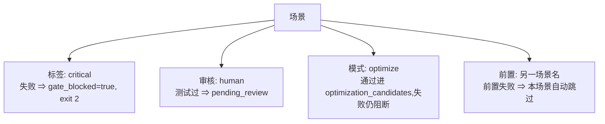

# 第 5 章 场景 DSL 与测试绑定

> **定位**：本章是完成条件的语法手册：BDD 关键字、测试选择器、步骤表格、
> 标签与场景依赖。前置依赖：第 4 章。基于 agent-spec 1.0.0。

## BDD 关键字（中英等价）

| English | 中文 | 语义 |
|---------|------|------|
| `Given` | `假设` | 前置条件 |
| `When` | `当` | 动作 |
| `Then` | `那么` | 期望结果 |
| `And` | `并且` | 同类补充步骤 |
| `But` | `但是` | 反向补充步骤 |

措辞必须**确定性**："返回 201"而不是"应该返回 201"——`should/might/应该`
会被 determinism linter 拦下。

## 测试选择器

```markdown
场景: 正常路径
  测试: test_happy_path            # 简单形式

场景: 跨包验证
  测试:                            # 结构化形式
    包: spec-gateway
    过滤: test_contract_prompt_format
    级别: integration
```

选择器过滤的是真实测试名。改了测试函数名合同就会 skip——这是特性不是缺陷：
溯源链宁断勿假。

## 步骤表格

结构化输入用表格，别发明散文格式：

```markdown
场景: 批量校验
  测试: test_batch_validation
  假设 如下输入记录:
    | name  | email          | valid |
    | Alice | alice@test.com | true  |
    | Bob   | invalid        | false |
  当 校验器处理该批次
  那么 "1" 条通过且 "1" 条失败
```

## 标签与模式



- `critical`：必须通过的场景，CI 友好的硬门。
- `审核: human`：测试通过后仍需人签——`--review-mode strict` 下不算通过。
- `前置:` 声明场景执行顺序；循环依赖由 lint 检出。

## Rule 分组（BDD-spine）

相关场景可组织在 `### Rule:` 下——一条系统承诺，由一组例子证明：

```markdown
### Rule: reject-invalid-input — 拒绝非法输入
场景: 空邮箱被拒绝
  测试: test_rejects_empty_email
  ...
场景: 弱密码被拒绝
  测试: test_rejects_weak_password
  ...
```

Rule 的 kebab-case id 是稳定锚（改显示名随意，id 不动），成熟后可用
`agent-spec promote` 升入能力库（`specs/capabilities/`）。id 与显示名之间用
**em dash `—` 或两个以上空格**分隔——普通 `--` 会被吞进 id。

## 一份体检清单

写完场景过一遍：每个场景都有选择器吗？异常 ≥ 正常吗？措辞确定吗？表格代替了
自造格式吗？关键场景打了 critical 吗？——这五问的机械版就是下一章的 lint。
