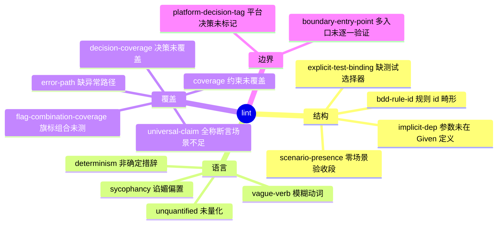

# 第 6 章 质量门:lint

> **定位**：本章讲合同自身的"代码审查"——linter 家族、评分门槛与 lint-ack
> 豁免机制。前置依赖：第 5 章。基于 agent-spec 1.0.0。

合同是要交给 Agent 执行的输入，输入的质量决定输出的上限。`agent-spec lint`
对合同做机械审查：

```bash
agent-spec parse specs/task.spec.md          # 先确认结构:段落数、场景数非零
agent-spec lint specs/task.spec.md --min-score 0.7
```

```text
Spec: agent-spec 1.0 Book (Chinese Edition)
Quality: 100% (determinism: 100%, testability: 100%, coverage: 100%)
  No issues found.
```

上面这段输出来自本书自己的合同——真实运行，未经修饰。

## linter 家族一览



几个高频警告的修法：

| 警告 | 症状 | 修法 |
|------|------|------|
| `vague-verb` | "处理邮箱" | 改为"校验邮箱格式" |
| `unquantified` | "响应要快" | 改为"200ms 内响应" |
| `error-path` | 全是正常路径 | 补异常场景至 ≥ 正常场景 |
| `decision-coverage` | 决策没人验证 | 为该决策补一个场景 |

## lint-ack：有理由的豁免

当某条 Warning 确属正当例外，用**带强制理由**的行内确认，而不是扭曲合同：

```markdown
<!-- lint-ack: error-path — 本任务是只读查询，无失败路径 -->
```

三条规则：`lint-ack:` 后的码与理由必须用 em dash `—` 或冒号分隔（否则整串被
当作码，什么也没确认）；被确认的 lint 从报告中过滤但**计入 audit**（豁免上了
台账，不是消音）；**Error 永远不可确认**——机械硬失败没有商量余地。

## Questions：诚实的未完成

合同成形前，把未决问题放进 `## 问题` 段（非阻塞，Info/Warning 级）：

```markdown
## 问题

- 折扣能否叠加?
- [x] 退款按折后价(已确认)
```

`agent-spec discover --from-codebase` 反向生成草稿合同时也会播种这一段——
一份冷启动草稿诚实地标着"已知不完整"，好过伪装成品。
