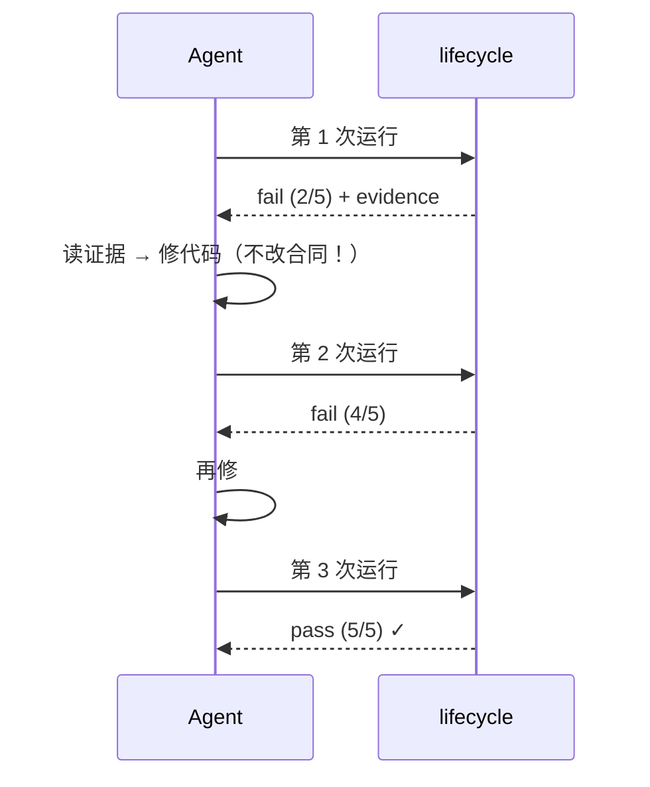

# 第 7 章 验证与重试:lifecycle

> **定位**：本章是验证管线的完整手册——四层验证器、五种 verdict、重试协议与
> AI caller 模式。前置依赖：第 6 章。基于 agent-spec 1.0.0。

## 四层确定性管线

```bash
agent-spec lifecycle specs/task.spec.md --code . --format json --run-log-dir .agent-spec/runs
```


绿色四层是确定性的：零 token 成本、无假阴性。第五层 AI 只处理机械层够不着的
残余，且默认关闭。1.0 里还有第六个隐形成员：Atlas 符号验证器——当合同声明了
`### Symbols` 时激活（详见第 8 章）。

## 五种 verdict

| verdict | 含义 | 动作 |
|---------|------|------|
| `pass` | 场景被证实 | 无 |
| `fail` | 绑定测试跑了且失败 | 读证据，修代码 |
| `skip` | 测试没找到/没跑 | 补测试或修选择器 |
| `uncertain` | AI 桩/待人工评审 | 人工看或接 AI 后端 |
| `pending_review` | 测试过了但要人签 | 走人工签核 |

**skip ≠ pass** 是这套体系的第一铁律。`is_passing` 要求 total>0 且
failed=skipped=uncertain=0——任何"没验证"都不会被静默当作"验证通过"。

## 重试循环



`--run-log-dir` 记下每一次运行——`explain --history` 能给出"这份合同重试了
几次才过"的表格（详见第 9 章）。长合同用 `--resume` 跳过已过场景；
`--resume=conservative` 全部重跑但检测回归。

## AI caller 模式

机械层覆盖不了的场景（设计意图、代码品质）可以让**调用方 Agent 自己当验证器**：

```bash
agent-spec lifecycle specs/task.spec.md --code . --ai-mode caller --format json
# 输出含 "ai_pending": true 与 pending 请求文件
# Agent 逐场景分析后写 decisions.json（scenario/verdict/confidence/reasoning）
agent-spec resolve-ai specs/task.spec.md --code . --decisions decisions.json
```

合并后的报告里，skip 被 Agent 的判定替换——但 provenance 会标注这是
Inferential（推理证据），与 Computational（机械证据）在 `matrix` 中泾渭分明。
