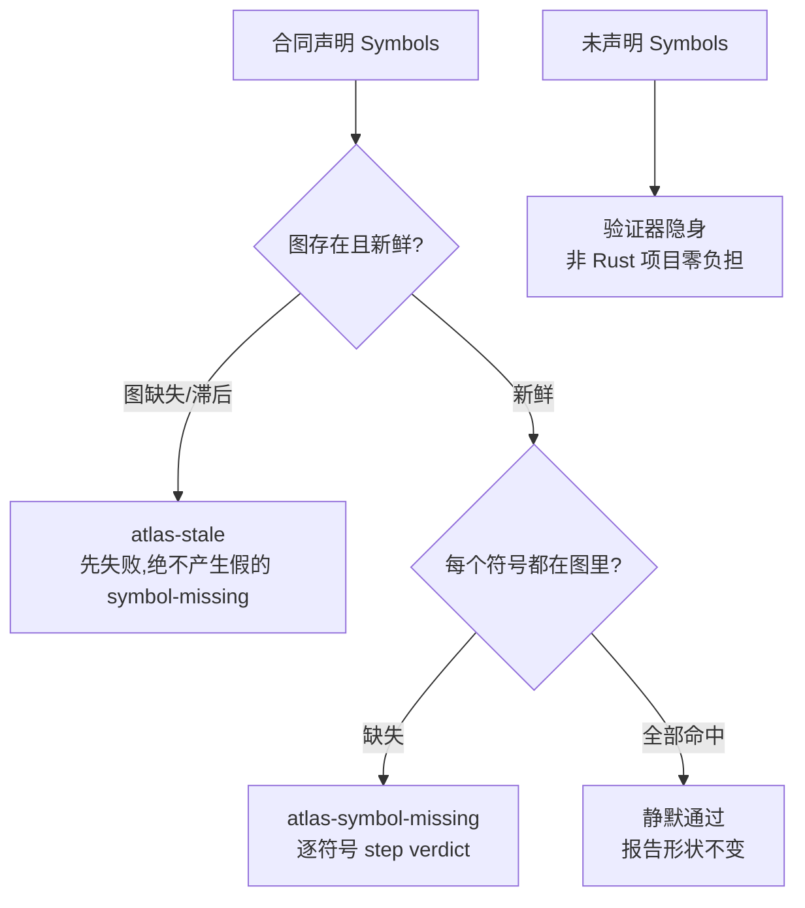

# 第 8 章 边界、守卫与符号

> **定位**：本章覆盖变更集执法（BoundariesVerifier）、全仓守卫（guard）与
> 1.0 的符号验证（`### Symbols`，Intent-Code Linker 的入口）。
> 前置依赖：第 7 章。基于 agent-spec 1.0.0。

## 变更集从哪来

边界执法需要知道"这次改了哪些文件"：

| 旗标 | 行为 |
|------|------|
| `--change <path>` | 显式指定文件/目录 |
| `--change-scope staged` | Git 暂存区（guard 默认）|
| `--change-scope worktree` | 全部工作区变更 |
| `--change-scope jj` | Jujutsu 变更（jj 仓库自动适用）|
| `--change-scope none` | 不做变更检测（lifecycle 默认）|

BoundariesVerifier 把每个变更文件对照合同的 glob：命中禁止 → fail；有允许清单
却不在其中 → fail；证据（PatternMatch）逐文件记录。

## guard：全仓一次验证

```bash
agent-spec guard --spec-dir specs --code . --change-scope staged   # pre-commit
agent-spec guard --spec-dir specs --code . --change-scope worktree # CI
```

```text
agent-spec guard: 55 spec(s) passed
```

这行输出来自 agent-spec 自己的仓库（写作时快照；活跃合同数会随仓库生长）——
全部活跃合同在每次提交前复验。
任何一份合同 lint 不过或验证不过，提交被阻断。

## `### Symbols`：把合同钉到真实符号上

1.0 的合同可以在边界下声明代码符号引用：

```markdown
## Boundaries

### Allowed Changes
- src/**

### Symbols
- rust-atlas: spec_verify::Verifier
- rust-atlas: spec_knowledge::build_work_units
```

lifecycle 管线中的 Atlas 符号验证器会拿**新鲜图**逐一核对：



三条语义值得背下来：**stale 优先**（图滞后时不指控符号缺失）；**全对即静默**
（不给报告添噪音）；**不声明即免税**（没有 Symbols 的合同永远不需要图）。
"合同里提到的符号已经不存在了"从此是机械诊断，不是考古发现——这是
Intent-Code Linker 的第一块（架构全景详见第 19 章，图的构建详见第 16 章）。

## VCS 感知

`.jj/` 存在（哪怕同时有 `.git/`）就用 `--change-scope jj`，且不要跑
`git add`——jj 自动快照。`stamp` 在 jj 仓库会带 `Spec-Change:` trailer；
`explain --history` 可通过 operation id 给出运行间的文件级 diff
（这两个命令详见第 9 章）。
