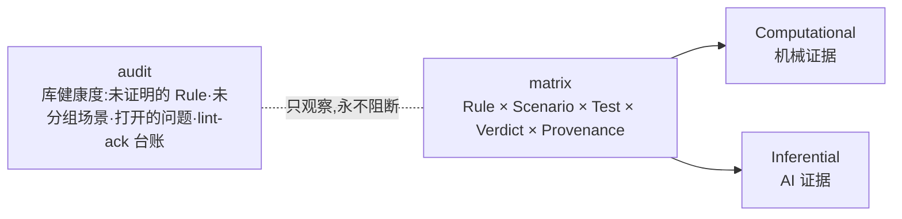

# 第 9 章 验收与追溯

> **定位**：本章讲人类在环的最后一步（合同验收）与合同↔提交的溯源链：
> explain、stamp、matrix、audit、archive。前置依赖：第 7、8 章。
> 基于 agent-spec 1.0.0。

## 合同验收，不是代码审查

```bash
agent-spec explain specs/task.spec.md --code . --format markdown
```

产出一份可直接贴进 PR 的合同级摘要。评审者只回答两个问题：

1. **合同定义对吗？**（意图、决策、边界讲得通吗）
2. **验证全过了吗？**（含异常路径的 N/N pass）

两个"是"就批准。这比读 500 行 diff 快一个数量级，而且注意力落在真正需要人类
判断的地方。想看过程再加 `--history`（真实渲染形状）：

```text
=== Run History (2 runs) ===
  First pass: run #2 (timestamp 1783453380)
  Failed runs: 1
  | run #1 | FAIL | 3 pass 2 fail 0 skip 0 uncertain |  |
  | run #2 | PASS | 5 pass 0 fail 0 skip 0 uncertain | +2 pass |
```

## stamp：合同 ↔ 提交

```bash
agent-spec stamp specs/task.spec.md --dry-run
```

```text
Spec-Name: 用户注册API
Spec-Passing: true
Spec-Summary: 4/4 passed, 0 failed, 0 skipped, 0 uncertain
```

trailer 进 commit message，溯源链完成：从任意提交都能回答"它兑现的是哪份合同、
当时的验证状态如何"。

## matrix 与 audit：证据的台账



`matrix` 回答"哪条规则由哪些测试以何种证据证明"；`audit` 是周期性健康快照——
它**只观察从不阻断**，包括 lint-ack 的豁免记录也在这里可查。

## archive：完成即出场

验收后的合同应该离开活跃扫描集：

```bash
agent-spec archive --spec-dir specs --archive-dir .agent-spec/archive/specs \
  --summary knowledge/context/spec-archives.md --run-log-dir . --dry-run
```

先 `--dry-run` 审阅压缩摘要，再对 `done/completed` 且**最新 lifecycle 证据仍然
通过**的合同实际归档。证据缺失或失败会阻断归档并给出诊断——归档不是遗忘，
归档处的合同内容与证据依旧可查（三轴状态里 archived 是执行阶梯的顶端，
详见第 11 章）。
