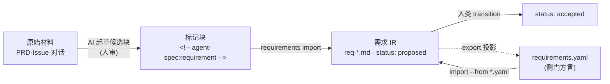

# 第 10 章 从 PRD 到需求 IR

> **定位**：本章进入意图编译的入口——原始 PRD/Issue 如何变成人类确认的需求 IR，
> 以及 YAML 方言侧门。前置依赖：第 3 章；建议先读第 4 章。基于 agent-spec 1.0.0。

## 谁拥有需求：所有权规则

正常流程是：人和 AI 聊需求 → 聊出一份**手写的自然语言文档** → 人类确认 →
这份文档（`knowledge/requirements/req-*.md`）成为**手工拥有的规范 IR** → 之后
才交给编译器降低。两条铁律：

1. **确认后的需求文档是唯一真相**。YAML 只是侧门输入方言与导出投影，永远不是
   已确认需求的源头。
2. **编译只读治理状态**。`import/graph/work-units/plan` 任何一步都不会改动
   需求文档一个字节。



## 标记块 intake

`requirements import` 只消费**显式标记块**——它从不静默解读散文：

```markdown
<!-- agent-spec:requirement id=REQ-NOTE-CREATE title="创建笔记" -->
## Problem
用户需要快速创建笔记。
## Requirements
[REQ-NOTE-CREATE] 系统 MUST 在 200ms 内完成笔记创建。
<!-- /agent-spec:requirement -->
```

```bash
agent-spec requirements import --from docs/prd.md --out knowledge/requirements
```

生成的文档带 `status: proposed`——**候选**身份，直到人类显式接受（下一章）。
原始散文的结构化由 `agent-spec-requirements-compiler` 技能辅助起草：候选块必须
带源摘录、置信度、场景与打开的问题，人审后才进 import。

## YAML 方言（v1.1）

对接外部生态时，`requirements.yaml` 树可以直接导入：

```yaml
requirements:
  - id: booking
    title: "Booking"
    type: FOLDER
    status: accepted
    scenarios:
      - name: "booking succeeds"
        given: "an available slot"
        when: "a visitor books it"
        then: "the slot is reserved"
    children:
      - id: reserve
        title: "Reserve"
        type: ATOMIC
        statement: "The system MUST reserve a slot exactly once."
```

方言是**受约束的子集**：两空格缩进、无锚点、无 flow 集合（`[]` 也不行）——
超出子集的构造会得到指名道姓的 `yaml-unsupported-construct` 诊断，而不是猜测性
解析。导入产物带 `source: imported-yaml` 溯源标记；再次导入只会刷新**带此标记**的
文件，任何不带标记的既有文档一律拒绝覆盖（没有强制开关——手写文档的所有权
不容侵犯）。

### ARC 原生形状（1.1.0+）

参照编译器（ARC）的真实输入是**单根树**：顶层就是根节点字段、`name:` 而非
`title:`、场景是 `steps: [{keyword, content}]`、ATOMIC 用 `description:` 携带
语句、id 允许点号层级（`REQ-1.1`）。`requirements import` 自动识别这种形状并
映射进 IR——点号 id 规范化为连字符，同时以 `source-id:` 保真行记录原始 id；
折叠块标量（`>-`）与空 flow 列表（`[]`）在此路径下被解析。反向的
`requirements export --dialect arc-native` 把 IR 投影为参照装载器可直接消费的
单根树并还原点号 id——agent-spec 编译的需求从此可以直接喂给 ARC。

反方向的导出（`requirements export --out requirements.yaml`）是**派生投影**：
往返是不动点（导出→导入→再导出逐字节相同），`--check` 做漂移门，装不下的内容
（Source Trace、tags 等）进 lossiness 清单而非静默丢弃。
