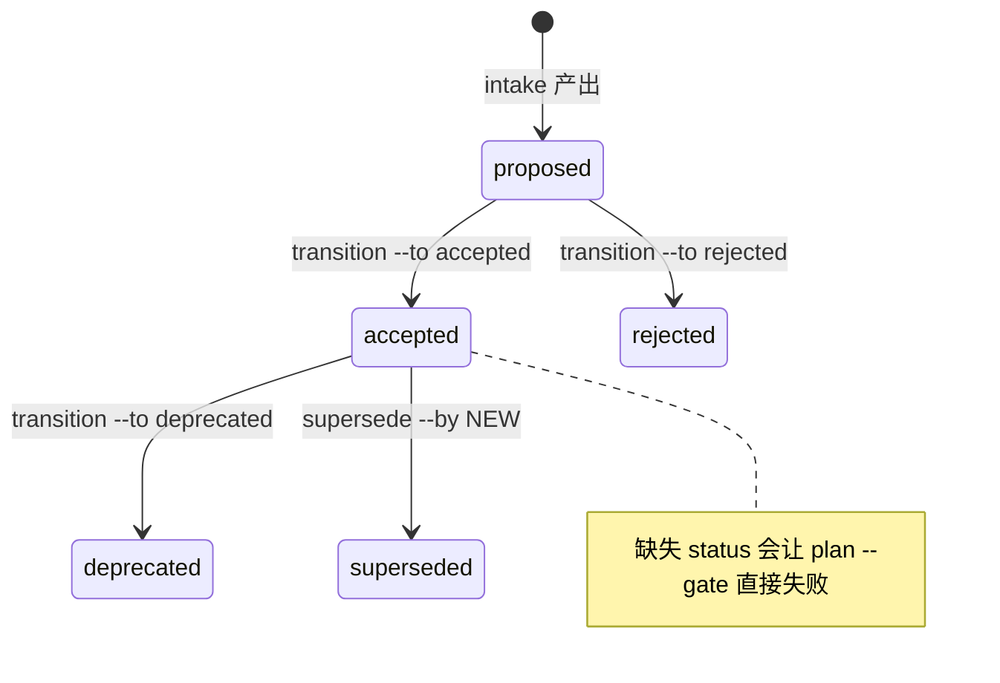

# 第 11 章 治理与三轴状态

> **定位**：本章讲需求的生命周期治理——显式人类转换、原子替换与一条命令看清
> 三个独立状态轴。前置依赖：第 10 章。基于 agent-spec 1.0.0。

## 状态机：接受是显式动作



```bash
agent-spec requirements transition REQ-BOOKING --to accepted
```

```text
REQ-BOOKING: proposed -> accepted (knowledge/requirements/req-booking.md)
```

三条纪律：改写是**行精确**的（只动 frontmatter 的 `status:` 行）；非法转换是
诊断（accepted 回不到 proposed）；`superseded` 只能经 `supersede` 命令到达——
它原子地改写两份文档（旧文档标 superseded，新文档记 `supersedes:`），第二次
写入失败会回滚第一次。

机器消费加 `--format json`——输出带改写后文档的 blake3 摘要，且**没有**
actor/authority/approval 字段（谁批准的由编排系统在自己的证据链里绑定到摘要上，
详见第 18 章 ADR-001）：

```json
{
  "document": "knowledge/requirements/req-provenance-run-hardening.md",
  "document_digest": "4a974a05742095071661737b5b676ef50a5bc07ce8f24c60486518a47b60f28f",
  "from": "proposed",
  "id": "REQ-PROVENANCE-RUN-HARDENING",
  "to": "accepted"
}
```

## 三轴状态：一条命令回答"REQ-X 现在怎么样了"

治理（人定、持久化）、执行（从工件推导）、liveness（从当前 verdict 重算）是
**三个独立的轴**：

```bash
agent-spec requirements status REQ-INTENT-CODE-LINKER
```

```text
REQ-INTENT-CODE-LINKER
  governance: accepted
  execution:  verified (work unit: ready)
  liveness:   honored
```

执行阶梯自底向上：`unplanned → planned → ready → active → verified → archived`
——staged 合同是 planned，工作单元就绪是 ready，活跃合同是 active，活跃且
honored 是 verified，归档是 archived。liveness 三值 `honored` / `violated` / `unproven`（外加声明性的 `na`），
**永远重算，从不存储**（详见第 15 章）。

## 开工仪式

接受一条需求意味着排期义务。plan 门会强制配对：accepted 而无活跃合同 →
`requirement-uncovered` 失败。因此标准开工动作是一次变更里同时完成——

```bash
agent-spec requirements transition REQ-X --to accepted
git mv specs/roadmap/task-x.spec.md specs/
```

这套仪式在本书自己的写作中如实上演过（详见附录 C）。
