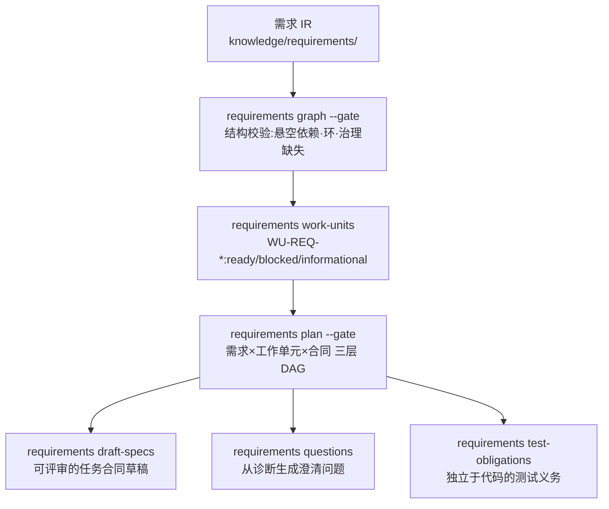

# 第 12 章 计划与工作单元

> **定位**：本章讲需求 IR 的降低（lowering）：验证需求图、生成工作单元、
> 汇成计划 DAG，直至可评审的合同草稿。前置依赖：第 11 章。基于 agent-spec 1.0.0。

## 降低管线



## graph 与 work-units

```bash
agent-spec requirements graph --knowledge knowledge --format json --gate
agent-spec requirements work-units --knowledge knowledge --out .agent-spec/work_units.json
```

graph 校验依赖 DAG（悬空引用、环）与治理完整性——**没有 status 的需求会直接
让 gate 失败**。work-units 把每条需求降低为工作单元并给出状态：

- `ready`：accepted + 场景齐备 + 可排期；
- `blocked`：缺场景等（`blocked: missing_scenarios`）；
- `informational`：proposed/缺状态——**治理未接受的工作永不 ready**。

## plan：一个 DAG 看三层

```bash
agent-spec requirements plan --knowledge knowledge --specs specs --gate
```

```text
batch 1: REQ-CODE-LIVE-WIKI, REQ-KLL-WORK-UNITS, REQ-RUST-ATLAS
batch 2: REQ-CODE-LIVE-WIKI-DEEPENING, REQ-REQUIREMENTS-COMPILER-PLAN-DAG
batch 3: REQ-CROSS-PROJECT-WIKI
```

批次即拓扑序：同批次可并行。gate 语义里最重要的一条是
`requirement-uncovered`——accepted 的需求没有活跃合同守护时失败。这正是上一章
"开工仪式"的机械依据：**接受即排期义务**。

## draft-specs：草稿不是成品

```bash
agent-spec requirements draft-specs --knowledge knowledge --out specs/generated
```

只有 `ready` 单元会生成草稿。草稿自带 `satisfies: [REQ-*]` 与占位选择器
（`pending_...`）——**lifecycle 对草稿本来就应该失败**，直到人类评审、补上真实
测试选择器并提升到 `specs/`。草稿是起点，不是可以直接執行的合同。

worktree 并行开发的机械配套：

```bash
agent-spec requirements worktrees --base main --path-prefix ../ws --out .agent-spec/worktrees.json
```

为每个 ready 单元生成确定性的 git worktree 条目（路径、分支名），供编排系统
直接消费。
