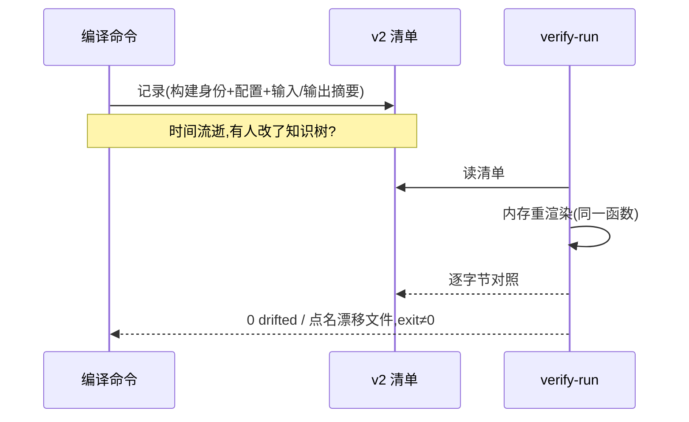

# 第 13 章 溯源与重放

> **定位**：本章讲证据链——一条需求的可追溯投影、编译的可重放清单与漂移检测。
> 前置依赖：第 11 章；trace ledger 细节关联第 15 章。基于 agent-spec 1.0.0。

## traceability：一个文档看完整证据链

```bash
agent-spec requirements traceability REQ-X --format json --out trace.json
```

投影是**纯读**且**字节稳定**（同输入两次运行逐字节相同）：条款 → 满足它的合同
→ 场景 → 绑定测试 → 最近记录的 verdict → 派生 liveness，一次给全。verdict 来自
存储的 trace ledger（不重跑测试），schema 为 `requirement-traceability-v1`。
仪表盘和编排系统消费这一个文档就够了，不必自己重推导。

## 编译运行清单（provenance v2）

每个写 `--out` 工件的 requirements 命令都能附带清单：

```bash
agent-spec requirements work-units --out wu.json --provenance wu.compilation.json
```

```text
provenance: wu.compilation.json (build 85b8f4f5dba5cf19c1d6c8ba34e9777d0e01cba8)
```

v2 清单绑定四件事：**编译器构建身份**（crate 版本 + 构建期嵌入的 git commit，
无 git 环境则为 `unknown`）、**生效配置**（子命令 + 旗标数组）、**输入语料摘要**
（知识树 blake3）、**输出摘要**。v1 清单（import/export）继续有效。

## verify-run：确定性成为可执行检查

```bash
agent-spec requirements verify-run --manifest wu.compilation.json
```

```text
verify-run requirements work-units: 0 output(s) drifted
```

重放在**内存中**进行（什么都不写——最强形式的沙箱）：按清单记录的命令与配置
重新渲染，逐字节对照记录的摘要，漂移的输出逐个点名、非零退出。记录与重放共用
同一渲染函数，**字节奇偶性是构造保证**而非测试巧合。



## trace / replay / explain-failure

需求级证据的三个读命令：`trace REQ-X` 列出全部 trace 记录；`replay REQ-X` 取
**最近一次运行**的证据链（是证据重放，不是"确定性 LLM 重放"）；
`explain-failure REQ-X` 聚焦非 pass 链并解释。这些记录从 lifecycle 的
`--run-log-dir`/trace 写入，1.0 起还携带类型化代码目标（详见第 14 章）。
