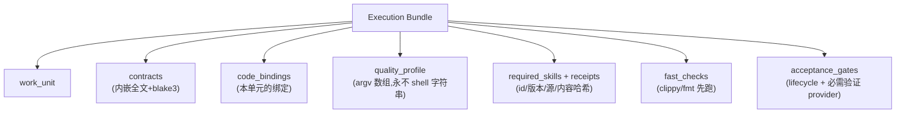

# 第 14 章 编译束与代码绑定

> **定位**：本章讲编译器的打包出口：per-requirement 四件套编译束、工作单元的
> 代码绑定与一体化执行束。前置依赖：第 12、13 章；符号语义见第 8 章。
> 基于 agent-spec 1.0.0。

## requirements compile：四件套

```bash
agent-spec requirements compile --out bundles/ --layout arc-v1
```

```text
compiled REQ-PARITY-BOOKING: 4 files (bundle eabda2986cdcdeced70613b89e1ec500...)
bundles written: 1 -> bundles/
```

每条 accepted 需求产出：需求文档、合同草稿、traceability 投影、编译清单
（含逐工件摘要 + **bundle 总摘要**——外部准入检查可以钉住整个束）。两种布局：

- `agent-spec-v1`（默认，中立）：`<id>/requirements.md`、`spec.md`、
  `traceability.json`、`compilation.json`；
- `arc-v1`（边缘兼容投影）：`<id>.requirements.md`、`<id>.spec.md`、
  `<id>.arc.traceability.json`、`<id>.arc.compilation.json`——内容与中立布局
  完全相同，只有文件命名不同。像 SARIF/SCIP 一样，兼容是**文件布局层面的事**，
  核心 schema 里没有任何外部项目的词汇（有机械测试守着这条纪律）。

写入是**原子**的：全部工件先在内存渲染校验，任何失败什么都不落盘；已有文件
不带 `--force` 拒绝覆盖并逐个点名。compile 清单同样可 `verify-run` 重放。

## requirements bind：把工作单元钉到代码

```bash
agent-spec requirements bind --code . --graph .agent-spec/graph
```

对每个 ready 工作单元，取其合同声明的 `### Symbols`，在 provider 图（首个
provider 是 rust-atlas，详见第 16 章）中解析成真实代码目标，写出
`.agent-spec/code-bindings.json`：需求 id、工作单元 id、provider、**图指纹**、
排序后的目标（node id / kind / file / provenance）。三条硬语义：

- **图滞后即失败**：stale 文件逐个点名，绝不产出绑定；
- **未知 provider 即诊断**：指名 spec 与注册表；
- **绑定是派生工作数据，永远不是 KLL 真相**——随时可从图重新生成。

## requirements bundle：一个工件给 Agent 全部上下文

```bash
agent-spec requirements bundle --unit WU-REQ-X --out bundle.json
```



质量 provider 有类型化角色（code-intelligence / diagnostic / verification /
transformation / agent-guidance）与归一化 outcome（pass / fail / unavailable /
error / 授权 skip）。两条被类型层面固化的纪律：**必需 provider 不可用永远不算
通过证据**；**技能回执是来源凭证，永远不是验收证据**——验收只认确定性工具输出
与 lifecycle verdict。
