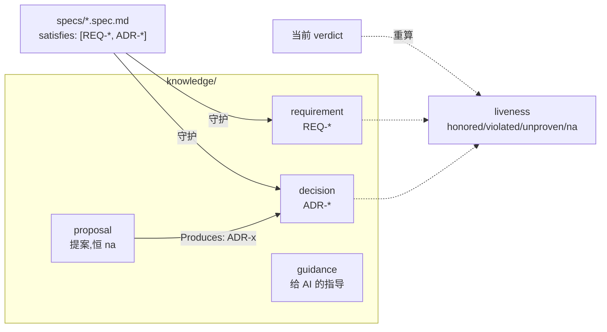

# 第 15 章 KLL 与 liveness

> **定位**：本章讲合同之外的持久知识层：四类知识文档、satisfies 边与永远重算的
> liveness。前置依赖：第 9 章。基于 agent-spec 1.0.0。

## 知识为什么需要一层

合同验证任务，但团队的持久知识——为什么这么决定、哪些需求还活着、给 AI 的
指导——散落在 PR 描述和聊天记录里会腐烂。KLL（Knowledge & Liveness Layer）
把它们放进 `knowledge/`，用类型化文档承载，用 `satisfies:` 边连回合同：



- **decision（ADR）**：accepted 的决策强制 `Alternatives Considered` 非空、
  `Consequences` 正反两面（forcing functions）——写决策时就被迫诚实。
- **requirement（REQ）**：BCP-14 规范句（MUST/SHOULD/MAY），一行一条款。
- **guidance**：作用域化的 AI 指导（`Applies To` glob + `Skills` 指定）。
- **proposal**：治理型提案，liveness 恒 `na`，永不进代码门，经
  `## Produces:` 链到它催生的决策。

## liveness：从不存储的答案

```bash
agent-spec trace REQ-X --gate
```

回答"这条知识现在还被通过中的合同守着吗"：

| liveness | 含义 |
|----------|------|
| `honored` | 有满足它的合同且全部通过 |
| `violated` | 有合同在失败 |
| `unproven` | 没有合同守护或证据不足 |
| `na` | 声明性不适用（如 proposal）|

关键设计：**它是派生值，重算于每次询问，从不落盘**。不存在"数据库里记着绿色
但代码早烂了"的陈旧状态。`--gate` 让 violated 退出码 2，可直接进 CI。

## 治理 lint

```bash
agent-spec lint-knowledge --knowledge knowledge --gate
```

```text
20 docs, 204 findings (0 errors)
```

（写作时快照；语料会生长，`0 errors` 是门的语义所在。）

语料级校验：id 冲突、supersession 完整性（superseded 必须有对应的
`supersedes:` 回链）、陈旧引用；文档级 forcing functions（上文的 ADR 规则等）。
`--format sarif` 可直接喂 GitHub Code Scanning。

一键铺设整个知识工作区：`agent-spec init --workspace`（幂等）。
