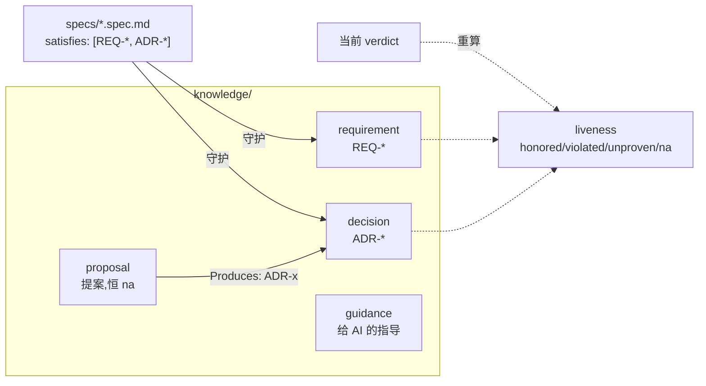

# 第 15 章 KLL 与 liveness

> **定位**：本章讲合同之外的持久知识层：四类知识文档、satisfies 边与永远重算的
> liveness。前置依赖：第 9 章。基于 agent-spec 1.0.0。

## 知识为什么需要一层

合同验证任务，但团队的持久知识——为什么这么决定、哪些需求还活着、给 AI 的
指导——散落在 PR 描述和聊天记录里会腐烂。KLL（Knowledge & Liveness Layer）
把它们放进 `knowledge/`，用类型化文档承载，用 `satisfies:` 边连回合同：


```mermaid
graph LR
    subgraph knowledge/
        D["decision<br/>ADR-*"]
        R["requirement<br/>REQ-*"]
        G["guidance<br/>给 AI 的指导"]
        P["proposal<br/>提案,恒 na"]
    end
    S["specs/*.spec.md<br/>satisfies: [REQ-*, ADR-*]"] -->|守护| R
    S -->|守护| D
    P -->|"Produces: ADR-x"| D
    V["当前 verdict"] -.重算.-> L["liveness<br/>honored/violated/unproven/na"]
    R -.-> L
    D -.-> L
```

- **decision（ADR）**：accepted 的决策强制 `Alternatives Considered` 非空、
  `Consequences` 正反两面（forcing functions）——写决策时就被迫诚实。
- **requirement（REQ）**：BCP-14 规范句（MUST/SHOULD/MAY），一行一条款。
- **guidance**：作用域化的 AI 指导（`Applies To` glob + `Skills` 指定）。
- **proposal**：治理型提案，liveness 恒 `na`，永不进代码门，经
  `## Produces:` 链到它催生的决策。

## liveness：从不存储的答案

```bash
agent-spec trace REQ-X --gate
```

回答"这条知识现在还被通过中的合同守着吗"：

| liveness | 含义 |
|----------|------|
| `honored` | 有满足它的合同且全部通过 |
| `violated` | 有合同在失败 |
| `unproven` | 没有合同守护或证据不足 |
| `na` | 声明性不适用（如 proposal）|

关键设计：**它是派生值，重算于每次询问，从不落盘**。不存在"数据库里记着绿色
但代码早烂了"的陈旧状态。`--gate` 让 violated 退出码 2，可直接进 CI。

## 治理 lint

```bash
agent-spec lint-knowledge --knowledge knowledge --gate
```

```text
20 docs, 204 findings (0 errors)
```

（写作时快照；语料会生长，`0 errors` 是门的语义所在。）

语料级校验：id 冲突、supersession 完整性（superseded 必须有对应的
`supersedes:` 回链）、陈旧引用；文档级 forcing functions（上文的 ADR 规则等）。
`--format sarif` 可直接喂 GitHub Code Scanning。

一键铺设整个知识工作区：`agent-spec init --workspace`（幂等）。

## 向前走，而不是事后找补

治理是单向的，每层只有一个出口：

```text
knowledge/proposals/    LEP-NNN   要不要做、为什么
    │  ## Produces: ADR-NNN
knowledge/decisions/    ADR-NNN   裁决与备选
    │  一份治理需求
knowledge/requirements/ REQ-*     MUST 条款 ＋ 场景
    │  satisfies: [REQ-*]
specs/                  task-*    可执行、可验收的合同
```

哪个前缀归哪一层，唯一权威是
`knowledge/standards/operational/id-registry.md`。用
`agent-spec knowledge new <kind> <id>` 建文件，枚举值、文件名与出口指引都一次到位，
省得手写 frontmatter 猜错。

同一道门禁负责拦住跳层：需求语料非空时，没有 `satisfies:` 的任务合同触发
`orphan-spec`；需求文档 `## Dependencies` 里出现 `ADR-*` 触发
`dependency-kind-mismatch`（那里只放 `REQ-*` 排序边，决策 id 属于
`## Source Trace`）；已接受的提案若其产出的决策没有回链，触发
`produces-link-integrity`。1.3.0 曾用只准缩小的
`.agent-spec/orphan-baseline.json` 基线豁免存量合同；迁移完成后该列表必须
保持为空，非空就是 Error，不再提供豁免。活动孤儿合同当前按 Warning 报告。

## 决策点：让提问也结构化

流水线有三处必须停下来等人拍板。CLI 在这三处都不交互、不猜答案，只发出
机器可读的问题信封，再吃回答案：

| 阶段 | 命令 | 问什么 |
|------|------|--------|
| 逆向访谈 | `requirements questions` | 需求 lint 发现的歧义 |
| 治理选型 | `knowledge questions <id>` | 提案的未决问题、决策的备选方案 |
| 验收判定 | `verify --emit-questions` | 机器判不了的场景，附带已收集证据 |

三处发出的是同一种信封（`envelope_version` ＋ 每个问题的 `kind`、`prompt`、
`source`、`options`），任何 agent harness 都能原样渲染成选择题，不必各自解析。
候选由调用方 agent 从源文本起草，CLI 只校验形状——至多四项、每项要有标签和
一句描述。**空候选表是合法且诚实的状态**：没有站得住的候选时，问题保持自由作答。

验收判定的答案可直接转成 `resolve-ai` 既有的 decisions JSON。人判过的场景会作为
一等证据进入 trace 证据链，记录判定的**类别**（`source: human`）、verdict、理由与
证据 digest，但**绝不记录身份**——CLI 无法证明谁批准，所以 `actor`、`authority`、
`approval`、`policy` 这四个字段被机械拒绝，绑定审批人是外部系统按 digest 做的事。
没有人工判定的运行，序列化结果与该字段存在之前逐字节相同。
