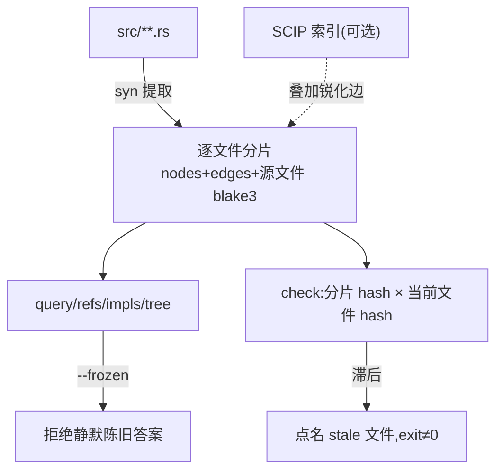

# 第 16 章 Rust Atlas

> **定位**：本章讲代码图 provider——查结构而非查文本：构建、查询、新鲜度与
> 冻结模式。前置依赖：第 8 章的符号语义。基于 agent-spec 1.0.0
> （rust-atlas crate 0.1.0）。

## 为什么不用 grep

Agent 理解代码时反复 grep 是在用文本近似结构。Atlas 用 `syn` 在 stable 工具链
上把 Rust 源码提取成**项目图**：模块、类型、trait、impl、调用边——每条边带
provenance（syn / scip / mir），每个分片带源文件 blake3。

```bash
agent-spec atlas build --code .            # 构建/增量刷新(逐文件分片+blake3)
agent-spec atlas query spec_verify::Verifier --format json
agent-spec atlas refs Verifier             # 谁引用/调用它
agent-spec atlas impls Verifier            # 哪些 impl 触及该 trait/类型
agent-spec atlas tree --code .             # 确定性模块大纲
agent-spec atlas check --code .            # 新鲜度门:任何分片滞后即非零退出
```



## 新鲜度是门，不是提示

分片记录它来自哪个字节状态的源文件。`check` 在 CI 里把"图落后于代码"变成硬失败；
读命令加 `--frozen` 则拒绝在陈旧图上给出答案。第 8 章的 `atlas-stale` 优先语义、
第 14 章 bind 的滞后即失败，根源都在这里：**宁可说"我不知道"，不给过期事实**。

## 图的消费者们

- **合同符号验证**（第 8 章）：lifecycle 拿新鲜图核对 `### Symbols`。
- **代码绑定**（第 14 章）：ready 工作单元解析成带图指纹的代码目标。
- **类型化 trace 目标**：通过验证的运行把 provider/node/kind/file/provenance/
  图指纹写进 trace 证据。
- **MCP**：`atlas_tree / atlas_query / atlas_refs / atlas_impls / atlas_status`
  五个只读工具，任何 MCP 客户端"问谁调用了它"得到的是带 provenance 的边，
  不是 grep 命中（详见第 17 章）。

## 增量与自托管

分片只在源文件 hash 变化时重建——大仓库重索引的成本是一个文件而不是全世界。
agent-spec 仓库自托管：写作时 85 个源文件全图零 unparsed。MIR 层（rustc 驱动
的深度事实）是 0.7 弧的 additive 深化，已列入路线图合同。

---

### 版本演化说明

> 本章核心分析基于 rust-atlas 0.1.0。截至 rust-atlas 0.2.0（schema v4），
> 本章的构建、查询、新鲜度与冻结模式语义不变，有两处 additive 演化：节点 id
> 带上了 `#` 消歧后缀（裸名引用仍可解析）；语法基线之上新增可选的 SCIP 语义
> 叠加层——`atlas scip-gen` 调 rust-analyzer 产出 `index.scip`，叠加
> `Calls`/`UsesType` 等语义边（`provenance=Scip`，syn 基线永不改写）。
> 路线图见仓库 `docs/atlas-roadmap.md`。
