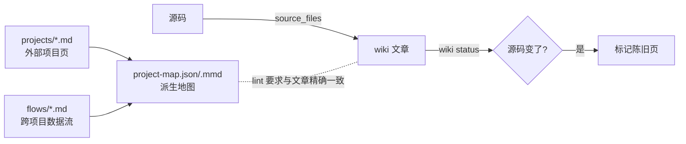

# 第 17 章 Live Wiki 与 MCP

> **定位**：本章讲 Agent 的工作记忆（源码溯源的 live wiki）与知识层的在线服务
> （只读 MCP）。前置依赖：第 15 章。基于 agent-spec 1.0.0。

## Live Wiki：会过期报警的工作记忆

`.agent-spec/wiki` 是仓库内被 git 跟踪的 wiki——不是 KLL 真相，不是发布文档，
而是 **Agent 的工作记忆**：模块页、概念页、决策页、架构清单、跨项目地图。
每篇文章声明 `source_files`，源码一变即被标记陈旧：

```bash
agent-spec wiki init --code .            # 铺目录(各文章目录带 .gitkeep)
agent-spec wiki seed --code .            # 聚焦式草稿页,不覆盖手工维护页
agent-spec wiki status                   # 哪些页陈旧了(含 worktree 未提交变更)
agent-spec wiki query "requirements compiler"
agent-spec wiki inspect src/spec_wiki/live.rs
agent-spec wiki check                    # 索引新鲜度+lint+陈旧状态,CI 结构门
```



跨项目场景用 project/flow 文章：`projects` 列表的相邻对构成有向边，仓库外的
路径只进 `external_sources` 证据标签（agent-spec 不扫描外部仓库）。派生的
project-map 必须与维护文章精确一致，`wiki lint` 守着。工作纪律：大量读源码前
先 `wiki query`；旧内容移入 `learnings/` 存档而非粗暴删除。

## 只读 MCP：项目真相在线可查

```bash
agent-spec mcp --knowledge knowledge
```

通过 stdio JSON-RPC 提供 **11 个确定性只读工具**（无 RAG、无网络）：

| 组 | 工具 |
|----|------|
| 知识 | `knowledge.find` / `knowledge.governing` / `context.read` |
| 活性 | `liveness.status` |
| 合同 | `spec.contract` |
| 指导 | `guidance.for` |
| 代码图 | `atlas_tree` / `atlas_query` / `atlas_refs` / `atlas_impls` / `atlas_status` |

任何 MCP 客户端（Claude Code、Codex、自研编排器）都能实时查询项目真相，而
不是反复重读文件。**只读**是边界承诺：审批、治理转换等写操作永远走 CLI——
这与第 18 章的 ADR-001 一脉相承。
