# 第 18 章 设计哲学

> **定位**：本章把散在前十七章里的设计选择收拢成五条原则——它们解释了这个
> 工具为什么长这样。前置依赖：通读第一、二部分任意深度。基于 agent-spec 1.0.0。

## 一、审查点位移

人类时间最贵的用法不是读 Agent 写的代码，而是定义"什么是正确"。整个工具链
围绕这一点组织：合同是人写的（50-80 行自然语言），验证是机器做的（四层确定性
管线），人类最后只回答"合同对吗、验证全过了吗"。

## 二、确定性优先，AI 在边缘

```mermaid
graph TD
    DET["确定性核心<br/>lint·结构·边界·测试·符号<br/>零 token·无假阴性·可重放"] --> AI["AI 只在边缘<br/>intake 起草(人审)·caller 验证(标注 Inferential)"]
    style DET fill:#16321f
    style AI fill:#2a2440,stroke-dasharray:4
```

每个新增检查都是**传感器**（lint/report/audit），从不静默改变 pass/fail 语义。
AI 证据与机械证据在 matrix 里 provenance 分明——`Inferential` 永远不会被
默默当作 `Computational`。

## 三、skip ≠ pass（诚实的五值逻辑）

"没验证"与"验证通过"是两件事。五种 verdict 各司其职，`is_passing` 只认
"跑了且全过"。同族的诚实还有：required provider 不可用**不是** pass；技能
回执**不是**验收证据；lint-ack 豁免**计入台账**而非消音；draft-specs 的占位
选择器**本来就该失败**。工具宁可红着，不给虚假的绿。

## 四、derived, never stored（派生值从不落盘）

liveness 每次询问都重算；traceability 是纯读投影；代码绑定随时可从图重生成；
wiki 的陈旧标记来自当下的源码对照。**任何会腐烂的答案都不允许缓存成"真相"**。
反过来，被持久化的只有事实：需求文档、trace 记录、编译清单——以及它们的
blake3 摘要。

## 五、编排器中立（ADR-001）

> agent-spec 提供确定性编译产物、稳定机器格式、digest 和重放能力；任何编排器
> 都可以在命令之间插入审批，但**审批身份、权威和工作流永远不进入编译器核心**。

CLI 无法可信证明"谁批准了"，所以它不假装能：JSON 输出带文档摘要，外部系统把
审批绑定到摘要上。依赖方向是单向的——编排器依赖 agent-spec 的冻结表面，
agent-spec 不知道任何编排器的存在。schema 里没有 actor/authority/approval/
policy 字段，这条纪律本身有机械测试守着。被否掉的备选方案（审批协议入核、
编排器命名的命令、双 canonical 所有权）连同否决理由记录在
`knowledge/decisions/adr-001-orchestrator-neutral-core.md`——用它自己要求的
forcing functions 格式写成。

## 这些原则的代价（诚实清单）

确定性优先意味着 NFR（性能/可靠性）只能给 `uncertain`；测试选择器改名会让
合同 skip（溯源宁断勿假的代价）；编排器中立意味着没有开箱即用的审批 UI；
以及最根本的一条——lifecycle 全绿只证明**合同被满足**，不证明**合同本身全面**，
所以周期性的人工与 AI 架构评审仍然必要（`audit` 自动化了其中一部分）。
工具把这些代价写在 README 的 "What agent-spec doesn't solve" 里，而不是藏起来。
