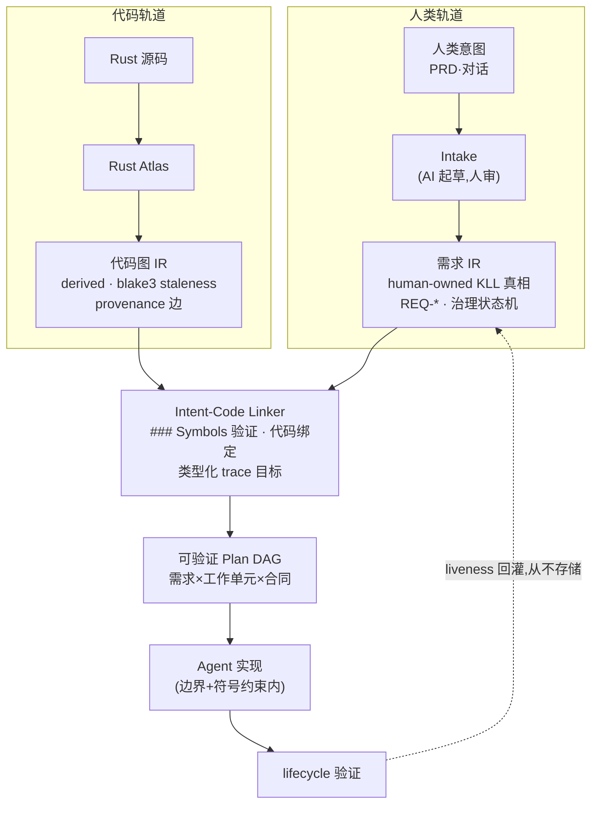

# 第 19 章 架构全景

> **定位**：本章是全书的收束——双 IR 收敛架构、五个交付边界与 1.0 兼容性
> 承诺的完整清单。前置依赖：第 18 章。基于 agent-spec 1.0.0。

## 双 IR 收敛

agent-spec 1.0 的架构是两条独立编译轨道在 Intent-Code Linker 汇合：

两条铁律贯穿始终：**派生的代码事实永远不改写 KLL 真相**（Linker 产出的绑定与
trace 事实都是 derived 工作数据）；**陈旧的图阻断一切定论**（stale 优先于任何
symbol 判断）。

## 五个交付边界（1.0 全部落地）

| 边界 | 交付物 | 章节 |
|------|--------|------|
| 1 治理门与转换 | 状态机、transition/supersede、缺状态即失败 | 第 11 章 |
| 2 代码图 IR 与绑定 | CodeGraphProvider 契约、`requirements bind` | 第 14、16 章 |
| 3 Intent-Code Linker | `### Symbols` 验证、类型化 trace 目标 | 第 8 章 |
| 4 质量计划与执行束 | provider 角色/outcome、`requirements bundle` | 第 14 章 |
| 5 三轴状态查询 | `requirements status` | 第 11 章 |

## Schema 家族

机器格式的每一员都有版本化、命名空间化的 `$id`
（`agent-spec/intent-compiler/*`），文件形式为可解析 URL：

`requirements-plan-v1` · `test-obligations-v1` · `worktree-manifest-v1` ·
`clarification-questions-v1` · `requirement-trace-ledger-v1`（含类型化
`code_target_facts`）· `compilation-provenance-v1` / `-v2`（可重放）·
`requirement-traceability-v1` · `code-bindings-v1` · `execution-bundle-v1`

## 1.0 兼容性承诺

自 1.0.0 起，以下表面破坏性变更只随主版本：

- **CLI**：全部命令族——从 `init/lint/contract/lifecycle/guard/explain/stamp`
  到 `requirements` 家族（含 `traceability|verify-run|compile|bind|bundle`）、
  `wiki *`、`atlas *`、`mcp`。
- **机器格式**：lifecycle/verify JSON 顶层键；五种 verdict 与 `is_passing`
  语义；上面的全部 schema；YAML 方言 v1.1；编译束双布局
  （`agent-spec-v1`、`arc-v1`）。
- **治理语义**：需求状态机、执行阶梯、derived-never-stored 的 liveness。

之后的路：Atlas MIR 层（0.7 弧，additive 深化）与英文版全书。架构不会重来——
它已经把自己钉进了机械验证里。
