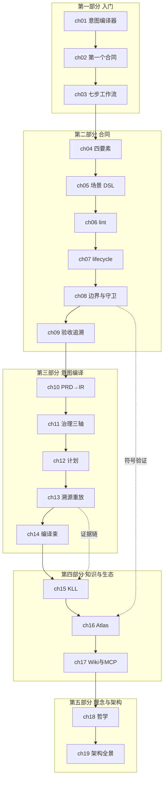

# 前言

agent-spec 是一个**意图编译器（Intent Compiler）**：人类的意图经它编译为结构化
需求（IR），再降低为可机械验证的任务合同（Task Contract），最后由确定性管线证明
"代码仍然遵守着当初的意图"。它是给 AI 协作时代准备的工程底座——当实现代码越来越
多地由 Agent 写出，人类的注意力应该花在**定义正确**上，而把**验证正确**交给机器。

本书基于 **agent-spec 1.0.0**（兼容性承诺生效版）写成，中文先行；**英文版**作为
后续工作，将在本书结构稳定后启动。全书由浅入深，以用法为主线：第一、二部分让你
从零跑通并精通合同工作流；第三、四部分进入意图编译与知识层；第五部分收束于设计
哲学与架构全景。

本书自身就是 agent-spec 工作流的展品：它有自己的 KLL 需求（`REQ-AGENT-SPEC-BOOK`）
与任务合同，每一章的定位锚、Mermaid 图、目录完整性都由绑定测试机械守卫——细节见
附录 C。

## 阅读准备

### 前置知识

- **命令行基础**：会在终端运行命令、读输出。
- **Git 常识**：知道 commit / branch / staged 是什么。
- **不需要**：Rust 编程能力（除非你读第 16 章 Atlas 的实现细节）、任何特定 AI
  工具的经验——agent-spec 是 agent-agnostic 的。

### 推荐阅读路径

**路径 A：实践者速通**（今天就要用起来）

> 前言 → 第 1 章 → 第 2 章 → 第 3 章 → 第 4 章 → 第 5 章 → 第 6 章 → 第 7 章 → 第 8 章 → 附录 A

读完你能独立写合同、过质量门、跑验证、看懂五种 verdict，并把 guard 挂进 CI。

**路径 B：架构师深读**（评估它是否值得引入团队）

> 前言 → 第 1 章 → 第 18 章 → 第 19 章 → 第 10 章 → 第 11 章 → 第 13 章 → 附录 D

这是一条**评估用的跳读路径**：刻意越过各章声明的前置依赖，先看哲学与架构，
再抽查编译管线，最后用两条端到端轨迹验证叙事完整性。读不顺处按定位锚补课即可。

### 全书知识地图

图例：实线为**阅读顺序**（部分之间的推荐先后），虚线为跨部分的主题关联；
各章严格的前置依赖以每章定位锚为准。

### 标记约定

- 标注为真实运行的命令输出来自 agent-spec 1.0.0，未经虚构；教程性示例
  （如第 2 章的"用户注册API"演练）会注明"示例"。仓库快照数字（合同数、
  文档数等）以写作时为准，仓库会继续生长。
- "详见第 N 章" 是交叉引用的规范格式（行文中也会自然使用"上一章/下一章"）。
- 每章开篇的 `> **定位**` 告诉你这一章讲什么、依赖哪一章（必要时含适用场景）。
