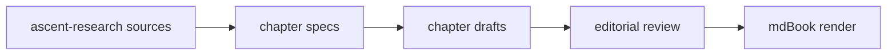

# 前言: 本书如何使用 spec 写成

本书正文尚未开始编写。

当前阶段只建立 mdBook 结构和章节写作合同。每一章的合同位于 `books/harness-spec-ai/specs/`，后续正文必须按这些合同逐章生成、审查和修订。

## 写作与渲染管线

这张图用于验证 mdBook 的 Mermaid 渲染链路。正式章节的图文预算见 `books/harness-spec-ai/specs/visual-budget.md`。
