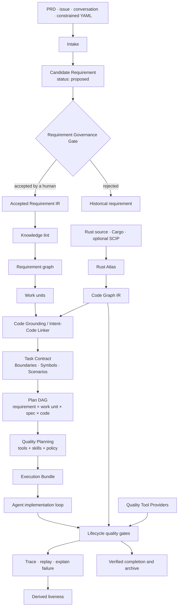

# Intent Compiler Architecture

> Status: target architecture. Requirement intake, Requirement IR, work units,
> Task Contracts, plan DAGs, lifecycle, trace, and archive exist today. The
> Requirement Governance transition commands, Code Graph Provider interface,
> Intent-Code Linker, Quality Planning, and Execution Bundle described below are
> planned extensions unless their roadmap contracts say otherwise.
> Current-pipeline diagram: README §"Architecture: the Intent Compiler".
> Delivery boundary 1 (governance gate + transitions) shipped via
> `specs/task-requirement-governance-transitions.spec.md`.

## Purpose

agent-spec compiles reviewed human intent into an executable, verifiable plan.
The target architecture uses two independent intermediate representations:

- **Requirement IR** records what the system must do. It is durable,
  human-reviewed KLL truth under `knowledge/requirements/`.
- **Code Graph IR** records what the current program contains. It is derived,
  stale-aware working data produced by language-specific providers.

The Intent-Code Linker joins those representations without allowing derived code
facts to rewrite accepted requirements.

## Target Pipeline



## Stage Contracts

| Stage | Main input | Main output | Trust rule |
|---|---|---|---|
| Intake | Raw intent | Candidate Requirement Blocks | AI may draft; a human must review |
| Governance Gate | Proposed requirement | Accepted, rejected, or historical requirement | Transitions are explicit and auditable |
| Requirement IR | Accepted KLL artifacts | Requirement dependency graph | Normative truth is human-maintained |
| Lowering | Requirement graph | Executable, informational, or blocked work units | Deterministic and code-independent |
| Code intelligence | Program source | Code Graph IR | Derived, capability-labelled, and stale-aware |
| Intent-Code Linker | Work units plus Code Graph IR | Typed code bindings | Never rewrites KLL truth |
| Task Contract and plan | Bindings plus scenarios | Verifiable Contract and execution DAG | Human Contract Acceptance remains required |
| Quality Planning | Contract, risk, bindings, project policy | Execution Bundle | Missing required capabilities are visible |
| Implementation | Execution Bundle | Source changes | AI works inside declared boundaries |
| Lifecycle | Source changes plus providers | Normalized evidence | `skip` and unavailable are not pass |
| Trace and archive | Evidence plus VCS state | Liveness, replay chain, archive summary | Liveness is derived, never stored |

## Requirement Governance Gate

Requirement governance status answers whether a requirement is authorized to
enter executable lowering. It does not answer whether implementation is complete.

```text
proposed ──human acceptance──> accepted ──replacement──> superseded
    │                              └──retirement───────> deprecated
    └──human rejection──────> rejected
```

The required compiler behavior is:

| Governance status | Compiler behavior |
|---|---|
| `proposed` | Keep visible for review; do not schedule executable work |
| `accepted` | Permit executable work units, Task Contracts, and plan coverage |
| `rejected` | Keep as history; exclude from execution |
| `superseded` | Keep traceability and require a valid replacement relationship |
| `deprecated` | Preserve evidence; do not create new implementation work by default |
| missing | Fail the governance gate rather than treating it as accepted |

Compilation must not mutate this status. Planned transition commands should make
the human action explicit, for example:

```bash
agent-spec requirements transition REQ-123 --to accepted
agent-spec requirements transition REQ-123 --to rejected
agent-spec requirements supersede REQ-123 --by REQ-456
```

## Code Grounding And Intent-Code Linking

Code grounding belongs after work-unit lowering and before the final Task
Contract and plan DAG are accepted. A leaf work unit is stable enough to map,
while the Contract can still use the mapping to define precise boundaries.

The linker consumes provider-neutral graph facts and emits a separate derived
binding artifact, tentatively `.agent-spec/code-bindings.json`:

```json
{
  "requirement_id": "REQ-AUTH-LOGIN",
  "work_unit_id": "WU-REQ-AUTH-LOGIN",
  "provider": "rust-atlas",
  "targets": [
    {
      "node_id": "app::auth::AuthService::login",
      "kind": "fn",
      "file": "src/auth.rs",
      "provenance": "scip",
      "graph_fingerprint": "example"
    }
  ]
}
```

Bindings support symbol-aware Contract boundaries, impact analysis, worktree
conflict detection, targeted verification, and typed trace evidence. A stale graph
must block definitive binding rather than silently serving old symbol ownership.
Requirement-derived test obligations remain code-independent.

Rust Atlas is the first planned Code Graph Provider. Non-Rust providers can
implement the same consumer contract without changing Requirement IR. Atlas is
therefore not a requirement parser and not a KLL source of truth.

## Quality Planning And Execution Bundles

Code intelligence and quality verification are different capabilities. Rust
Atlas describes program structure; Clippy and similar tools produce diagnostics
or verification evidence. Quality Planning resolves the tools, skills, and policy
needed for one work unit after code grounding has identified the affected scope.

An Execution Bundle should contain:

```json
{
  "work_unit": "WU-REQ-RUST-ATLAS",
  "contract": "specs/task-rust-atlas.spec.md",
  "code_bindings": ".agent-spec/code-bindings.json",
  "quality_profile": "rust-strict",
  "required_skills": ["rust-api-design", "rust-error-handling"],
  "fast_checks": ["cargo-check", "rustfmt", "clippy-targeted"],
  "acceptance_gates": ["cargo-test", "clippy-workspace", "cargo-deny"]
}
```

Skills shape how the agent reasons before and during generation. A skill receipt
may record the resolved skill id, version, source, and content hash, but an agent's
claim that it read a skill is not acceptance evidence. Deterministic tool output
and lifecycle verdicts remain the proof.

Fast checks run inside the implementation loop over the Atlas-derived affected
scope. Full acceptance gates run through lifecycle after implementation.

## Provider Roles

Provider interfaces must be typed rather than one arbitrary plugin surface:

| Provider role | Examples | Responsibility |
|---|---|---|
| Code intelligence | Rust Atlas, SCIP, Cargo metadata | Symbols, relationships, ownership, impact |
| Diagnostic | rustc, Clippy, cargo-deny | Normalized static diagnostics |
| Verification | cargo test, Miri, cargo-semver-checks | Behavioral or policy verdicts |
| Transformation | rustfmt, deterministic generators | Controlled source transformation |
| Agent guidance | Project and domain skills | Generation-time methods and constraints |

A third-party quality adapter should expose capability detection, scoped planning,
execution, and normalization. Prefer Cargo JSON, SARIF, or another structured
format over human terminal text. Configuration must use executable and argument
arrays, explicit working directories, timeouts, output limits, and declared
network requirements rather than interpolated shell commands.

Normalized quality outcomes must distinguish at least `pass`, `fail`,
`unavailable`, `error`, and policy-authorized `skip`. A required provider that is
unavailable, errors, or skips cannot contribute passing evidence.

## Three Independent State Axes

One `status` field cannot represent governance, delivery, and current correctness.

| Axis | Values | Storage rule |
|---|---|---|
| Requirement governance | proposed, accepted, superseded, deprecated, rejected | Persisted in KLL |
| Execution progress | unplanned, planned, ready, active, verified, archived | Derived from work units, spec location, lifecycle, and archive |
| Requirement liveness | honored, violated, unproven, n/a | Recomputed from current evidence |

For example, a shipped requirement can remain `accepted`, have execution state
`verified`, and have liveness `honored`. A later regression changes liveness to
`violated` without rewriting governance history.

A planned aggregate query should expose all axes without conflation:

```bash
agent-spec requirements status REQ-123
```

## Delivery Boundaries

The target architecture should be delivered in separate contracts:

1. Require and validate requirement governance status, then add explicit transitions.
2. Define a provider-neutral Code Graph IR and typed code-binding schema.
3. Integrate Rust Atlas through the Intent-Code Linker, lifecycle, trace, and wiki.
4. Add Quality Provider adapters, profiles, required-skill resolution, and Execution Bundles.
5. Add aggregate status and evidence queries, then dogfood every stage on agent-spec.

Each step must preserve deterministic gates, explicit human acceptance, and the
rule that derived program facts never become durable KLL truth.
