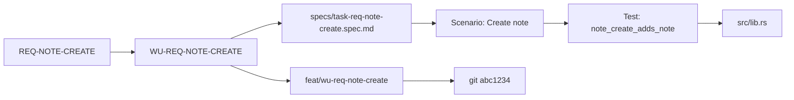

# Intent Compiler And Plan DAG Implementation Plan

> **For agentic workers:** REQUIRED SUB-SKILL: Use superpowers:subagent-driven-development (recommended) or superpowers:executing-plans to implement this plan task-by-task. Steps use checkbox (`- [ ]`) syntax for tracking.

**Goal:** Turn agent-spec's KLL requirements pipeline into a deterministic intent compiler that lowers natural-language-backed KLL requirements into a validated requirement/work-unit/spec plan DAG, spec-derived test obligations, QA class gates, worktree execution manifest, requirement trace ledger/replay surface, clarification questions, stronger lint gates, and an archival path for completed specs.

**Architecture:** Keep the core CLI deterministic and model-free. AI may assist through skills that generate candidate KLL artifacts or ask clarification questions, but the compiler passes operate on checked `knowledge/requirements/*.md`, parsed specs, and current lifecycle evidence. The main compiler chain is `docs/PRD or issue -> knowledge/requirements -> requirement IR -> work units -> spec plan DAG -> test obligations -> QA class gate -> worktree manifest -> task specs -> lifecycle -> requirement trace ledger -> replay/explain-failure/trace-graph -> archive summary`.

**Tech Stack:** Rust 2024, existing hand-written parsers, `clap`, `serde`/`serde_json`, current `src/spec_knowledge/` modules, current `src/spec_lint/` pipeline, Markdown skill/docs files, no network or LLM dependency in CLI code.

## Global Constraints

- Do not put LLM calls, network calls, or model-specific prompts in the CLI implementation.
- AI-assisted reverse interviewing belongs in skills or caller workflow docs; CLI emits deterministic diagnostics and question JSON.
- Preserve existing KLL requirement artifacts: `kind: requirement`, explicit `id`, `title`, `## Problem`, `## Requirements`, `## Scenarios`, `## Dependencies`, `## Child Requirements`, `## Source Trace`, `## Open Questions`.
- Preserve current explicit PRD import blocks; raw prose must not be silently reinterpreted by `requirements import`.
- Do not add `serde_yaml`; follow the current hand-written frontmatter/parser style.
- Sort all generated output deterministically by normalized id, file path, and stable diagnostic code.
- Generated draft specs remain review artifacts and must not be treated as executable until pending test selectors are replaced.
- `Open Questions` with real content must keep the affected requirement/work unit blocked.
- Borrow reference-project concepts only: requirement-as-source, DAG, scenario grounding, traceability. Do not copy reference-project Python code or app-generation runtime.
- Use the reference project's examples and generated test/runtime patterns as validation inspiration only. Compare agent-spec against the reference project's requirement tree, dependency, scenario, test-first, and traceability invariants; do not import reference-project tests or make the reference project's Python/Node runtime part of the agent-spec gate.
- `docs/` remains human-facing context. `knowledge/` remains typed, linted, traceable project truth.
- Ready work units may be mapped to git worktrees, branches, and agent sessions for parallel execution. Blocked, missing-scenario, and grouping-only units must not be mapped to implementation worktrees.
- Worktree planning is a deterministic manifest generator first. It must not run `git worktree add`, create branches, or modify other worktrees unless a later explicit command adds that behavior.
- A worktree entry must bind a work unit to a requirement id, a satisfying spec path, a branch name, a filesystem path, dependency ids, and a batch number.
- Spec-derived test obligations are independent verifier inputs. They must be generated from requirements/specs, not from implementation code, so code and test agents do not share the same blind spots.
- Requirement replay is evidence replay, not deterministic LLM time travel. It re-materializes requirement/work-unit/spec/scenario/test/VCS/worktree evidence from stored lifecycle outputs, trace records, worktree manifests, and current KLL/spec artifacts.
- Requirement trace records must never invent code ownership. They may cite code paths from explicit `Test: Targets:`, verifier `Evidence::CodeSnippet`, test output metadata, change paths, or worktree manifest entries. If no code path is known, emit `unknown` plus a diagnostic instead of guessing.
- Failure explanation must start from non-pass lifecycle scenario results and walk backward to `satisfies:` requirement ids and work units. It must preserve `fail`, `skip`, `uncertain`, and `pending_review` as distinct states.
- QA class gates classify work by risk (`A`, `B`, `C`) and determine required verification layers. Class A must require lifecycle, targeted tests, trace, and an adversarial review record; Class B requires lifecycle and trace; Class C requires lifecycle only.
- State-machine requirements must be explicit when behavior depends on protocol, lifecycle, or daemon transitions. Every transition in a `## State Machine` section must map to at least one scenario or test obligation.
- Archived specs are historical evidence, not active contracts. Default `guard`, `trace`, and `requirements plan` scans must ignore the archive directory unless a command explicitly opts into archived history.
- Archival must never delete specs; it moves or copies completed specs into a dedicated archive and writes a compressed summary with the original path, satisfies ids, scenarios, test selectors, and last known verification status.
- Existing `lifecycle`, `guard`, `trace`, `lint-knowledge`, and `requirements graph` semantics must remain backward compatible unless this plan explicitly adds a stricter `--gate` mode.
- The noteapp fixture is demonstration evidence only. agent-spec development must dogfood its own requirements pipeline through `knowledge/requirements/req-requirements-compiler-plan-dag.md`, `specs/task-requirements-compiler-plan-dag.spec.md`, self-hosting `requirements plan`, lifecycle, replay, explain-failure, and trace-graph evidence.
- Final acceptance must prove both tracks: self-hosting dogfood for this repository first, then the compact fixture as an external demonstration. Passing the fixture must never substitute for passing the agent-spec self-hosting contract.
- Final acceptance must include an Reference-inspired cross-check: the borrowed invariants from the reference project's ticketbooking demo, traceability service, and test-generation templates must each map to an agent-spec test, fixture assertion, or explicit documented non-goal.
- Lore's documentation engineering practice is in scope: agent-spec must carry doc-type canon, language/format canon, operational review checklists, tool documentation, and a docs lint script/gate. This governs human-facing `docs/` quality while KLL governs machine-consumable truth.
- Documentation engineering must remain plain Markdown and deterministic tooling. Do not add a site generator requirement, network dependency, or LLM-based prose judgment to the CLI.

---

## Reference Material

Reference project:

```text
<reference-project>
```

Reference validation material:

```text
<reference-project>/example/ticketbooking-demo/requirements.yaml
<reference-project>/src/agent/traceability/service.py
<reference-project>/src/agent/agents/test_generator.py
<reference-project>/src/agent/templates/web/backend
<reference-project>/src/agent/templates/android/app/src/test
```

Reference paper:

```text
/Users/zhangalex/Desktop/2602.13723v3.pdf
/tmp/reference-paper-2602.13723v3.txt
```

DORA analysis:

```text
/Users/zhangalex/Desktop/dora-spec-driven-development-analysis.md
```

Lore documentation engineering reference:

```text
/Users/zhangalex/Work/Projects/consult/lore/docs/developing/doc-standards
/Users/zhangalex/Work/Projects/consult/lore/docs/proposals
```

Borrowed model:

- Requirements are source artifacts, not prompt context.
- A requirement document is a DAG of requirement nodes.
- Nodes carry dependencies, children, scenarios, and steps.
- Scenarios and steps ground requirements into testable behavior.
- Traceability links requirement ids to tests, specs, and implementation evidence.
- Requirement replay reconstructs the latest known evidence chain; it is useful for debugging and audits, but it is not a promise that every historical agent action can be deterministically reproduced.
- From the reference project's validation material: test against requirement-tree invariants, child/dependency edges, executable scenarios, negative cases, test-first obligations, and traceability queries from requirement id to tests/interfaces/code-state evidence.
- LLM-assisted translation from informal requirements is useful, but ambiguity remains unless it becomes explicit diagnostics and human-reviewed answers.
- From DORA: Era-2 process discipline matters, but the highest-leverage gap is Stream D: tests derived from spec independently of code.
- From DORA: capability-to-test matrices, risk-based QA gates, and explicit state-machine specs are practical stepping stones from prose plans to machine-checkable conformance.
- From Lore: documentation is engineered through doc types, canon, operational checklists, and tools; this practice should be copied as governance structure, not as product-site content.
- From Lore: significant proposals need pre-implementation structure with goals, non-goals, compatibility, migration, security, privacy, risks, alternatives, and unresolved questions.

agent-spec adaptation:

```text
docs/prd.md or issue text
  -> knowledge/requirements/*.md
  -> RequirementGraph
  -> RequirementPlan
  -> WorkUnitSet
  -> SpecPlan DAG
  -> specs/task-*.spec.md
  -> TestObligationSet
  -> QaGatePlan
  -> WorktreeManifest
  -> lifecycle / guard
  -> RequirementTraceLedger
  -> requirements replay / explain-failure / trace-graph
  -> trace / liveness
```

## Target File Structure

- Create: `knowledge/requirements/req-requirements-compiler-plan-dag.md`
  - KLL source requirement for this feature.

- Create: `specs/task-requirements-compiler-plan-dag.spec.md`
  - Self-hosting Task Contract for this implementation.

- Create: `src/spec_knowledge/requirement_plan.rs`
  - Builds the cross-layer compiler IR and plan DAG from KLL requirements plus specs.

- Create: `src/spec_knowledge/questions.rs`
  - Converts blocking diagnostics into deterministic clarification questions for AI reverse-interview skills.

- Create: `src/spec_knowledge/worktrees.rs`
  - Converts ready work units and plan batches into a deterministic git worktree execution manifest.

- Create: `src/spec_knowledge/trace_ledger.rs`
  - Builds and reads requirement-level trace records from lifecycle reports, specs, requirement plans, and worktree manifests.

- Create: `src/spec_knowledge/test_obligations.rs`
  - Emits spec-derived test obligations independently from implementation code.

- Create: `src/spec_qa.rs`
  - Defines QA class parsing, defaults, and gate requirements for Class A/B/C work.

- Modify: `src/spec_knowledge/mod.rs`
  - Re-export `RequirementPlan`, question structs, worktree manifest structs, requirement trace ledger structs, test obligation structs, and builder functions.

- Modify: `src/spec_knowledge/requirement_graph.rs`
  - Add child-cycle validation and expose stable helpers required by plan/lint code.

- Modify: `src/spec_knowledge/lint.rs`
  - Add requirement quality lints that catch ambiguity, weak scenarios, missing source trace, missing testable coverage, and uncovered state-machine transitions.

- Modify: `src/main.rs`
  - Add `requirements plan`, `requirements questions`, `requirements worktrees`, `requirements trace`, `requirements replay`, `requirements explain-failure`, `requirements trace-graph`, and `requirements test-obligations` subcommands.
  - Add text/json formatting and gate behavior.

- Create: `src/spec_archive.rs`
  - Selects completed specs, writes archival summaries, and moves active specs out of the default scan path.

- Modify: `skills/agent-spec-tool-first/SKILL.md`
- Modify: `skills/agent-spec-tool-first/references/commands.md`
- Modify: `.claude/skills/agent-spec-tool-first/SKILL.md`
- Modify: `.claude/skills/agent-spec-tool-first/references/commands.md`
  - Document compiler workflow, plan DAG, and clarification loop.

- Create: `skills/agent-spec-intent-compiler/SKILL.md`
  - Agent skill for PRD/issue to candidate KLL requirements and reverse interviewing.

- Modify: `README.md`
- Modify: `AGENTS.md`
- Modify: `CHANGELOG.md`
  - Document the compiler, clarification, and archive workflows.

- Create: `docs/intent-compiler/reference-validation-matrix.md`
  - Records the Reference-inspired validation invariants borrowed from ticketbooking, traceability, and test-generation references.

- Create: `docs/intent-compiler/schemas/requirements-plan-v1.schema.json`
- Create: `docs/intent-compiler/schemas/test-obligations-v1.schema.json`
- Create: `docs/intent-compiler/schemas/worktree-manifest-v1.schema.json`
- Create: `docs/intent-compiler/schemas/clarification-questions-v1.schema.json`
- Create: `docs/intent-compiler/schemas/requirement-trace-ledger-v1.schema.json`
  - Versioned JSON Schema contracts for intent compiler machine-readable artifacts.

- Create: `knowledge/standards/canon/doc-types.md`
- Create: `knowledge/standards/canon/language.md`
- Create: `knowledge/standards/canon/format.md`
- Create: `knowledge/standards/operational/filenames.md`
- Create: `knowledge/standards/operational/review-checklist.md`
- Create: `knowledge/standards/operational/glossary-conventions.md`
- Create: `knowledge/standards/tools/README.md`
- Create: `knowledge/proposals/proposal-template.md`
- Create: `scripts/docs-lint.sh`
  - Lore-style documentation engineering governance for doc types, pre-publish review, prose/structure/link linting, and proposal quality.

- Create: `fixtures/requirements-noteapp/Cargo.toml`
- Create: `fixtures/requirements-noteapp/src/lib.rs`
- Create: `fixtures/requirements-noteapp/tests/noteapp_contract.rs`
- Create: `fixtures/requirements-noteapp/docs/prd.md`
- Create: `fixtures/requirements-noteapp/knowledge/requirements/req-note-create.md`
- Create: `fixtures/requirements-noteapp/knowledge/requirements/req-note-list.md`
- Create: `fixtures/requirements-noteapp/specs/task-req-note-create.spec.md`
- Create: `fixtures/requirements-noteapp/specs/task-req-note-list.spec.md`
- Create: `fixtures/requirements-noteapp/.agent-spec/requirements-plan.json`
- Create: `fixtures/requirements-noteapp/.agent-spec/test_obligations.json`
- Create: `fixtures/requirements-noteapp/.agent-spec/worktrees.json`
- Create: `fixtures/requirements-noteapp/.agent-spec/questions.json`
  - Small Rust fixture demonstrating the compiler chain on a real but compact project. This is not the dogfood proof for agent-spec itself.

---

### Task 1: Add The Self-Hosting Requirement And Task Contract

**Files:**
- Create: `knowledge/requirements/req-requirements-compiler-plan-dag.md`
- Create: `specs/task-requirements-compiler-plan-dag.spec.md`

**Interfaces:**
- Consumes: Existing KLL requirement schema and spec schema.
- Produces: Requirement id `REQ-REQUIREMENTS-COMPILER-PLAN-DAG`; task spec file satisfying that id.

- [ ] **Step 1: Write the KLL requirement artifact**

Create `knowledge/requirements/req-requirements-compiler-plan-dag.md` with this content:

```md
---
kind: requirement
id: REQ-REQUIREMENTS-COMPILER-PLAN-DAG
title: "Intent Compiler Plan DAG"
liveness: auto
tags: [kll, requirements, compiler, planning]
---

## Problem

agent-spec can import explicit PRD requirement blocks into KLL artifacts and draft task specs, but it does not yet expose a full compiler-style plan DAG from requirements to work units to satisfying specs. Agents need a deterministic plan surface that identifies ready work, blocked requirements, missing coverage, and clarification questions before implementation starts.

## Requirements

[REQ-REQUIREMENTS-COMPILER-PLAN-DAG-IR] The intent compiler MUST produce a deterministic requirement plan IR from KLL requirements and specs.
[REQ-REQUIREMENTS-COMPILER-PLAN-DAG-WORK-UNIT-NODES] The intent compiler MUST expose work units as first-class plan DAG nodes with stable `WU-*` ids and explicit edges from source requirements.
[REQ-REQUIREMENTS-COMPILER-PLAN-DAG-SCHEMA] The intent compiler MUST publish versioned JSON schemas and stable fixture golden outputs for its machine-readable compiler artifacts.
[REQ-REQUIREMENTS-COMPILER-PLAN-DAG-GATE] The intent compiler MUST gate parse errors, graph errors, dangling spec coverage, dependency cycles, and executable requirements with unresolved blocking questions.
[REQ-REQUIREMENTS-COMPILER-PLAN-DAG-TEST-OBLIGATIONS] The intent compiler MUST emit test obligations derived from requirements and specs independently of implementation code.
[REQ-REQUIREMENTS-COMPILER-PLAN-DAG-QA-CLASS] The intent compiler MUST support QA class gates that map risk class A/B/C to required verification evidence.
[REQ-REQUIREMENTS-COMPILER-PLAN-DAG-STATE-MACHINE] The knowledge linter MUST detect state-machine transitions that lack scenario or test-obligation coverage.
[REQ-REQUIREMENTS-COMPILER-PLAN-DAG-WORKTREES] The intent compiler MUST map ready work units to deterministic git worktree execution entries for parallel implementation.
[REQ-REQUIREMENTS-COMPILER-PLAN-DAG-TRACE-LEDGER] The intent compiler MUST persist and query requirement-level trace records from requirement id to work unit, spec, scenario, test selector, code targets, lifecycle verdict, worktree, and VCS reference.
[REQ-REQUIREMENTS-COMPILER-PLAN-DAG-REPLAY] The intent compiler MUST replay the latest known evidence chain for a requirement without treating replay as deterministic LLM execution replay.
[REQ-REQUIREMENTS-COMPILER-PLAN-DAG-FAILURE-EXPLAIN] The intent compiler MUST explain non-pass requirement states by walking from lifecycle scenario verdicts back to requirement ids, work units, tests, code targets, worktrees, and VCS references.
[REQ-REQUIREMENTS-COMPILER-PLAN-DAG-QUESTIONS] The intent compiler MUST convert blocking ambiguity diagnostics into machine-readable clarification questions.
[REQ-REQUIREMENTS-COMPILER-PLAN-DAG-PRD-INTAKE-SKILL] The intent compiler skill MUST define natural-language PRD intake as a human-confirmed Candidate Requirement Block workflow with source excerpts, confidence, scenarios, and open questions.
[REQ-REQUIREMENTS-COMPILER-PLAN-DAG-LINT] The knowledge linter MUST detect missing scenario coverage, weak observable outcomes, missing source trace, compound clauses, and unmeasured non-functional requirements.
[REQ-REQUIREMENTS-COMPILER-PLAN-DAG-DOCS] The tool documentation and skills MUST explain the deterministic compiler workflow and keep AI assistance outside the CLI core.
[REQ-REQUIREMENTS-COMPILER-PLAN-DAG-DOC-ENGINEERING] agent-spec documentation governance MUST absorb Lore-style doc types, canon, operational checklists, tool guidance, documentation linting, and proposal template rigor.
[REQ-REQUIREMENTS-COMPILER-PLAN-DAG-DOGFOOD] agent-spec development MUST dogfood the intent compiler on this repository's own KLL requirement and task spec before treating external examples as sufficient validation.
[REQ-REQUIREMENTS-COMPILER-PLAN-DAG-REFERENCE-VALIDATION] Final validation MUST compare agent-spec's implementation against Reference-inspired invariants from the ticketbooking requirement tree, traceability service, and test-generation templates without importing reference-project runtime tests.

## Scenarios

Scenario: Plan DAG reports batches and spec coverage
  Given KLL requirements with dependencies and specs that satisfy them
  When the operator runs `agent-spec requirements plan --format json`
  Then the output contains requirement nodes, work-unit nodes, spec coverage, dependency edges, and deterministic execution batches

Scenario: Compiler artifact schemas and golden outputs are stable
  Given the noteapp fixture and versioned intent compiler schemas
  When the repository test suite regenerates plan, test-obligation, worktree, and question outputs from the fixture
  Then the regenerated JSON exactly matches the checked-in golden outputs and every schema has a stable v1 identifier

Scenario: Plan gate blocks unresolved compiler errors
  Given a KLL requirement that depends on a missing requirement or has a dependency cycle
  When the operator runs `agent-spec requirements plan --gate`
  Then the command exits non-zero and reports Error-level diagnostics

Scenario: Clarification questions surface blocking ambiguity
  Given a KLL requirement with a real open question or weak observable scenario
  When the operator runs `agent-spec requirements questions --format json`
  Then the output contains a question with the requirement id, source diagnostic code, prompt text, and blocking flag

Scenario: PRD intake and reverse interview skill contract is governed
  Given the agent-spec intent compiler skill
  When documentation tests inspect the skill
  Then the skill defines Candidate Requirement Blocks, source excerpts, confidence, Open Questions, Reverse Interview Loop, Answer Integration, and human-confirmed answers

Scenario: Worktree manifest maps ready work units only
  Given a requirement plan with one ready work unit and one blocked work unit
  When the operator runs `agent-spec requirements worktrees --format json`
  Then the output contains a branch and worktree path for the ready work unit only

Scenario: Requirement trace ledger locates failing evidence chain
  Given a lifecycle report with a failing scenario for a spec that satisfies REQ-NOTE-CREATE
  And a worktree manifest entry for WU-REQ-NOTE-CREATE
  When the operator runs `agent-spec requirements explain-failure REQ-NOTE-CREATE --format json`
  Then the output contains the requirement id, work-unit id, spec path, scenario name, test selector, code targets, worktree path, branch, VCS reference, and non-pass verdict

Scenario: Failure explanation text answers the full trace chain
  Given a stored non-pass requirement trace record
  When the operator runs `agent-spec requirements explain-failure REQ-NOTE-CREATE --format text`
  Then the text output names the requirement, work unit, spec, scenario, test selector, code targets, worktree, branch, VCS reference, and verdict

Scenario: Lifecycle auto trace writes to the project trace directory
  Given lifecycle runs with a custom run log directory
  When requirement trace evidence is written for a satisfying spec
  Then the trace ledger appears under the project `.agent-spec/trace` directory so default replay commands can find it

Scenario: Requirement replay reconstructs latest known evidence
  Given stored requirement trace records for REQ-NOTE-CREATE across multiple lifecycle runs
  When the operator runs `agent-spec requirements replay REQ-NOTE-CREATE --format text`
  Then the output shows the latest evidence chain and marks missing code targets as unknown instead of inferring them

Scenario: Requirement trace graph is visualizable
  Given a requirement trace ledger with a requirement, work unit, spec, scenario, test selector, code target, worktree, and VCS reference
  When the operator runs `agent-spec requirements trace-graph REQ-NOTE-CREATE --format mermaid`
  Then the output contains a deterministic graph from requirement to verification evidence

Scenario: Test obligations are derived from specs, not code
  Given a requirement with scenarios and a satisfying task spec
  When the operator runs `agent-spec requirements test-obligations --format json`
  Then the output contains expected test obligations without scanning implementation code

Scenario: QA class gate requires stronger evidence for high-risk work
  Given a task spec marked `risk: A`
  When the operator runs the QA class gate
  Then the gate requires lifecycle, trace, targeted tests, and adversarial review evidence

Scenario: State-machine transitions require coverage
  Given a requirement with a `## State Machine` section
  When a transition has no matching scenario or test obligation
  Then `agent-spec lint-knowledge --gate` reports a state-machine transition coverage diagnostic

Scenario: Requirement lint catches weak compiler inputs
  Given a requirement with a MUST clause, no source trace, and a weak Then step
  When the operator runs `agent-spec lint-knowledge --gate`
  Then the report includes deterministic requirement-quality diagnostics

Scenario: Requirement quality diagnostics feed clarification questions
  Given a requirement with no source trace and a compound requirement clause
  When the operator runs `agent-spec requirements questions --format json`
  Then the output includes source-trace and compound-clause diagnostics that can be resolved before task specs are generated

Scenario: agent-spec dogfoods its own compiler workflow
  Given this feature's KLL requirement and task spec are present in the agent-spec repository
  When the operator runs the self-hosting requirements plan, lifecycle, replay, explain-failure, and trace-graph commands
  Then the evidence chain proves REQ-REQUIREMENTS-COMPILER-PLAN-DAG is satisfied by agent-spec's own implementation before fixture validation is accepted

Scenario: Reference-inspired validation checks borrowed invariants
  Given the reference project's ticketbooking requirements, traceability service, and test-generation templates are available as reference material
  When final verification maps the reference project's requirement tree, dependency, scenario, test-first, and traceability invariants to agent-spec checks
  Then every borrowed invariant is covered by an agent-spec test, fixture assertion, or explicit non-goal without executing reference-project runtime tests

Scenario: Lore-style documentation engineering gate is present
  Given agent-spec documentation standards are scaffolded under knowledge/standards
  When documentation tests inspect the standards, proposal template, and docs lint script
  Then they find doc types, canon, operational checklist, tools guidance, pre-publish checks, proposal compatibility, security, privacy, risks, alternatives, Harper, built-in Chinese docs lint, markdownlint, and lychee

## Dependencies

- REQ-KLL-WORK-UNITS

## Source Trace

- Reference project: <reference-project>
- Reference validation material: <reference-project>/example/ticketbooking-demo/requirements.yaml, <reference-project>/src/agent/traceability/service.py, <reference-project>/src/agent/agents/test_generator.py
- Reference paper: /Users/zhangalex/Desktop/2602.13723v3.pdf
- Current implementation plan: docs/superpowers/plans/2026-07-08-requirements-compiler-plan-dag.md

## Open Questions

None.
```

- [ ] **Step 2: Write the task spec**

Create `specs/task-requirements-compiler-plan-dag.spec.md` with this content:

```spec
spec: task
name: "Intent Compiler Plan DAG"
tags: [kll, requirements, compiler, planning]
satisfies: [REQ-REQUIREMENTS-COMPILER-PLAN-DAG]
depends: [task-requirements-intake-work-units]
---

## Intent

Extend the current KLL requirements intake pipeline into a compiler-style plan DAG. The new workflow keeps CLI behavior deterministic while exposing requirement readiness, dependency batches, spec coverage, worktree execution entries, and clarification questions that an AI reverse-interview skill can use before implementation.

## Decisions

- Add `src/spec_knowledge/requirement_plan.rs` for cross-layer plan IR.
- Represent work units as first-class plan nodes with stable `WU-*` ids and explicit `work_unit` edges from source requirements.
- Add `src/spec_knowledge/questions.rs` for deterministic clarification question generation.
- Add `src/spec_knowledge/worktrees.rs` for deterministic work unit to git worktree execution manifests.
- Add `src/spec_knowledge/trace_ledger.rs` for requirement-level trace records, replay, failure explanation, and visual graph data.
- Add `src/spec_knowledge/test_obligations.rs` for spec-derived test obligations that are independent of implementation code.
- Add `src/spec_qa.rs` for DORA-inspired QA class A/B/C gate requirements.
- Add `agent-spec requirements plan` for machine-readable requirement/work-unit/spec planning.
- Add `agent-spec requirements questions` for reverse-interview inputs.
- Add `agent-spec requirements worktrees` for parallel implementation planning without mutating git state.
- Add `agent-spec requirements trace`, `requirements replay`, `requirements explain-failure`, and `requirements trace-graph` for requirement-level debugging and audit.
- Add `agent-spec requirements test-obligations` for Stream-D style spec-to-test-obligation output.
- Add versioned JSON Schema files and checked-in fixture golden outputs for the intent compiler's machine-readable artifacts.
- Keep AI generation outside CLI code and document it as a skill workflow.
- Define natural-language PRD intake in the intent compiler skill as a Candidate Requirement Block workflow, not as nondeterministic CLI parsing.
- Treat generated draft specs with `pending_...` selectors as review artifacts, not passing contracts.
- Treat the noteapp fixture as demonstration documentation, not as replacement for this repository's self-hosting dogfood gate.
- Add Lore-style documentation engineering standards under `knowledge/standards/` and a docs lint script that can run Harper, built-in Chinese docs lint, markdownlint, and lychee when installed.
- Use the reference project's reference tests/templates as a final validation checklist: requirement tree shape, dependency edges, executable scenarios, negative cases, test-first obligations, and requirement-to-evidence traceability must be covered by agent-spec tests or called out as non-goals.

## Boundaries

### Allowed Changes
- src/spec_knowledge/**
- src/spec_lint/**
- src/spec_qa.rs
- src/main.rs
- .agent-spec/**
- scripts/docs-lint.sh
- README.md
- AGENTS.md
- CHANGELOG.md
- docs/intent-compiler/**
- skills/agent-spec-tool-first/**
- skills/agent-spec-intent-compiler/**
- .claude/skills/agent-spec-tool-first/**
- knowledge/requirements/**
- knowledge/standards/**
- knowledge/proposals/proposal-template.md
- specs/task-requirements-compiler-plan-dag.spec.md
- fixtures/requirements-noteapp/**

### Forbidden
- Do not add network or LLM calls to CLI code.
- Do not add serde_yaml.
- Do not remove existing requirements import, graph, work-units, or draft-specs commands.
- Do not weaken existing lifecycle, guard, trace, or lint-knowledge gates.

## Completion Criteria

Scenario: Requirement plan JSON includes DAG and coverage
  Test: test_requirements_plan_json_includes_batches_edges_and_coverage
  Given two KLL requirements where REQ-NOTE-LIST depends on REQ-NOTE-CREATE
  And specs satisfying both requirements
  When `cmd_requirements_plan` renders JSON
  Then the JSON contains requirement nodes, work-unit nodes, dependency edges, work-unit edges, execution batches, and spec coverage for both requirements

Scenario: Intent Compiler artifact contracts are versioned and stable
  Test: test_requirements_compiler_schema_files_and_fixture_golden_outputs_are_stable
  Given versioned JSON Schema files under docs/intent-compiler/schemas
  And checked-in noteapp fixture golden outputs under fixtures/requirements-noteapp/.agent-spec
  When repository tests regenerate the requirements plan, test obligations, worktree manifest, and clarification questions from the noteapp fixture
  Then the regenerated JSON exactly matches the golden outputs and every schema has a stable v1 identifier

Scenario: Requirement plan gate fails on hard diagnostics
  Test: test_requirements_plan_gate_fails_on_dangling_dependency
  Given a KLL requirement that depends on REQ-MISSING
  When `cmd_requirements_plan` runs with gate enabled
  Then it returns an error containing "requirements plan gate failed"

Scenario: Clarification questions JSON is deterministic
  Test: test_requirements_questions_json_reports_open_question
  Given a KLL requirement with an open question
  When `cmd_requirements_questions` renders JSON
  Then the output contains a blocking question tied to that requirement id and diagnostic code

Scenario: PRD intake and reverse interview skill contract is explicit
  Test: test_requirements_compiler_skill_defines_prd_intake_and_reverse_interview_contract
  Given the agent-spec intent compiler skill
  When documentation tests inspect the skill
  Then the skill defines Candidate Requirement Blocks, source excerpts, confidence, Open Questions, Reverse Interview Loop, Answer Integration, human-confirmed answers, and the rule that model inference is not accepted truth

Scenario: Worktree manifest includes ready work units only
  Test: test_requirements_worktrees_json_maps_ready_units_only
  Given a requirement plan with one ready work unit and one blocked work unit
  When `cmd_requirements_worktrees` renders JSON
  Then the output contains a branch, path, batch number, spec path, and requirement id for the ready work unit only

Scenario: Requirement trace ledger records lifecycle evidence
  Test: test_requirement_trace_ledger_records_req_to_scenario_test_code_and_vcs
  Given a requirement plan, a worktree manifest, and a lifecycle report for a spec satisfying REQ-NOTE-CREATE
  When `record_requirement_trace_run` writes trace records
  Then the trace record contains requirement id, work-unit id, spec path, scenario name, test selector, code targets, verdict, worktree path, branch, VCS reference, and run id

Scenario: Lifecycle requirement trace writes to the project trace directory
  Test: test_lifecycle_requirement_trace_writes_to_code_root_trace_dir
  Given lifecycle runs with a custom run log directory
  When requirement trace evidence is written for a satisfying spec
  Then the trace ledger appears under the project `.agent-spec/trace` directory rather than under the run log directory

Scenario: Requirement replay shows latest evidence chain
  Test: test_requirements_replay_uses_latest_trace_record_for_requirement
  Given two stored trace records for REQ-NOTE-CREATE
  When `cmd_requirements_replay` renders text
  Then the output uses the newest run and does not claim deterministic LLM replay

Scenario: Requirement explain-failure walks non-pass scenario to code target
  Test: test_requirements_explain_failure_reports_non_pass_chain
  Given a stored trace record with verdict `fail`
  When `cmd_requirements_explain_failure` renders JSON
  Then it contains requirement id, work-unit id, spec path, scenario name, test selector, code targets, worktree path, branch, VCS reference, and failure evidence

Scenario: Requirement explain-failure text answers the full trace chain
  Test: test_failure_text_reports_full_requirement_trace_chain
  Given a stored trace record with verdict `fail`
  When `format_requirement_failure_text` renders text
  Then it names the requirement, work unit, spec, scenario, test selector, code targets, worktree path, branch, VCS reference, and verdict

Scenario: Requirement trace graph emits Mermaid
  Test: test_requirements_trace_graph_mermaid_contains_evidence_nodes
  Given a stored trace record for REQ-NOTE-CREATE
  When `cmd_requirements_trace_graph` renders Mermaid
  Then the graph contains nodes for requirement, work unit, spec, scenario, test, code target, worktree, and VCS reference

Scenario: Test obligations JSON is independent of code
  Test: test_requirements_test_obligations_json_contains_spec_derived_obligations
  Given a KLL requirement with a scenario and a satisfying task spec
  When `cmd_requirements_test_obligations` renders JSON
  Then the output contains requirement id, scenario name, suggested selector, and verification strength without reading source code files

Scenario: QA class A requires full evidence
  Test: test_qa_class_a_requires_lifecycle_trace_targeted_tests_and_adversarial_review
  Given a task spec with frontmatter `risk: A`
  When the QA class gate evaluates required evidence
  Then it requires lifecycle, trace, targeted tests, and adversarial review evidence

Scenario: State-machine transition without scenario is linted
  Test: test_lint_requirement_warns_on_uncovered_state_machine_transition
  Given a requirement with a `## State Machine` transition and no matching scenario
  When `lint_requirement` runs
  Then it reports `requirement-state-machine-transition-uncovered`

Scenario: Requirement lint catches missing scenario coverage
  Test: test_lint_requirement_warns_when_must_clause_has_no_scenario
  Given a requirement with a MUST clause and no scenarios
  When `lint_requirement` runs
  Then it reports `requirement-must-needs-scenario`

Scenario: Requirement lint catches weak observable outcome
  Test: test_lint_requirement_warns_on_weak_then_step
  Given a requirement scenario whose Then step says "the feature works"
  When `lint_requirement` runs
  Then it reports `requirement-weak-then`

Scenario: Requirement quality diagnostics feed clarification questions
  Test: test_collect_clarification_lint_diagnostics_surfaces_quality_convergence_rules
  Given a requirement with no source trace and a compound requirement clause
  When `collect_clarification_lint_diagnostics` runs
  Then the collected diagnostics include `requirement-source-trace-required` and `requirement-compound-clause`

Scenario: Documentation describes compiler workflow
  Test: test_docs_describe_requirements_compiler_plan_and_questions
  Given README, AGENTS, and tool-first skills
  When documentation tests inspect their content
  Then they mention `requirements plan`, `requirements test-obligations`, `requirements worktrees`, `requirements trace`, `requirements replay`, `requirements explain-failure`, `requirements trace-graph`, `requirements questions`, QA class gates, state-machine coverage, deterministic CLI, dogfood, and AI reverse interview as a skill workflow

Scenario: Documentation engineering standards are governed
  Test: test_docs_engineering_standards_include_lore_practices
  Given knowledge standards and proposal templates
  When documentation tests inspect their content
  Then they mention Tutorial, How-To, Reference, Explanation, Internals, ADR, Code-Standard, Landing, canon, operational checklist, tools, Harper, Chinese docs lint, markdownlint, lychee, pre-publish, compatibility, migration, security, privacy, risks, alternatives, and unresolved questions

Scenario: Self-hosting dogfood remains the primary acceptance gate
  Test: test_requirements_compiler_plan_dag_self_hosting_contract_is_traced
  Given the task spec satisfies REQ-REQUIREMENTS-COMPILER-PLAN-DAG
  When lifecycle writes requirement trace evidence for this repository
  Then replay and trace-graph can locate the requirement, work unit, spec scenario, test selector, code target, worktree or branch, and VCS reference for the agent-spec implementation

Scenario: Reference-inspired validation matrix covers borrowed invariants
  Test: test_reference_validation_matrix_covers_borrowed_invariants
  Given the reference project's ticketbooking demo requirements, traceability service, and test-generation templates are used as reference material
  When final verification compares agent-spec tests and fixture checks against the reference project's tree, dependency, scenario, test-first, negative-case, and traceability patterns
  Then each borrowed reference invariant is mapped to an agent-spec test, fixture assertion, or explicit non-goal without importing reference-project runtime tests
```

- [ ] **Step 3: Run knowledge and spec lint to confirm initial contract quality**

Run:

```bash
cargo run --quiet -- lint-knowledge --knowledge knowledge --gate
cargo run --quiet -- lint specs/task-requirements-compiler-plan-dag.spec.md --min-score 0.7
```

Expected:

```text
No Error-level knowledge diagnostics for the new requirement.
The task spec lint exits successfully with score >= 0.7.
```

- [ ] **Step 4: Commit**

Run:

```bash
git add knowledge/requirements/req-requirements-compiler-plan-dag.md specs/task-requirements-compiler-plan-dag.spec.md
git commit -m "spec: define intent compiler plan dag"
```

Expected:

```text
Commit succeeds.
```

---

### Task 2: Build RequirementPlan IR And Cross-Layer DAG

**Files:**
- Create: `src/spec_knowledge/requirement_plan.rs`
- Modify: `src/spec_knowledge/mod.rs`
- Test: `src/spec_knowledge/requirement_plan.rs`

**Interfaces:**
- Consumes: `RequirementGraph`, `WorkUnitSet`, parsed spec files, and `SpecDocument.meta.satisfies`.
- Produces:
  - `pub struct RequirementPlan`
  - `pub fn build_requirement_plan(knowledge_dir: &Path, specs_dir: &Path) -> RequirementPlan`
  - `pub fn validate_requirement_plan(plan: &RequirementPlan) -> Vec<RequirementPlanDiagnostic>`

- [ ] **Step 1: Write failing tests for plan batches and coverage**

Add tests to `src/spec_knowledge/requirement_plan.rs`:

```rust
use std::fs;
use std::path::PathBuf;
use std::time::{SystemTime, UNIX_EPOCH};

fn make_temp_dir(prefix: &str) -> PathBuf {
    let stamp = SystemTime::now()
        .duration_since(UNIX_EPOCH)
        .unwrap_or_default()
        .as_nanos();
    let dir = std::env::temp_dir().join(format!("{prefix}-{stamp}"));
    fs::create_dir_all(&dir).unwrap();
    dir
}

#[test]
fn test_requirement_plan_builds_batches_edges_and_coverage() {
    let dir = make_temp_dir("requirement-plan-batches");
    let knowledge = dir.join("knowledge");
    let specs = dir.join("specs");
    fs::create_dir_all(knowledge.join("requirements")).unwrap();
    fs::create_dir_all(&specs).unwrap();

    fs::write(
        knowledge.join("requirements/req-note-create.md"),
        "---\nkind: requirement\nid: REQ-NOTE-CREATE\ntitle: \"Create Note\"\nliveness: auto\n---\n## Problem\nCreate notes.\n## Requirements\n[REQ-NOTE-CREATE] The note service MUST create a note.\n## Scenarios\nScenario: Create note\n  Given an empty store\n  When a note is created\n  Then the created note is available in the store\n## Dependencies\nNone.\n## Source Trace\n- example:noteapp\n## Open Questions\nNone.\n",
    )
    .unwrap();
    fs::write(
        knowledge.join("requirements/req-note-list.md"),
        "---\nkind: requirement\nid: REQ-NOTE-LIST\ntitle: \"List Notes\"\nliveness: auto\n---\n## Problem\nList notes.\n## Requirements\n[REQ-NOTE-LIST] The note service MUST list created notes.\n## Scenarios\nScenario: List notes\n  Given one created note\n  When notes are listed\n  Then the created note appears in the list\n## Dependencies\n- REQ-NOTE-CREATE\n## Source Trace\n- example:noteapp\n## Open Questions\nNone.\n",
    )
    .unwrap();
    fs::write(
        specs.join("task-req-note-create.spec.md"),
        "spec: task\nname: \"Create Note\"\nsatisfies: [REQ-NOTE-CREATE]\n---\n## Intent\nCreate note.\n## Completion Criteria\nScenario: Create note\n  Test: note_create_adds_note\n  Given an empty store\n  When a note is created\n  Then the note exists\n",
    )
    .unwrap();
    fs::write(
        specs.join("task-req-note-list.spec.md"),
        "spec: task\nname: \"List Notes\"\nsatisfies: [REQ-NOTE-LIST]\ndepends: [task-req-note-create]\n---\n## Intent\nList notes.\n## Completion Criteria\nScenario: List notes\n  Test: note_list_returns_created_notes\n  Given one note\n  When notes are listed\n  Then the note appears\n",
    )
    .unwrap();

    let plan = build_requirement_plan(&knowledge, &specs);

    assert_eq!(plan.version, 1);
    assert_eq!(plan.requirements.len(), 2);
    assert!(plan.edges.iter().any(|edge| {
        edge.from == "REQ-NOTE-CREATE"
            && edge.to == "REQ-NOTE-LIST"
            && edge.kind == RequirementPlanEdgeKind::Dependency
    }));
    assert_eq!(plan.batches.len(), 2);
    assert_eq!(plan.batches[0].requirement_ids, vec!["REQ-NOTE-CREATE"]);
    assert_eq!(plan.batches[1].requirement_ids, vec!["REQ-NOTE-LIST"]);
    assert_eq!(
        plan.coverage
            .iter()
            .find(|coverage| coverage.requirement_id == "REQ-NOTE-CREATE")
            .unwrap()
            .spec_paths
            .len(),
        1
    );

    fs::remove_dir_all(dir).ok();
}
```

- [ ] **Step 2: Write failing tests for plan validation**

Add:

```rust
#[test]
fn test_requirement_plan_validation_reports_uncovered_ready_requirement() {
    let mut plan = RequirementPlan {
        version: 1,
        requirements: vec![RequirementPlanNode {
            id: "REQ-UNCOVERED".into(),
            title: "Uncovered".into(),
            source_path: PathBuf::from("knowledge/requirements/req-uncovered.md"),
            status: RequirementPlanStatus::Ready,
            mode: "leaf_full".into(),
            scenario_count: 1,
            blocked_by: Vec::new(),
        }],
        edges: Vec::new(),
        batches: vec![RequirementPlanBatch {
            order: 1,
            requirement_ids: vec!["REQ-UNCOVERED".into()],
        }],
        coverage: vec![RequirementSpecCoverage {
            requirement_id: "REQ-UNCOVERED".into(),
            spec_paths: Vec::new(),
            spec_depends: Vec::new(),
        }],
        diagnostics: Vec::new(),
        parse_errors: Vec::new(),
    };

    let diagnostics = validate_requirement_plan(&plan);
    assert!(diagnostics.iter().any(|diag| {
        diag.code == "requirement-uncovered" && diag.severity == "error"
    }));

    plan.coverage[0].spec_paths.push(PathBuf::from("specs/task.spec.md"));
    let diagnostics = validate_requirement_plan(&plan);
    assert!(!diagnostics.iter().any(|diag| diag.code == "requirement-uncovered"));
}
```

- [ ] **Step 3: Implement the public structs**

Add these definitions to `src/spec_knowledge/requirement_plan.rs`:

```rust
use crate::spec_knowledge::{
    RequirementGraphDiagnostic, WorkUnitStatus, build_requirement_graph, build_work_units,
    validate_requirement_graph,
};
use serde::Serialize;
use std::collections::{BTreeMap, BTreeSet, VecDeque};
use std::path::{Path, PathBuf};

#[derive(Debug, Clone, Serialize, PartialEq, Eq)]
pub struct RequirementPlan {
    pub version: u32,
    pub requirements: Vec<RequirementPlanNode>,
    pub edges: Vec<RequirementPlanEdge>,
    pub batches: Vec<RequirementPlanBatch>,
    pub coverage: Vec<RequirementSpecCoverage>,
    pub diagnostics: Vec<RequirementPlanDiagnostic>,
    pub parse_errors: Vec<crate::spec_knowledge::KnowledgeParseErrorView>,
}

#[derive(Debug, Clone, Serialize, PartialEq, Eq)]
pub struct RequirementPlanNode {
    pub id: String,
    pub title: String,
    pub source_path: PathBuf,
    pub status: RequirementPlanStatus,
    pub mode: String,
    pub scenario_count: usize,
    pub blocked_by: Vec<String>,
}

#[derive(Debug, Clone, Copy, Serialize, PartialEq, Eq)]
#[serde(rename_all = "snake_case")]
pub enum RequirementPlanStatus {
    Ready,
    Informational,
    Blocked,
}

#[derive(Debug, Clone, Serialize, PartialEq, Eq)]
pub struct RequirementPlanEdge {
    pub from: String,
    pub to: String,
    pub kind: RequirementPlanEdgeKind,
}

#[derive(Debug, Clone, Copy, Serialize, PartialEq, Eq)]
#[serde(rename_all = "snake_case")]
pub enum RequirementPlanEdgeKind {
    Dependency,
    Child,
    Satisfies,
    SpecDepends,
}

#[derive(Debug, Clone, Serialize, PartialEq, Eq)]
pub struct RequirementPlanBatch {
    pub order: usize,
    pub requirement_ids: Vec<String>,
}

#[derive(Debug, Clone, Serialize, PartialEq, Eq)]
pub struct RequirementSpecCoverage {
    pub requirement_id: String,
    pub spec_paths: Vec<PathBuf>,
    pub spec_depends: Vec<String>,
}

#[derive(Debug, Clone, Serialize, PartialEq, Eq)]
pub struct RequirementPlanDiagnostic {
    pub code: String,
    pub severity: String,
    pub requirement_id: Option<String>,
    pub message: String,
}
```

- [ ] **Step 4: Implement `build_requirement_plan`**

Implement:

```rust
pub fn build_requirement_plan(knowledge_dir: &Path, specs_dir: &Path) -> RequirementPlan {
    let mut graph = build_requirement_graph(knowledge_dir);
    graph.diagnostics.extend(validate_requirement_graph(&graph));
    graph.diagnostics.sort_by(|a, b| {
        a.requirement_id
            .cmp(&b.requirement_id)
            .then_with(|| a.code.cmp(&b.code))
            .then_with(|| a.message.cmp(&b.message))
    });

    let work_units = build_work_units(&graph);
    let coverage_by_req = collect_spec_coverage(specs_dir);

    let requirements = work_units
        .units
        .iter()
        .map(|unit| RequirementPlanNode {
            id: unit.requirement_id.clone(),
            title: unit.title.clone(),
            source_path: unit.source_path.clone(),
            status: match unit.status {
                WorkUnitStatus::Ready => RequirementPlanStatus::Ready,
                WorkUnitStatus::Informational => RequirementPlanStatus::Informational,
                WorkUnitStatus::Blocked => RequirementPlanStatus::Blocked,
            },
            mode: format!("{:?}", unit.mode).to_ascii_lowercase(),
            scenario_count: unit.scenario_count,
            blocked_by: unit.blocked_by.clone(),
        })
        .collect::<Vec<_>>();

    let mut edges = Vec::new();
    for node in &graph.nodes {
        for dep in &node.dependencies {
            edges.push(RequirementPlanEdge {
                from: dep.clone(),
                to: node.id.clone(),
                kind: RequirementPlanEdgeKind::Dependency,
            });
        }
        for child in &node.children {
            edges.push(RequirementPlanEdge {
                from: node.id.clone(),
                to: child.clone(),
                kind: RequirementPlanEdgeKind::Child,
            });
        }
    }

    let mut coverage = coverage_by_req
        .into_iter()
        .map(|(requirement_id, spec_info)| RequirementSpecCoverage {
            requirement_id,
            spec_paths: spec_info.spec_paths,
            spec_depends: spec_info.spec_depends,
        })
        .collect::<Vec<_>>();

    for req in &requirements {
        if !coverage
            .iter()
            .any(|entry| entry.requirement_id == req.id)
        {
            coverage.push(RequirementSpecCoverage {
                requirement_id: req.id.clone(),
                spec_paths: Vec::new(),
                spec_depends: Vec::new(),
            });
        }
    }

    coverage.sort_by(|a, b| a.requirement_id.cmp(&b.requirement_id));
    edges.sort_by(|a, b| {
        a.from
            .cmp(&b.from)
            .then_with(|| a.to.cmp(&b.to))
            .then_with(|| format!("{:?}", a.kind).cmp(&format!("{:?}", b.kind)))
    });

    let batches = build_batches(&requirements, &edges);
    let diagnostics = graph
        .diagnostics
        .iter()
        .map(plan_diag_from_graph_diag)
        .collect::<Vec<_>>();

    let mut plan = RequirementPlan {
        version: 1,
        requirements,
        edges,
        batches,
        coverage,
        diagnostics,
        parse_errors: graph.parse_errors,
    };
    plan.diagnostics.extend(validate_requirement_plan(&plan));
    plan.diagnostics.sort_by(|a, b| {
        a.requirement_id
            .cmp(&b.requirement_id)
            .then_with(|| a.code.cmp(&b.code))
            .then_with(|| a.message.cmp(&b.message))
    });
    plan
}
```

- [ ] **Step 5: Implement coverage collection and batches**

Implement private helpers in the same file:

```rust
#[derive(Default)]
struct SpecCoverageAccumulator {
    spec_paths: Vec<PathBuf>,
    spec_depends: Vec<String>,
}

fn collect_spec_coverage(specs_dir: &Path) -> BTreeMap<String, SpecCoverageAccumulator> {
    let mut out: BTreeMap<String, SpecCoverageAccumulator> = BTreeMap::new();
    for path in spec_files(specs_dir) {
        let Ok(doc) = crate::spec_parser::parse_spec(&path) else {
            continue;
        };
        for req in &doc.meta.satisfies {
            if !req.starts_with("REQ-") {
                continue;
            }
            let entry = out.entry(req.clone()).or_default();
            entry.spec_paths.push(path.clone());
            entry.spec_depends.extend(doc.meta.depends.clone());
        }
    }
    for value in out.values_mut() {
        value.spec_paths.sort();
        value.spec_paths.dedup();
        value.spec_depends.sort();
        value.spec_depends.dedup();
    }
    out
}

fn build_batches(
    nodes: &[RequirementPlanNode],
    edges: &[RequirementPlanEdge],
) -> Vec<RequirementPlanBatch> {
    let ready_ids = nodes
        .iter()
        .filter(|node| node.status == RequirementPlanStatus::Ready)
        .map(|node| node.id.clone())
        .collect::<BTreeSet<_>>();
    let mut indegree = ready_ids
        .iter()
        .map(|id| (id.clone(), 0usize))
        .collect::<BTreeMap<_, _>>();
    let mut outgoing: BTreeMap<String, Vec<String>> = BTreeMap::new();

    for edge in edges {
        if edge.kind != RequirementPlanEdgeKind::Dependency {
            continue;
        }
        if ready_ids.contains(&edge.from) && ready_ids.contains(&edge.to) {
            outgoing.entry(edge.from.clone()).or_default().push(edge.to.clone());
            *indegree.entry(edge.to.clone()).or_insert(0) += 1;
        }
    }

    let mut queue = indegree
        .iter()
        .filter_map(|(id, degree)| (*degree == 0).then_some(id.clone()))
        .collect::<VecDeque<_>>();
    let mut batches = Vec::new();
    let mut order = 1;

    while !queue.is_empty() {
        let count = queue.len();
        let mut ids = Vec::new();
        for _ in 0..count {
            if let Some(id) = queue.pop_front() {
                ids.push(id.clone());
                for next in outgoing.get(&id).into_iter().flatten() {
                    if let Some(degree) = indegree.get_mut(next) {
                        *degree -= 1;
                        if *degree == 0 {
                            queue.push_back(next.clone());
                        }
                    }
                }
            }
        }
        ids.sort();
        batches.push(RequirementPlanBatch {
            order,
            requirement_ids: ids,
        });
        order += 1;
    }

    batches
}

fn spec_files(dir: &Path) -> Vec<PathBuf> {
    let mut out = Vec::new();
    collect_spec_files(dir, &mut out);
    out.sort();
    out
}

fn collect_spec_files(dir: &Path, out: &mut Vec<PathBuf>) {
    let Ok(entries) = std::fs::read_dir(dir) else {
        return;
    };
    for entry in entries.flatten() {
        let path = entry.path();
        if path.is_dir() {
            if !should_skip_spec_dir(&path) {
                collect_spec_files(&path, out);
            }
        } else {
            let name = path.file_name().and_then(|n| n.to_str()).unwrap_or_default();
            if name.ends_with(".spec.md") || name.ends_with(".spec") {
                out.push(path);
            }
        }
    }
}

fn should_skip_spec_dir(path: &Path) -> bool {
    matches!(
        path.file_name().and_then(|name| name.to_str()),
        Some(".agent-spec" | "_archive" | "archive")
    )
}
```

- [ ] **Step 6: Implement validation**

Implement:

```rust
pub fn validate_requirement_plan(plan: &RequirementPlan) -> Vec<RequirementPlanDiagnostic> {
    let mut diagnostics = Vec::new();
    for node in &plan.requirements {
        if node.status == RequirementPlanStatus::Ready {
            let coverage = plan
                .coverage
                .iter()
                .find(|entry| entry.requirement_id == node.id);
            if coverage.map_or(true, |entry| entry.spec_paths.is_empty()) {
                diagnostics.push(RequirementPlanDiagnostic {
                    code: "requirement-uncovered".into(),
                    severity: "error".into(),
                    requirement_id: Some(node.id.clone()),
                    message: format!("{} is ready but has no satisfying spec", node.id),
                });
            }
        }
        if node.status == RequirementPlanStatus::Blocked {
            diagnostics.push(RequirementPlanDiagnostic {
                code: "requirement-blocked".into(),
                severity: "warning".into(),
                requirement_id: Some(node.id.clone()),
                message: format!("{} is blocked: {}", node.id, node.blocked_by.join("; ")),
            });
        }
    }
    diagnostics.sort_by(|a, b| {
        a.requirement_id
            .cmp(&b.requirement_id)
            .then_with(|| a.code.cmp(&b.code))
            .then_with(|| a.message.cmp(&b.message))
    });
    diagnostics
}

fn plan_diag_from_graph_diag(diag: &RequirementGraphDiagnostic) -> RequirementPlanDiagnostic {
    RequirementPlanDiagnostic {
        code: diag.code.clone(),
        severity: diag.severity.clone(),
        requirement_id: diag.requirement_id.clone(),
        message: diag.message.clone(),
    }
}
```

- [ ] **Step 7: Re-export the new module**

Modify `src/spec_knowledge/mod.rs`:

```rust
mod requirement_plan;

pub use requirement_plan::{
    RequirementPlan, RequirementPlanBatch, RequirementPlanDiagnostic, RequirementPlanEdge,
    RequirementPlanEdgeKind, RequirementPlanNode, RequirementPlanStatus, RequirementSpecCoverage,
    build_requirement_plan, validate_requirement_plan,
};
```

- [ ] **Step 8: Run focused tests**

Run:

```bash
cargo test requirement_plan --quiet
```

Expected:

```text
All requirement_plan tests pass.
```

- [ ] **Step 9: Commit**

Run:

```bash
git add src/spec_knowledge/requirement_plan.rs src/spec_knowledge/mod.rs
git commit -m "feat: add requirement plan ir"
```

Expected:

```text
Commit succeeds.
```

---

### Task 3: Add `requirements plan` CLI

**Files:**
- Modify: `src/main.rs`
- Test: `src/main.rs`

**Interfaces:**
- Consumes: `build_requirement_plan(knowledge_dir, specs_dir)`.
- Produces: `agent-spec requirements plan --knowledge <dir> --specs <dir> --format text|json --gate`.

- [ ] **Step 1: Write failing CLI parser test**

Add to the existing `src/main.rs` tests:

```rust
#[test]
fn test_requirements_plan_cli_parses_nested_subcommand() {
    let cli = Cli::parse_from([
        "agent-spec",
        "requirements",
        "plan",
        "--knowledge",
        "knowledge",
        "--specs",
        "specs",
        "--format",
        "json",
        "--gate",
    ]);

    match cli.command {
        Commands::Requirements {
            action:
                RequirementCommands::Plan {
                    knowledge,
                    specs,
                    format,
                    gate,
                },
        } => {
            assert_eq!(knowledge, PathBuf::from("knowledge"));
            assert_eq!(specs, PathBuf::from("specs"));
            assert_eq!(format, "json");
            assert!(gate);
        }
        _ => panic!("expected requirements plan command"),
    }
}
```

- [ ] **Step 2: Write failing command behavior tests**

Add:

```rust
#[test]
fn test_requirements_plan_json_includes_batches_edges_and_coverage() {
    let dir = make_temp_dir("requirements-plan-cli-json");
    let knowledge = dir.join("knowledge");
    let specs = dir.join("specs");
    fs::create_dir_all(knowledge.join("requirements")).unwrap();
    fs::create_dir_all(&specs).unwrap();

    fs::write(
        knowledge.join("requirements/req-a.md"),
        "---\nkind: requirement\nid: REQ-A\ntitle: \"A\"\nliveness: auto\n---\n## Problem\nA.\n## Requirements\n[REQ-A] The system MUST do A.\n## Scenarios\nScenario: A\n  Given input A\n  When A runs\n  Then output A is visible\n## Source Trace\n- test\n## Open Questions\nNone.\n",
    )
    .unwrap();
    fs::write(
        specs.join("task-a.spec.md"),
        "spec: task\nname: \"A\"\nsatisfies: [REQ-A]\n---\n## Intent\nA.\n## Completion Criteria\nScenario: A\n  Test: test_a\n  Given A\n  When A\n  Then A\n",
    )
    .unwrap();

    let plan = crate::spec_knowledge::build_requirement_plan(&knowledge, &specs);
    let json = serde_json::to_string_pretty(&plan).unwrap();
    assert!(json.contains("\"requirements\""));
    assert!(json.contains("\"batches\""));
    assert!(json.contains("\"coverage\""));
    assert!(json.contains("REQ-A"));

    fs::remove_dir_all(dir).ok();
}

#[test]
fn test_requirements_plan_gate_fails_on_dangling_dependency() {
    let dir = make_temp_dir("requirements-plan-cli-gate");
    let knowledge = dir.join("knowledge");
    let specs = dir.join("specs");
    fs::create_dir_all(knowledge.join("requirements")).unwrap();
    fs::create_dir_all(&specs).unwrap();

    fs::write(
        knowledge.join("requirements/req-a.md"),
        "---\nkind: requirement\nid: REQ-A\ntitle: \"A\"\nliveness: auto\n---\n## Problem\nA.\n## Requirements\n[REQ-A] The system MUST do A.\n## Dependencies\n- REQ-MISSING\n## Scenarios\nScenario: A\n  Given input A\n  When A runs\n  Then output A is visible\n## Source Trace\n- test\n## Open Questions\nNone.\n",
    )
    .unwrap();

    let err = cmd_requirements_plan(&knowledge, &specs, "text", true).unwrap_err();
    assert!(err.to_string().contains("requirements plan gate failed"));

    fs::remove_dir_all(dir).ok();
}
```

- [ ] **Step 3: Add the subcommand enum variant**

Modify `RequirementCommands`:

```rust
/// Build a cross-layer requirement/work-unit/spec plan DAG
Plan {
    #[arg(long, default_value = "knowledge")]
    knowledge: PathBuf,
    #[arg(long, default_value = "specs")]
    specs: PathBuf,
    #[arg(long, default_value = "text")]
    format: String,
    #[arg(long)]
    gate: bool,
},
```

- [ ] **Step 4: Wire dispatch**

Modify `cmd_requirements`:

```rust
RequirementCommands::Plan {
    knowledge,
    specs,
    format,
    gate,
} => cmd_requirements_plan(&knowledge, &specs, &format, gate),
```

- [ ] **Step 5: Implement command formatting**

Add:

```rust
fn cmd_requirements_plan(
    knowledge: &Path,
    specs: &Path,
    format: &str,
    gate: bool,
) -> Result<(), Box<dyn std::error::Error>> {
    let plan = crate::spec_knowledge::build_requirement_plan(knowledge, specs);
    match format {
        "json" => println!("{}", serde_json::to_string_pretty(&plan)?),
        _ => print_requirement_plan_text(&plan),
    }

    if gate
        && (!plan.parse_errors.is_empty()
            || plan
                .diagnostics
                .iter()
                .any(|diag| diag.severity == "error"))
    {
        return Err("requirements plan gate failed".into());
    }

    Ok(())
}

fn print_requirement_plan_text(plan: &crate::spec_knowledge::RequirementPlan) {
    println!(
        "requirements plan: {} requirements, {} batches, {} diagnostics, {} parse errors",
        plan.requirements.len(),
        plan.batches.len(),
        plan.diagnostics.len(),
        plan.parse_errors.len()
    );
    for diagnostic in &plan.diagnostics {
        let id = diagnostic.requirement_id.as_deref().unwrap_or("(plan)");
        println!(
            "[{}] {} {}: {}",
            diagnostic.severity, id, diagnostic.code, diagnostic.message
        );
    }
    for batch in &plan.batches {
        println!("batch {}: {}", batch.order, batch.requirement_ids.join(", "));
    }
}
```

- [ ] **Step 6: Run focused tests**

Run:

```bash
cargo test requirements_plan --quiet
```

Expected:

```text
All requirements_plan tests pass.
```

- [ ] **Step 7: Commit**

Run:

```bash
git add src/main.rs
git commit -m "feat: add requirements plan command"
```

Expected:

```text
Commit succeeds.
```

---

### Task 4: Strengthen Requirement Graph Validation

**Files:**
- Modify: `src/spec_knowledge/requirement_graph.rs`
- Test: `src/spec_knowledge/requirement_graph.rs`

**Interfaces:**
- Consumes: Existing `RequirementGraph`.
- Produces: Additional Error-level diagnostics:
  - `child-cycle`
  - `duplicate-child-parent`

- [ ] **Step 1: Write failing tests for child graph errors**

Add:

```rust
#[test]
fn test_requirement_graph_reports_child_cycle_and_duplicate_parent() {
    let graph = RequirementGraph {
        nodes: vec![
            RequirementNode {
                id: "REQ-A".into(),
                title: "A".into(),
                source_path: PathBuf::from("knowledge/requirements/req-a.md"),
                problem: "A".into(),
                clauses: Vec::new(),
                dependencies: Vec::new(),
                children: vec!["REQ-B".into(), "REQ-C".into()],
                scenarios: Vec::new(),
                source_trace: Vec::new(),
                open_questions: Vec::new(),
                tags: Vec::new(),
            },
            RequirementNode {
                id: "REQ-B".into(),
                title: "B".into(),
                source_path: PathBuf::from("knowledge/requirements/req-b.md"),
                problem: "B".into(),
                clauses: Vec::new(),
                dependencies: Vec::new(),
                children: vec!["REQ-A".into()],
                scenarios: Vec::new(),
                source_trace: Vec::new(),
                open_questions: Vec::new(),
                tags: Vec::new(),
            },
            RequirementNode {
                id: "REQ-C".into(),
                title: "C".into(),
                source_path: PathBuf::from("knowledge/requirements/req-c.md"),
                problem: "C".into(),
                clauses: Vec::new(),
                dependencies: Vec::new(),
                children: Vec::new(),
                scenarios: Vec::new(),
                source_trace: Vec::new(),
                open_questions: Vec::new(),
                tags: Vec::new(),
            },
            RequirementNode {
                id: "REQ-D".into(),
                title: "D".into(),
                source_path: PathBuf::from("knowledge/requirements/req-d.md"),
                problem: "D".into(),
                clauses: Vec::new(),
                dependencies: Vec::new(),
                children: vec!["REQ-C".into()],
                scenarios: Vec::new(),
                source_trace: Vec::new(),
                open_questions: Vec::new(),
                tags: Vec::new(),
            },
        ],
        diagnostics: Vec::new(),
        parse_errors: Vec::new(),
    };

    let diagnostics = validate_requirement_graph(&graph);
    assert!(diagnostics.iter().any(|diag| diag.code == "child-cycle"));
    assert!(diagnostics.iter().any(|diag| diag.code == "duplicate-child-parent"));
}
```

- [ ] **Step 2: Implement child parent validation**

Add to `validate_requirement_graph` after dangling child checks:

```rust
let mut child_parent: BTreeMap<&str, Vec<&str>> = BTreeMap::new();
for node in &graph.nodes {
    for child in &node.children {
        child_parent
            .entry(child.as_str())
            .or_default()
            .push(node.id.as_str());
    }
}
for (child, parents) in child_parent {
    if parents.len() > 1 {
        diagnostics.push(diag(
            "duplicate-child-parent",
            Some(child.to_string()),
            format!("{child} is listed under multiple parents: {}", parents.join(", ")),
        ));
    }
}
```

- [ ] **Step 3: Implement child cycle detection**

Add a child adjacency cycle detector modeled after dependency cycle detection:

```rust
diagnostics.extend(find_child_cycles(graph));
```

Implement:

```rust
fn find_child_cycles(graph: &RequirementGraph) -> Vec<RequirementGraphDiagnostic> {
    let adjacency = graph
        .nodes
        .iter()
        .map(|node| {
            (
                node.id.as_str(),
                node.children.iter().map(String::as_str).collect::<Vec<_>>(),
            )
        })
        .collect::<BTreeMap<_, _>>();
    let mut diagnostics = Vec::new();
    let mut reported = BTreeSet::new();
    for node in &graph.nodes {
        let mut visiting = BTreeSet::new();
        let mut path = Vec::new();
        detect_child_cycle(
            node.id.as_str(),
            &adjacency,
            &mut visiting,
            &mut path,
            &mut reported,
            &mut diagnostics,
        );
    }
    diagnostics
}

fn detect_child_cycle<'a>(
    id: &'a str,
    adjacency: &BTreeMap<&'a str, Vec<&'a str>>,
    visiting: &mut BTreeSet<&'a str>,
    path: &mut Vec<&'a str>,
    reported: &mut BTreeSet<String>,
    diagnostics: &mut Vec<RequirementGraphDiagnostic>,
) {
    if let Some(pos) = path.iter().position(|existing| *existing == id) {
        let mut cycle = path[pos..].to_vec();
        cycle.push(id);
        let key = canonical_cycle_key(&cycle);
        if reported.insert(key) {
            diagnostics.push(diag(
                "child-cycle",
                Some(id.to_string()),
                format!("child cycle detected: {}", cycle.join(" -> ")),
            ));
        }
        return;
    }
    if !visiting.insert(id) {
        return;
    }
    path.push(id);
    for child in adjacency.get(id).into_iter().flatten() {
        if adjacency.contains_key(child) {
            detect_child_cycle(child, adjacency, visiting, path, reported, diagnostics);
        }
    }
    path.pop();
    visiting.remove(id);
}
```

- [ ] **Step 4: Update severity mapping**

Modify `severity_for`:

```rust
"duplicate-child-parent" | "child-cycle" => "error",
```

- [ ] **Step 5: Run focused tests**

Run:

```bash
cargo test requirement_graph --quiet
```

Expected:

```text
All requirement_graph tests pass.
```

- [ ] **Step 6: Commit**

Run:

```bash
git add src/spec_knowledge/requirement_graph.rs
git commit -m "feat: validate requirement child graph"
```

Expected:

```text
Commit succeeds.
```

---

### Task 5: Add Requirement Quality Lints

**Files:**
- Modify: `src/spec_knowledge/lint.rs`
- Test: `src/spec_knowledge/lint.rs`

**Interfaces:**
- Consumes: `KnowledgeDoc` requirement artifacts.
- Produces new diagnostics:
  - `requirement-must-needs-scenario`
  - `requirement-weak-then`
  - `requirement-source-trace-required`
  - `requirement-compound-clause`
  - `requirement-nfr-needs-measure`
  - `requirement-needs-negative-scenario`

- [ ] **Step 1: Write failing lint tests**

Add:

```rust
#[test]
fn test_lint_requirement_warns_when_must_clause_has_no_scenario() {
    let doc = parse_requirement(
        "---\nkind: requirement\nid: REQ-500\ntitle: \"No Scenario\"\n---\n## Problem\nNeed behavior.\n## Requirements\n[REQ-500] The system MUST produce output.\n## Source Trace\n- issue:#500\n",
    );
    let diagnostics = lint_requirement(&doc);
    assert!(diagnostics
        .iter()
        .any(|diag| diag.rule == "requirement-must-needs-scenario"));
}

#[test]
fn test_lint_requirement_warns_on_weak_then_step() {
    let doc = parse_requirement(
        "---\nkind: requirement\nid: REQ-501\ntitle: \"Weak Then\"\n---\n## Problem\nNeed behavior.\n## Requirements\n[REQ-501] The system MUST produce output.\n## Scenarios\nScenario: Weak outcome\n  Given input\n  When the feature runs\n  Then it works\n## Source Trace\n- issue:#501\n",
    );
    let diagnostics = lint_requirement(&doc);
    assert!(diagnostics
        .iter()
        .any(|diag| diag.rule == "requirement-weak-then"));
}

#[test]
fn test_lint_requirement_warns_when_source_trace_missing() {
    let doc = parse_requirement(
        "---\nkind: requirement\nid: REQ-502\ntitle: \"No Source\"\n---\n## Problem\nNeed behavior.\n## Requirements\n[REQ-502] The system MUST produce output.\n## Scenarios\nScenario: Output\n  Given input\n  When the system runs\n  Then stdout contains \"done\"\n",
    );
    let diagnostics = lint_requirement(&doc);
    assert!(diagnostics
        .iter()
        .any(|diag| diag.rule == "requirement-source-trace-required"));
}

#[test]
fn test_lint_requirement_warns_on_unmeasured_nfr() {
    let doc = parse_requirement(
        "---\nkind: requirement\nid: REQ-503\ntitle: \"Fast\"\n---\n## Problem\nNeed speed.\n## Requirements\n[REQ-503] The system MUST be fast and reliable.\n## Scenarios\nScenario: Speed\n  Given input\n  When the system runs\n  Then output is visible\n## Source Trace\n- issue:#503\n",
    );
    let diagnostics = lint_requirement(&doc);
    assert!(diagnostics
        .iter()
        .any(|diag| diag.rule == "requirement-nfr-needs-measure"));
}
```

Add this helper inside the test module:

```rust
fn parse_requirement(input: &str) -> KnowledgeDoc {
    crate::spec_knowledge::parser::parse_knowledge_str(input, Path::new("req.md")).unwrap()
}
```

- [ ] **Step 2: Add scenario extraction helpers**

Add private helpers:

```rust
fn requirement_section_body(doc: &KnowledgeDoc, heading: &str) -> String {
    doc.section(heading)
        .map(|section| section.body.clone())
        .unwrap_or_default()
}

fn scenario_then_lines(doc: &KnowledgeDoc) -> Vec<String> {
    requirement_section_body(doc, "Scenarios")
        .lines()
        .map(str::trim)
        .filter_map(|line| {
            line.strip_prefix("Then ")
                .or_else(|| line.strip_prefix("那么 "))
                .map(str::trim)
                .map(str::to_string)
        })
        .collect()
}

fn has_real_source_trace(doc: &KnowledgeDoc) -> bool {
    requirement_section_body(doc, "Source Trace")
        .lines()
        .map(|line| line.trim().trim_start_matches('-').trim())
        .any(|line| !line.is_empty() && !line.eq_ignore_ascii_case("none."))
}
```

- [ ] **Step 3: Add lint rules**

Append inside `lint_requirement` after clause checks:

```rust
let scenarios_body = requirement_section_body(doc, "Scenarios");
let has_scenario = scenarios_body
    .lines()
    .any(|line| line.trim_start().starts_with("Scenario:") || line.trim_start().starts_with("场景:"));

if clauses
    .iter()
    .any(|clause| clause.keyword == Some(crate::spec_knowledge::NormativeKeyword::Must))
    && !has_scenario
{
    out.push(diag(
        "requirement-must-needs-scenario",
        Severity::Warning,
        "MUST requirements should have at least one scenario".into(),
        Some("add a `## Scenarios` section with Given/When/Then steps"),
    ));
}

for then_line in scenario_then_lines(doc) {
    let lower = then_line.to_ascii_lowercase();
    let weak = ["works", "handles it", "is supported", "succeeds", "完成", "正常"]
        .iter()
        .any(|needle| lower.contains(needle));
    let observable = [
        "stdout", "stderr", "file", "status", "response", "contains", "returns",
        "writes", "persists", "visible", "error", "exits", "appears", "emits",
        "lists", "shows", "created", "available", "输出", "响应", "状态码",
        "文件", "包含", "返回", "错误", "出现", "展示", "创建",
    ]
    .iter()
    .any(|needle| lower.contains(needle));
    if weak || !observable {
        out.push(diag(
            "requirement-weak-then",
            Severity::Warning,
            format!("scenario Then step is not clearly observable: `{then_line}`"),
            Some("state the observable stdout/stderr/file/API/status/persisted result"),
        ));
    }
}

if !has_real_source_trace(doc) {
    out.push(diag(
        "requirement-source-trace-required",
        Severity::Warning,
        "requirement has no concrete `## Source Trace` entry".into(),
        Some("add the source PRD, issue, paper, interview answer, or design doc reference"),
    ));
}

for (i, clause) in clauses.iter().enumerate() {
    let lower = clause.text.to_ascii_lowercase();
    if lower.contains(" and ") && normative_token_count(&clause.text) >= 1 {
        out.push(diag(
            "requirement-compound-clause",
            Severity::Warning,
            format!("requirement clause {} may contain multiple obligations", i + 1),
            Some("split independent obligations into separate requirement ids"),
        ));
    }
    let mentions_nfr = ["fast", "performance", "reliable", "secure", "scalable", "性能", "可靠", "安全"]
        .iter()
        .any(|needle| lower.contains(needle));
    let has_measure = lower.chars().any(|ch| ch.is_ascii_digit())
        || ["ms", "seconds", "%", "p95", "p99", "秒", "毫秒"].iter().any(|needle| lower.contains(needle));
    if mentions_nfr && !has_measure {
        out.push(diag(
            "requirement-nfr-needs-measure",
            Severity::Warning,
            format!("requirement clause {} names a non-functional property without a measurable threshold", i + 1),
            Some("add a threshold and probe, such as p95 latency, max retries, or failure rate"),
        ));
    }
}
```

- [ ] **Step 4: Add negative-path lint**

Add:

```rust
let requirement_text = clauses
    .iter()
    .map(|clause| clause.text.as_str())
    .collect::<Vec<_>>()
    .join("\n")
    .to_ascii_lowercase();
let scenarios_lower = scenarios_body.to_ascii_lowercase();
let needs_negative = [
    "invalid", "reject", "error", "permission", "auth", "delete", "fallback",
    "失败", "拒绝", "错误", "权限", "认证", "删除",
]
.iter()
.any(|needle| requirement_text.contains(needle));
let has_negative = [
    "invalid", "reject", "error", "fail", "denied", "not create", "失败", "拒绝", "错误", "不创建",
]
.iter()
.any(|needle| scenarios_lower.contains(needle));
if needs_negative && !has_negative {
    out.push(diag(
        "requirement-needs-negative-scenario",
        Severity::Warning,
        "requirement names validation, auth, delete, fallback, or error behavior without a negative scenario".into(),
        Some("add at least one scenario for the rejection or failure path"),
    ));
}
```

- [ ] **Step 5: Run focused tests**

Run:

```bash
cargo test spec_knowledge::lint --quiet
```

Expected:

```text
All spec_knowledge::lint tests pass.
```

- [ ] **Step 6: Commit**

Run:

```bash
git add src/spec_knowledge/lint.rs
git commit -m "feat: strengthen requirement quality lint"
```

Expected:

```text
Commit succeeds.
```

---

### Task 6: Add DORA-Inspired Test Obligations, QA Class Gate, And State-Machine Lints

**Files:**
- Create: `src/spec_knowledge/test_obligations.rs`
- Create: `src/spec_qa.rs`
- Modify: `src/spec_knowledge/mod.rs`
- Modify: `src/spec_knowledge/lint.rs`
- Modify: `src/spec_parser/meta.rs`
- Modify: `src/spec_core/ast.rs`
- Modify: `src/main.rs`
- Test: `src/spec_knowledge/test_obligations.rs`, `src/spec_qa.rs`, `src/spec_knowledge/lint.rs`, `src/spec_parser/meta.rs`, `src/main.rs`

**Interfaces:**
- Consumes: KLL requirements, requirement scenarios, task spec frontmatter, and satisfying-spec coverage.
- Produces:
  - `pub struct TestObligationSet`
  - `pub struct TestObligation`
  - `pub fn build_test_obligations(knowledge_dir: &Path, specs_dir: &Path) -> TestObligationSet`
  - `pub enum QaClass`
  - `pub fn required_evidence_for(class: QaClass) -> Vec<QaEvidenceKind>`
  - `agent-spec requirements test-obligations --knowledge <dir> --specs <dir> --format text|json --out <path>`
  - lint diagnostic `requirement-state-machine-transition-uncovered`

- [ ] **Step 1: Add `risk:` metadata parsing tests**

Add to `src/spec_parser/meta.rs` tests:

```rust
#[test]
fn test_parse_spec_risk_class_field() {
    let lines = vec![
        "spec: task",
        r#"name: "High Risk""#,
        "risk: A",
    ];
    let meta = parse_meta(&lines).unwrap();
    assert_eq!(meta.risk.as_deref(), Some("A"));
}
```

- [ ] **Step 2: Add `risk` to `SpecMeta` and parser**

Modify `src/spec_core/ast.rs`:

```rust
#[serde(default, skip_serializing_if = "Option::is_none")]
pub risk: Option<String>,
```

Add it near `satisfies` in `SpecMeta`.

Modify `src/spec_parser/meta.rs`:

```rust
let mut risk = None;
```

Add match arm:

```rust
"risk" => {
    let v = value.trim();
    if !v.is_empty() {
        risk = Some(v.to_ascii_uppercase());
    }
}
```

Add to returned `SpecMeta`:

```rust
risk,
```

- [ ] **Step 3: Write QA class tests**

Create `src/spec_qa.rs`:

```rust
#[cfg(test)]
mod tests {
    use super::*;

    #[test]
    fn test_qa_class_a_requires_full_evidence() {
        let evidence = required_evidence_for(QaClass::A);
        assert!(evidence.contains(&QaEvidenceKind::Lifecycle));
        assert!(evidence.contains(&QaEvidenceKind::Trace));
        assert!(evidence.contains(&QaEvidenceKind::TargetedTests));
        assert!(evidence.contains(&QaEvidenceKind::AdversarialReview));
    }

    #[test]
    fn test_qa_class_defaults_to_b_for_unknown_values() {
        assert_eq!(QaClass::parse(Some("A")), QaClass::A);
        assert_eq!(QaClass::parse(Some("B")), QaClass::B);
        assert_eq!(QaClass::parse(Some("C")), QaClass::C);
        assert_eq!(QaClass::parse(Some("unknown")), QaClass::B);
        assert_eq!(QaClass::parse(None), QaClass::B);
    }
}
```

- [ ] **Step 4: Implement QA class gate primitives**

Add:

```rust
use serde::Serialize;

#[derive(Debug, Clone, Copy, PartialEq, Eq, Serialize)]
pub enum QaClass {
    A,
    B,
    C,
}

impl QaClass {
    pub fn parse(value: Option<&str>) -> Self {
        match value.unwrap_or("B").trim().to_ascii_uppercase().as_str() {
            "A" => QaClass::A,
            "C" => QaClass::C,
            _ => QaClass::B,
        }
    }
}

#[derive(Debug, Clone, Copy, PartialEq, Eq, Serialize)]
#[serde(rename_all = "snake_case")]
pub enum QaEvidenceKind {
    Lifecycle,
    Trace,
    TargetedTests,
    AdversarialReview,
}

pub fn required_evidence_for(class: QaClass) -> Vec<QaEvidenceKind> {
    match class {
        QaClass::A => vec![
            QaEvidenceKind::Lifecycle,
            QaEvidenceKind::Trace,
            QaEvidenceKind::TargetedTests,
            QaEvidenceKind::AdversarialReview,
        ],
        QaClass::B => vec![QaEvidenceKind::Lifecycle, QaEvidenceKind::Trace],
        QaClass::C => vec![QaEvidenceKind::Lifecycle],
    }
}
```

Add module declaration near other top-level modules in `src/main.rs`:

```rust
mod spec_qa;
```

- [ ] **Step 5: Write test obligation builder tests**

Create `src/spec_knowledge/test_obligations.rs` with:

```rust
#[cfg(test)]
#[allow(clippy::unwrap_used)]
mod tests {
    use super::*;
    use std::fs;
    use std::path::PathBuf;

    fn make_temp_dir(name: &str) -> PathBuf {
        let dir = std::env::temp_dir().join(format!("{name}-{}", std::process::id()));
        let _ = fs::remove_dir_all(&dir);
        fs::create_dir_all(&dir).unwrap();
        dir
    }

    #[test]
    fn test_test_obligations_are_derived_from_requirements_and_specs() {
        let dir = make_temp_dir("test-obligations");
        let knowledge = dir.join("knowledge");
        let specs = dir.join("specs");
        fs::create_dir_all(knowledge.join("requirements")).unwrap();
        fs::create_dir_all(&specs).unwrap();

        fs::write(
            knowledge.join("requirements/req-note-create.md"),
            "---\nkind: requirement\nid: REQ-NOTE-CREATE\ntitle: \"Create Note\"\nliveness: auto\n---\n## Problem\nCreate notes.\n## Requirements\n[REQ-NOTE-CREATE] The note store MUST create notes.\n## Scenarios\nScenario: Create note\n  Given an empty store\n  When a note is created\n  Then the returned note appears in the list\n## Source Trace\n- test\n## Open Questions\nNone.\n",
        )
        .unwrap();
        fs::write(
            specs.join("task-req-note-create.spec.md"),
            "spec: task\nname: \"Create Note\"\nsatisfies: [REQ-NOTE-CREATE]\nrisk: A\n---\n## Intent\nCreate note.\n## Completion Criteria\nScenario: Create note\n  Test: note_create_adds_note\n  Given an empty store\n  When a note is created\n  Then the returned note appears in the list\n",
        )
        .unwrap();

        let obligations = build_test_obligations(&knowledge, &specs);

        assert_eq!(obligations.obligations.len(), 1);
        let obligation = &obligations.obligations[0];
        assert_eq!(obligation.requirement_id, "REQ-NOTE-CREATE");
        assert_eq!(obligation.scenario_name, "Create note");
        assert_eq!(obligation.suggested_selector, "note_create_adds_note");
        assert_eq!(obligation.verification_strength, "contract");
        assert_eq!(
            obligation.required_evidence,
            vec![
                crate::spec_qa::QaEvidenceKind::Lifecycle,
                crate::spec_qa::QaEvidenceKind::Trace,
                crate::spec_qa::QaEvidenceKind::TargetedTests,
                crate::spec_qa::QaEvidenceKind::AdversarialReview,
            ]
        );

        fs::remove_dir_all(dir).ok();
    }
}
```

- [ ] **Step 6: Implement test obligation structs**

Add:

```rust
use crate::spec_knowledge::{build_requirement_graph, build_satisfies_index};
use crate::spec_qa::{QaClass, QaEvidenceKind, required_evidence_for};
use serde::Serialize;
use std::path::{Path, PathBuf};

#[derive(Debug, Clone, Serialize, PartialEq, Eq)]
pub struct TestObligationSet {
    pub version: u32,
    pub obligations: Vec<TestObligation>,
    pub diagnostics: Vec<TestObligationDiagnostic>,
}

#[derive(Debug, Clone, Serialize, PartialEq, Eq)]
pub struct TestObligation {
    pub requirement_id: String,
    pub scenario_name: String,
    pub suggested_selector: String,
    pub verification_strength: String,
    pub spec_path: Option<PathBuf>,
    pub required_evidence: Vec<QaEvidenceKind>,
}

#[derive(Debug, Clone, Serialize, PartialEq, Eq)]
pub struct TestObligationDiagnostic {
    pub code: String,
    pub severity: String,
    pub requirement_id: Option<String>,
    pub message: String,
}
```

- [ ] **Step 7: Implement `build_test_obligations`**

Add:

```rust
pub fn build_test_obligations(knowledge_dir: &Path, specs_dir: &Path) -> TestObligationSet {
    let graph = build_requirement_graph(knowledge_dir);
    let satisfies = build_satisfies_index(specs_dir);
    let mut obligations = Vec::new();
    let mut diagnostics = Vec::new();

    for node in graph.nodes {
        let spec_paths = satisfies.get(&node.id).cloned().unwrap_or_default();
        let qa_class = spec_paths
            .first()
            .and_then(|path| crate::spec_parser::parse_spec(path).ok())
            .map(|doc| QaClass::parse(doc.meta.risk.as_deref()))
            .unwrap_or(QaClass::B);
        for scenario in node.scenarios {
            obligations.push(TestObligation {
                requirement_id: node.id.clone(),
                scenario_name: scenario.name.clone(),
                suggested_selector: selector_from_scenario(&scenario.name),
                verification_strength: "contract".into(),
                spec_path: spec_paths.first().cloned(),
                required_evidence: required_evidence_for(qa_class),
            });
        }
        if spec_paths.is_empty() {
            diagnostics.push(TestObligationDiagnostic {
                code: "test-obligation-missing-spec".into(),
                severity: "warning".into(),
                requirement_id: Some(node.id),
                message: "requirement has test obligations but no satisfying spec".into(),
            });
        }
    }

    obligations.sort_by(|a, b| {
        a.requirement_id
            .cmp(&b.requirement_id)
            .then_with(|| a.scenario_name.cmp(&b.scenario_name))
    });
    diagnostics.sort_by(|a, b| {
        a.requirement_id
            .cmp(&b.requirement_id)
            .then_with(|| a.code.cmp(&b.code))
    });

    TestObligationSet {
        version: 1,
        obligations,
        diagnostics,
    }
}

fn selector_from_scenario(name: &str) -> String {
    let mut slug = String::new();
    for ch in name.chars() {
        if ch.is_ascii_alphanumeric() {
            slug.push(ch.to_ascii_lowercase());
        } else if !slug.ends_with('_') {
            slug.push('_');
        }
    }
    format!("test_{}", slug.trim_matches('_'))
}
```

- [ ] **Step 8: Re-export test obligations**

Modify `src/spec_knowledge/mod.rs`:

```rust
mod test_obligations;

pub use test_obligations::{
    TestObligation, TestObligationDiagnostic, TestObligationSet, build_test_obligations,
};
```

- [ ] **Step 9: Add state-machine transition lint test**

Add to `src/spec_knowledge/lint.rs` tests:

```rust
#[test]
fn test_lint_requirement_warns_on_uncovered_state_machine_transition() {
    let doc = parse_requirement(
        "---\nkind: requirement\nid: REQ-SM\ntitle: \"Lifecycle\"\n---\n## Problem\nNeed lifecycle correctness.\n## Requirements\n[REQ-SM] The node lifecycle MUST handle planned stop.\n## State Machine\nState: Running\n  On planned stop -> StoppingCleanly\n## Scenarios\nScenario: Start node\n  Given a stopped node\n  When the node starts\n  Then status is Running\n## Source Trace\n- issue:#sm\n",
    );
    let diagnostics = lint_requirement(&doc);
    assert!(diagnostics
        .iter()
        .any(|diag| diag.rule == "requirement-state-machine-transition-uncovered"));
}
```

- [ ] **Step 10: Implement state-machine coverage lint**

Add helpers to `src/spec_knowledge/lint.rs`:

```rust
fn state_machine_transitions(doc: &KnowledgeDoc) -> Vec<String> {
    requirement_section_body(doc, "State Machine")
        .lines()
        .map(str::trim)
        .filter_map(|line| {
            if line.starts_with("On ") && line.contains("->") {
                Some(line.to_string())
            } else {
                None
            }
        })
        .collect()
}

fn scenarios_text(doc: &KnowledgeDoc) -> String {
    requirement_section_body(doc, "Scenarios").to_ascii_lowercase()
}
```

Append inside `lint_requirement`:

```rust
let scenario_text = scenarios_text(doc);
for transition in state_machine_transitions(doc) {
    let transition_lower = transition.to_ascii_lowercase();
    let covered = transition_lower
        .split(|ch: char| !ch.is_ascii_alphanumeric())
        .filter(|part| part.len() >= 4)
        .any(|part| scenario_text.contains(part));
    if !covered {
        out.push(diag(
            "requirement-state-machine-transition-uncovered",
            Severity::Warning,
            format!("state-machine transition has no matching scenario coverage: `{transition}`"),
            Some("add a scenario that names the event and expected target state"),
        ));
    }
}
```

- [ ] **Step 11: Add CLI parser and command tests**

Add to `src/main.rs` tests:

```rust
#[test]
fn test_requirements_test_obligations_cli_parses_nested_subcommand() {
    let cli = Cli::parse_from([
        "agent-spec",
        "requirements",
        "test-obligations",
        "--knowledge",
        "knowledge",
        "--specs",
        "specs",
        "--format",
        "json",
        "--out",
        ".agent-spec/test_obligations.json",
    ]);

    match cli.command {
        Commands::Requirements {
            action:
                RequirementCommands::TestObligations {
                    knowledge,
                    specs,
                    format,
                    out,
                },
        } => {
            assert_eq!(knowledge, PathBuf::from("knowledge"));
            assert_eq!(specs, PathBuf::from("specs"));
            assert_eq!(format, "json");
            assert_eq!(out, Some(PathBuf::from(".agent-spec/test_obligations.json")));
        }
        _ => panic!("expected requirements test-obligations command"),
    }
}
```

- [ ] **Step 12: Add `requirements test-obligations` command**

Modify `RequirementCommands`:

```rust
/// Emit test obligations derived from requirements and specs, independent of code
TestObligations {
    #[arg(long, default_value = "knowledge")]
    knowledge: PathBuf,
    #[arg(long, default_value = "specs")]
    specs: PathBuf,
    #[arg(long, default_value = "json")]
    format: String,
    #[arg(long)]
    out: Option<PathBuf>,
},
```

Modify `cmd_requirements`:

```rust
RequirementCommands::TestObligations {
    knowledge,
    specs,
    format,
    out,
} => cmd_requirements_test_obligations(&knowledge, &specs, &format, out.as_deref()),
```

Add:

```rust
fn cmd_requirements_test_obligations(
    knowledge: &Path,
    specs: &Path,
    format: &str,
    out: Option<&Path>,
) -> Result<(), Box<dyn std::error::Error>> {
    let obligations = crate::spec_knowledge::build_test_obligations(knowledge, specs);
    let body = match format {
        "text" => format_test_obligations_text(&obligations),
        _ => serde_json::to_string_pretty(&obligations)?,
    };
    if let Some(path) = out {
        if let Some(parent) = path.parent() {
            std::fs::create_dir_all(parent)?;
        }
        std::fs::write(path, body)?;
    } else {
        print!("{body}");
    }
    Ok(())
}

fn format_test_obligations_text(
    obligations: &crate::spec_knowledge::TestObligationSet,
) -> String {
    let mut out = format!(
        "test obligations: {} obligations, {} diagnostics\n",
        obligations.obligations.len(),
        obligations.diagnostics.len()
    );
    for obligation in &obligations.obligations {
        out.push_str(&format!(
            "{} {} -> {}\n",
            obligation.requirement_id,
            obligation.scenario_name,
            obligation.suggested_selector
        ));
    }
    out
}
```

- [ ] **Step 13: Run focused tests**

Run:

```bash
cargo test risk_class --quiet
cargo test qa_class --quiet
cargo test test_obligations --quiet
cargo test state_machine_transition --quiet
cargo test requirements_test_obligations --quiet
```

Expected:

```text
All DORA-inspired test obligation, QA class, and state-machine lint tests pass.
```

- [ ] **Step 14: Commit**

Run:

```bash
git add src/spec_core/ast.rs src/spec_parser/meta.rs src/spec_qa.rs src/spec_knowledge/test_obligations.rs src/spec_knowledge/mod.rs src/spec_knowledge/lint.rs src/main.rs
git commit -m "feat: add spec-derived test obligations and qa gates"
```

Expected:

```text
Commit succeeds.
```

---

### Task 7: Add Clarification Question Generation And CLI

**Files:**
- Create: `src/spec_knowledge/questions.rs`
- Modify: `src/spec_knowledge/mod.rs`
- Modify: `src/main.rs`
- Test: `src/spec_knowledge/questions.rs`, `src/main.rs`

**Interfaces:**
- Consumes: `RequirementPlan` diagnostics, blocked requirements, and selected `lint_requirement` diagnostics from KLL requirement documents.
- Produces:
  - `pub struct ClarificationQuestion`
  - `pub struct ClarificationDiagnostic`
  - `pub fn collect_clarification_lint_diagnostics(knowledge_dir: &Path) -> Vec<ClarificationDiagnostic>`
  - `pub fn build_clarification_questions(plan: &RequirementPlan, lint_diagnostics: &[ClarificationDiagnostic]) -> Vec<ClarificationQuestion>`
  - `agent-spec requirements questions --knowledge <dir> --specs <dir> --format text|json`

- [ ] **Step 1: Write failing question builder test**

Create `src/spec_knowledge/questions.rs` with tests:

```rust
#[cfg(test)]
#[allow(clippy::unwrap_used)]
mod tests {
    use super::*;
    use crate::spec_knowledge::{
        RequirementPlan, RequirementPlanBatch, RequirementPlanDiagnostic, RequirementPlanNode,
        RequirementPlanStatus, RequirementSpecCoverage,
    };
    use std::path::PathBuf;

    #[test]
    fn test_build_clarification_questions_from_open_question_diagnostic() {
        let plan = RequirementPlan {
            version: 1,
            requirements: vec![RequirementPlanNode {
                id: "REQ-A".into(),
                title: "A".into(),
                source_path: PathBuf::from("knowledge/requirements/req-a.md"),
                status: RequirementPlanStatus::Blocked,
                mode: "blocked_questions".into(),
                scenario_count: 1,
                blocked_by: vec!["Should export support CSV?".into()],
            }],
            edges: Vec::new(),
            batches: Vec::<RequirementPlanBatch>::new(),
            coverage: Vec::<RequirementSpecCoverage>::new(),
            diagnostics: vec![RequirementPlanDiagnostic {
                code: "blocked-open-questions".into(),
                severity: "warning".into(),
                requirement_id: Some("REQ-A".into()),
                message: "REQ-A has open questions".into(),
            }],
            parse_errors: Vec::new(),
        };

        let questions = build_clarification_questions(&plan, &[]);
        assert_eq!(questions.len(), 1);
        assert_eq!(questions[0].target_id, "REQ-A");
        assert_eq!(questions[0].diagnostic_code, "blocked-open-questions");
        assert!(questions[0].blocking);
        assert!(questions[0].prompt.contains("Should export support CSV?"));
    }

    #[test]
    fn test_build_clarification_questions_from_lint_diagnostic() {
        let plan = RequirementPlan {
            version: 1,
            requirements: vec![RequirementPlanNode {
                id: "REQ-A".into(),
                title: "A".into(),
                source_path: PathBuf::from("knowledge/requirements/req-a.md"),
                status: RequirementPlanStatus::Ready,
                mode: "leaf_full".into(),
                scenario_count: 1,
                blocked_by: Vec::new(),
            }],
            edges: Vec::new(),
            batches: Vec::<RequirementPlanBatch>::new(),
            coverage: Vec::<RequirementSpecCoverage>::new(),
            diagnostics: Vec::new(),
            parse_errors: Vec::new(),
        };
        let lint_diagnostics = vec![ClarificationDiagnostic {
            target_id: "REQ-A".into(),
            code: "requirement-weak-then".into(),
            severity: "warning".into(),
            message: "Then step needs an observable outcome".into(),
            source: "knowledge/requirements/req-a.md".into(),
        }];

        let questions = build_clarification_questions(&plan, &lint_diagnostics);
        assert_eq!(questions.len(), 1);
        assert_eq!(questions[0].target_id, "REQ-A");
        assert_eq!(questions[0].diagnostic_code, "requirement-weak-then");
        assert!(!questions[0].blocking);
    }
}
```

- [ ] **Step 2: Implement question structs and builder**

Add:

```rust
use crate::spec_core::Severity;
use crate::spec_knowledge::{
    KnowledgeKind, RequirementPlan, collect_knowledge_checked, lint_requirement,
};
use serde::Serialize;
use std::path::Path;

#[derive(Debug, Clone, Serialize, PartialEq, Eq)]
pub struct ClarificationQuestion {
    pub id: String,
    pub target_id: String,
    pub diagnostic_code: String,
    pub blocking: bool,
    pub prompt: String,
    pub source: String,
    pub options: Vec<String>,
}

#[derive(Debug, Clone, Serialize, PartialEq, Eq)]
pub struct ClarificationDiagnostic {
    pub target_id: String,
    pub code: String,
    pub severity: String,
    pub message: String,
    pub source: String,
}

pub fn collect_clarification_lint_diagnostics(knowledge_dir: &Path) -> Vec<ClarificationDiagnostic> {
    let collection = collect_knowledge_checked(knowledge_dir);
    let mut out = Vec::new();
    for doc in collection.docs {
        if doc.meta.kind != KnowledgeKind::Requirement {
            continue;
        }
        for diagnostic in lint_requirement(&doc) {
            if !is_question_lint(&diagnostic.rule) {
                continue;
            }
            out.push(ClarificationDiagnostic {
                target_id: doc.meta.id.clone(),
                code: diagnostic.rule,
                severity: severity_label(diagnostic.severity).into(),
                message: diagnostic.message,
                source: doc.source_path.display().to_string(),
            });
        }
    }
    out.sort_by(|a, b| {
        a.target_id
            .cmp(&b.target_id)
            .then_with(|| a.code.cmp(&b.code))
            .then_with(|| a.message.cmp(&b.message))
    });
    out
}

fn is_question_lint(rule: &str) -> bool {
    matches!(
        rule,
        "requirement-weak-then"
            | "requirement-must-needs-scenario"
            | "requirement-nfr-needs-measure"
    )
}

fn severity_label(severity: Severity) -> &'static str {
    match severity {
        Severity::Error => "error",
        Severity::Warning => "warning",
        Severity::Info => "info",
    }
}

pub fn build_clarification_questions(
    plan: &RequirementPlan,
    lint_diagnostics: &[ClarificationDiagnostic],
) -> Vec<ClarificationQuestion> {
    let mut questions = Vec::new();
    for node in &plan.requirements {
        for (idx, question) in node.blocked_by.iter().enumerate() {
            questions.push(ClarificationQuestion {
                id: format!("Q-{}-{}", node.id, idx + 1),
                target_id: node.id.clone(),
                diagnostic_code: "blocked-open-questions".into(),
                blocking: true,
                prompt: question.clone(),
                source: node.source_path.display().to_string(),
                options: Vec::new(),
            });
        }
    }

    for diagnostic in lint_diagnostics {
        questions.push(ClarificationQuestion {
            id: format!("Q-{}-{}", diagnostic.target_id, diagnostic.code),
            target_id: diagnostic.target_id.clone(),
            diagnostic_code: diagnostic.code.clone(),
            blocking: diagnostic.severity == "error",
            prompt: diagnostic.message.clone(),
            source: diagnostic.source.clone(),
            options: Vec::new(),
        });
    }

    questions.sort_by(|a, b| {
        a.target_id
            .cmp(&b.target_id)
            .then_with(|| a.diagnostic_code.cmp(&b.diagnostic_code))
            .then_with(|| a.id.cmp(&b.id))
    });
    questions.dedup_by(|a, b| a.id == b.id);
    questions
}
```

- [ ] **Step 3: Re-export the module**

Modify `src/spec_knowledge/mod.rs`:

```rust
mod questions;

pub use questions::{
    ClarificationDiagnostic, ClarificationQuestion, build_clarification_questions,
    collect_clarification_lint_diagnostics,
};
```

- [ ] **Step 4: Add CLI parser and behavior tests**

Add to `src/main.rs` tests:

```rust
#[test]
fn test_requirements_questions_cli_parses_nested_subcommand() {
    let cli = Cli::parse_from([
        "agent-spec",
        "requirements",
        "questions",
        "--knowledge",
        "knowledge",
        "--specs",
        "specs",
        "--format",
        "json",
    ]);

    match cli.command {
        Commands::Requirements {
            action:
                RequirementCommands::Questions {
                    knowledge,
                    specs,
                    format,
                },
        } => {
            assert_eq!(knowledge, PathBuf::from("knowledge"));
            assert_eq!(specs, PathBuf::from("specs"));
            assert_eq!(format, "json");
        }
        _ => panic!("expected requirements questions command"),
    }
}
```

- [ ] **Step 5: Add the subcommand and dispatcher**

Modify `RequirementCommands`:

```rust
/// Emit clarification questions from requirement diagnostics
Questions {
    #[arg(long, default_value = "knowledge")]
    knowledge: PathBuf,
    #[arg(long, default_value = "specs")]
    specs: PathBuf,
    #[arg(long, default_value = "text")]
    format: String,
},
```

Modify `cmd_requirements`:

```rust
RequirementCommands::Questions {
    knowledge,
    specs,
    format,
} => cmd_requirements_questions(&knowledge, &specs, &format),
```

- [ ] **Step 6: Implement the command**

Add:

```rust
fn cmd_requirements_questions(
    knowledge: &Path,
    specs: &Path,
    format: &str,
) -> Result<(), Box<dyn std::error::Error>> {
    let plan = crate::spec_knowledge::build_requirement_plan(knowledge, specs);
    let lint_diagnostics = crate::spec_knowledge::collect_clarification_lint_diagnostics(knowledge);
    let questions = crate::spec_knowledge::build_clarification_questions(&plan, &lint_diagnostics);
    match format {
        "json" => println!("{}", serde_json::to_string_pretty(&questions)?),
        _ => {
            println!("clarification questions: {}", questions.len());
            for question in questions {
                println!(
                    "{} [{}] {}: {}",
                    question.id, question.diagnostic_code, question.target_id, question.prompt
                );
            }
        }
    }
    Ok(())
}
```

- [ ] **Step 7: Run focused tests**

Run:

```bash
cargo test clarification_questions --quiet
cargo test requirements_questions --quiet
```

Expected:

```text
All clarification and requirements_questions tests pass.
```

- [ ] **Step 8: Commit**

Run:

```bash
git add src/spec_knowledge/questions.rs src/spec_knowledge/mod.rs src/main.rs
git commit -m "feat: emit requirement clarification questions"
```

Expected:

```text
Commit succeeds.
```

---

### Task 8: Add A Compact Rust Example Project

**Files:**
- Create: `fixtures/requirements-noteapp/Cargo.toml`
- Create: `fixtures/requirements-noteapp/src/lib.rs`
- Create: `fixtures/requirements-noteapp/tests/noteapp_contract.rs`
- Create: `fixtures/requirements-noteapp/docs/prd.md`
- Create: `fixtures/requirements-noteapp/knowledge/requirements/req-note-create.md`
- Create: `fixtures/requirements-noteapp/knowledge/requirements/req-note-list.md`
- Create: `fixtures/requirements-noteapp/specs/task-req-note-create.spec.md`
- Create: `fixtures/requirements-noteapp/specs/task-req-note-list.spec.md`

**Interfaces:**
- Consumes: `requirements plan`, `requirements questions`, `lint-knowledge`, `lifecycle`, `trace`, and `requirements test-obligations`.
- Produces: A runnable Rust note-app fixture with two requirements and two task specs.

Place this under `fixtures/requirements-noteapp/` rather than `examples/` so it remains an agent-spec workflow fixture and does not mix with Cargo's package/example discovery conventions or the repo's existing `.spec` examples. This fixture demonstrates the workflow for a small external Rust project; it is not the dogfood gate for agent-spec's own development.

- [ ] **Step 1: Create the Rust crate**

Add `fixtures/requirements-noteapp/Cargo.toml`:

```toml
[package]
name = "requirements-noteapp"
version = "0.1.0"
edition = "2024"

[lib]
path = "src/lib.rs"
```

Add `fixtures/requirements-noteapp/src/lib.rs`:

```rust
#[derive(Debug, Clone, PartialEq, Eq)]
pub struct Note {
    pub id: u64,
    pub title: String,
    pub body: String,
}

#[derive(Debug, Default)]
pub struct NoteStore {
    next_id: u64,
    notes: Vec<Note>,
}

impl NoteStore {
    pub fn new() -> Self {
        Self {
            next_id: 1,
            notes: Vec::new(),
        }
    }

    pub fn create_note(&mut self, title: impl Into<String>, body: impl Into<String>) -> Note {
        let note = Note {
            id: self.next_id,
            title: title.into(),
            body: body.into(),
        };
        self.next_id += 1;
        self.notes.push(note.clone());
        note
    }

    pub fn list_notes(&self) -> Vec<Note> {
        self.notes.clone()
    }
}
```

- [ ] **Step 2: Add contract tests**

Add `fixtures/requirements-noteapp/tests/noteapp_contract.rs`:

```rust
use requirements_noteapp::NoteStore;

#[test]
fn note_create_adds_note() {
    let mut store = NoteStore::new();

    let note = store.create_note("compiler notes", "capture requirement decisions");

    assert_eq!(note.id, 1);
    assert_eq!(store.list_notes(), vec![note]);
}

#[test]
fn note_list_returns_created_notes() {
    let mut store = NoteStore::new();
    let first = store.create_note("first", "body one");
    let second = store.create_note("second", "body two");

    let notes = store.list_notes();

    assert_eq!(notes, vec![first, second]);
}
```

- [ ] **Step 3: Add PRD source material**

Add `fixtures/requirements-noteapp/docs/prd.md`:

```md
# Note App PRD

The example app demonstrates the agent-spec intent compiler workflow on a small Rust library.

<!-- agent-spec:requirement id=REQ-NOTE-CREATE title="Create Note" tags=example,rust source=prd:noteapp -->
## Problem

Users need to create short notes and receive the created note back from the store.

## Requirements

[REQ-NOTE-CREATE] The note store MUST create a note with a stable id, title, and body.

## Scenarios

Scenario: Create note
  Given an empty note store
  When a note with title "compiler notes" and body "capture requirement decisions" is created
  Then the returned note has id 1 and appears in the store list

## Dependencies

None.

## Open Questions

None.
<!-- /agent-spec:requirement -->

<!-- agent-spec:requirement id=REQ-NOTE-LIST title="List Notes" tags=example,rust source=prd:noteapp -->
## Problem

Users need to list notes in creation order.

## Requirements

[REQ-NOTE-LIST] The note store MUST list created notes in creation order.

## Scenarios

Scenario: List notes
  Given a note store with two created notes
  When notes are listed
  Then the returned list contains both notes in creation order

## Dependencies

- REQ-NOTE-CREATE

## Open Questions

None.
<!-- /agent-spec:requirement -->
```

- [ ] **Step 4: Add imported KLL requirements**

Run:

```bash
cargo run --quiet -- requirements import --from fixtures/requirements-noteapp/docs/prd.md --out fixtures/requirements-noteapp/knowledge/requirements
```

Expected:

```text
Command exits successfully and writes two requirement artifacts.
```

- [ ] **Step 5: Add specs with real test selectors**

Add `fixtures/requirements-noteapp/specs/task-req-note-create.spec.md`:

```spec
spec: task
name: "Create Note"
tags: [example, rust]
satisfies: [REQ-NOTE-CREATE]
risk: C
---

## Intent

Implement note creation for the example Rust note store.

## Decisions

- Use an in-memory `NoteStore`.
- Assign ids starting at 1 and increment by 1 for each created note.

## Boundaries

### Allowed Changes
- src/lib.rs
- tests/noteapp_contract.rs

### Forbidden
- Do not add external dependencies.

## Completion Criteria

Scenario: Create note
  Test: note_create_adds_note
  Given an empty note store
  When a note with title "compiler notes" and body "capture requirement decisions" is created
  Then the returned note has id 1 and appears in the store list
```

Add `fixtures/requirements-noteapp/specs/task-req-note-list.spec.md`:

```spec
spec: task
name: "List Notes"
tags: [example, rust]
satisfies: [REQ-NOTE-LIST]
depends: [task-req-note-create]
risk: C
---

## Intent

Implement note listing for the example Rust note store.

## Decisions

- Return notes in creation order.
- Return cloned notes so callers cannot mutate store internals.

## Boundaries

### Allowed Changes
- src/lib.rs
- tests/noteapp_contract.rs

### Forbidden
- Do not add persistence.
- Do not add external dependencies.

## Completion Criteria

Scenario: List notes
  Test: note_list_returns_created_notes
  Given a note store with two created notes
  When notes are listed
  Then the returned list contains both notes in creation order
```

- [ ] **Step 6: Verify the example**

Run:

```bash
cargo test --manifest-path fixtures/requirements-noteapp/Cargo.toml --quiet
cargo run --quiet -- lint-knowledge --knowledge fixtures/requirements-noteapp/knowledge --gate
cargo run --quiet -- requirements plan --knowledge fixtures/requirements-noteapp/knowledge --specs fixtures/requirements-noteapp/specs --format json --gate
cargo run --quiet -- requirements test-obligations --knowledge fixtures/requirements-noteapp/knowledge --specs fixtures/requirements-noteapp/specs --format json --out /tmp/requirements-noteapp-test-obligations.json
cargo run --quiet -- requirements questions --knowledge fixtures/requirements-noteapp/knowledge --specs fixtures/requirements-noteapp/specs --format json
```

Expected:

```text
The Rust crate tests pass.
lint-knowledge exits successfully.
requirements plan --gate exits successfully.
requirements test-obligations writes a JSON manifest with two contract obligations and Class C lifecycle evidence.
requirements questions prints [].
```

Do not run `requirements worktrees` in this task. That subcommand is introduced in Task 9 and is verified in Task 12 after it exists.

- [ ] **Step 7: Commit**

Run:

```bash
git add fixtures/requirements-noteapp
git commit -m "test: add intent compiler noteapp fixture"
```

Expected:

```text
Commit succeeds.
```

---

### Task 9: Add Work Unit Worktree Execution Manifest

**Files:**
- Create: `src/spec_knowledge/worktrees.rs`
- Modify: `src/spec_knowledge/mod.rs`
- Modify: `src/main.rs`
- Test: `src/spec_knowledge/worktrees.rs`, `src/main.rs`

**Interfaces:**
- Consumes: `RequirementPlan`, `RequirementPlanBatch`, `RequirementPlanStatus::Ready`, and requirement-to-spec coverage.
- Produces:
  - `pub struct WorktreeManifest`
  - `pub struct WorktreeEntry`
  - `pub fn build_worktree_manifest(plan: &RequirementPlan, base_branch: &str, path_prefix: &Path) -> WorktreeManifest`
  - `agent-spec requirements worktrees --knowledge <dir> --specs <dir> --base <branch> --path-prefix <dir> --format text|json --out <path>`

- [ ] **Step 1: Write failing manifest tests**

Create `src/spec_knowledge/worktrees.rs` with tests:

```rust
#[cfg(test)]
#[allow(clippy::unwrap_used)]
mod tests {
    use super::*;
    use crate::spec_knowledge::{
        RequirementPlan, RequirementPlanBatch, RequirementPlanNode, RequirementPlanStatus,
        RequirementSpecCoverage,
    };
    use std::path::PathBuf;

    #[test]
    fn test_worktree_manifest_maps_ready_units_only() {
        let plan = RequirementPlan {
            version: 1,
            requirements: vec![
                RequirementPlanNode {
                    id: "REQ-NOTE-CREATE".into(),
                    title: "Create Note".into(),
                    source_path: PathBuf::from("knowledge/requirements/req-note-create.md"),
                    status: RequirementPlanStatus::Ready,
                    mode: "leaf_full".into(),
                    scenario_count: 1,
                    blocked_by: Vec::new(),
                },
                RequirementPlanNode {
                    id: "REQ-NOTE-EXPORT".into(),
                    title: "Export Note".into(),
                    source_path: PathBuf::from("knowledge/requirements/req-note-export.md"),
                    status: RequirementPlanStatus::Blocked,
                    mode: "blocked_questions".into(),
                    scenario_count: 1,
                    blocked_by: vec!["Should CSV be supported?".into()],
                },
            ],
            edges: Vec::new(),
            batches: vec![RequirementPlanBatch {
                order: 1,
                requirement_ids: vec!["REQ-NOTE-CREATE".into(), "REQ-NOTE-EXPORT".into()],
            }],
            coverage: vec![RequirementSpecCoverage {
                requirement_id: "REQ-NOTE-CREATE".into(),
                spec_paths: vec![PathBuf::from("specs/task-req-note-create.spec.md")],
                spec_depends: Vec::new(),
            }],
            diagnostics: Vec::new(),
            parse_errors: Vec::new(),
        };

        let manifest = build_worktree_manifest(&plan, "main", PathBuf::from("../worktrees").as_path());

        assert_eq!(manifest.entries.len(), 1);
        let entry = &manifest.entries[0];
        assert_eq!(entry.work_unit_id, "WU-REQ-NOTE-CREATE");
        assert_eq!(entry.requirement_id, "REQ-NOTE-CREATE");
        assert_eq!(entry.batch, 1);
        assert_eq!(entry.base_branch, "main");
        assert_eq!(entry.branch, "feat/wu-req-note-create");
        assert_eq!(entry.path, PathBuf::from("../worktrees/wu-req-note-create"));
        assert_eq!(entry.spec_path, PathBuf::from("specs/task-req-note-create.spec.md"));
    }
}
```

- [ ] **Step 2: Implement manifest structs**

Add:

```rust
use crate::spec_knowledge::{RequirementPlan, RequirementPlanStatus};
use serde::Serialize;
use std::path::{Path, PathBuf};

#[derive(Debug, Clone, Serialize, PartialEq, Eq)]
pub struct WorktreeManifest {
    pub version: u32,
    pub entries: Vec<WorktreeEntry>,
    pub diagnostics: Vec<WorktreeDiagnostic>,
}

#[derive(Debug, Clone, Serialize, PartialEq, Eq)]
pub struct WorktreeEntry {
    pub work_unit_id: String,
    pub requirement_id: String,
    pub batch: usize,
    pub base_branch: String,
    pub branch: String,
    pub path: PathBuf,
    pub spec_path: PathBuf,
    pub depends_on: Vec<String>,
}

#[derive(Debug, Clone, Serialize, PartialEq, Eq)]
pub struct WorktreeDiagnostic {
    pub code: String,
    pub severity: String,
    pub requirement_id: Option<String>,
    pub message: String,
}
```

- [ ] **Step 3: Implement manifest builder**

Add:

```rust
pub fn build_worktree_manifest(
    plan: &RequirementPlan,
    base_branch: &str,
    path_prefix: &Path,
) -> WorktreeManifest {
    let mut entries = Vec::new();
    let mut diagnostics = Vec::new();

    for node in &plan.requirements {
        if node.status != RequirementPlanStatus::Ready {
            continue;
        }
        let Some(coverage) = plan
            .coverage
            .iter()
            .find(|entry| entry.requirement_id == node.id)
        else {
            diagnostics.push(missing_spec_diag(&node.id));
            continue;
        };
        let Some(spec_path) = coverage.spec_paths.first() else {
            diagnostics.push(missing_spec_diag(&node.id));
            continue;
        };
        let slug = requirement_slug(&node.id);
        entries.push(WorktreeEntry {
            work_unit_id: format!("WU-{}", node.id),
            requirement_id: node.id.clone(),
            batch: batch_for(plan, &node.id).unwrap_or(0),
            base_branch: base_branch.to_string(),
            branch: format!("feat/wu-{slug}"),
            path: path_prefix.join(format!("wu-{slug}")),
            spec_path: spec_path.clone(),
            depends_on: dependency_ids(plan, &node.id),
        });
    }

    entries.sort_by(|a, b| {
        a.batch
            .cmp(&b.batch)
            .then_with(|| a.requirement_id.cmp(&b.requirement_id))
    });
    diagnostics.sort_by(|a, b| {
        a.requirement_id
            .cmp(&b.requirement_id)
            .then_with(|| a.code.cmp(&b.code))
    });

    WorktreeManifest {
        version: 1,
        entries,
        diagnostics,
    }
}
```

Add helpers:

```rust
fn requirement_slug(id: &str) -> String {
    id.to_ascii_lowercase().replace('_', "-")
}

fn batch_for(plan: &RequirementPlan, requirement_id: &str) -> Option<usize> {
    plan.batches
        .iter()
        .find(|batch| batch.requirement_ids.iter().any(|id| id == requirement_id))
        .map(|batch| batch.order)
}

fn dependency_ids(plan: &RequirementPlan, requirement_id: &str) -> Vec<String> {
    let mut deps = plan
        .edges
        .iter()
        .filter(|edge| {
            edge.to == requirement_id
                && edge.kind == crate::spec_knowledge::RequirementPlanEdgeKind::Dependency
        })
        .map(|edge| edge.from.clone())
        .collect::<Vec<_>>();
    deps.sort();
    deps.dedup();
    deps
}

fn missing_spec_diag(requirement_id: &str) -> WorktreeDiagnostic {
    WorktreeDiagnostic {
        code: "worktree-missing-spec".into(),
        severity: "error".into(),
        requirement_id: Some(requirement_id.to_string()),
        message: format!("{requirement_id} is ready but has no spec path for worktree execution"),
    }
}
```

- [ ] **Step 4: Re-export the module**

Modify `src/spec_knowledge/mod.rs`:

```rust
mod worktrees;

pub use worktrees::{
    WorktreeDiagnostic, WorktreeEntry, WorktreeManifest, build_worktree_manifest,
};
```

- [ ] **Step 5: Add CLI parser test**

Add to `src/main.rs` tests:

```rust
#[test]
fn test_requirements_worktrees_cli_parses_nested_subcommand() {
    let cli = Cli::parse_from([
        "agent-spec",
        "requirements",
        "worktrees",
        "--knowledge",
        "knowledge",
        "--specs",
        "specs",
        "--base",
        "main",
        "--path-prefix",
        "../worktrees",
        "--format",
        "json",
        "--out",
        ".agent-spec/worktrees.json",
    ]);

    match cli.command {
        Commands::Requirements {
            action:
                RequirementCommands::Worktrees {
                    knowledge,
                    specs,
                    base,
                    path_prefix,
                    format,
                    out,
                },
        } => {
            assert_eq!(knowledge, PathBuf::from("knowledge"));
            assert_eq!(specs, PathBuf::from("specs"));
            assert_eq!(base, "main");
            assert_eq!(path_prefix, PathBuf::from("../worktrees"));
            assert_eq!(format, "json");
            assert_eq!(out, Some(PathBuf::from(".agent-spec/worktrees.json")));
        }
        _ => panic!("expected requirements worktrees command"),
    }
}
```

- [ ] **Step 6: Add CLI subcommand and dispatcher**

Modify `RequirementCommands`:

```rust
/// Generate deterministic git worktree execution entries for ready work units
Worktrees {
    #[arg(long, default_value = "knowledge")]
    knowledge: PathBuf,
    #[arg(long, default_value = "specs")]
    specs: PathBuf,
    #[arg(long, default_value = "main")]
    base: String,
    #[arg(long, default_value = "../agent-spec-worktrees")]
    path_prefix: PathBuf,
    #[arg(long, default_value = "json")]
    format: String,
    #[arg(long)]
    out: Option<PathBuf>,
},
```

Modify `cmd_requirements`:

```rust
RequirementCommands::Worktrees {
    knowledge,
    specs,
    base,
    path_prefix,
    format,
    out,
} => cmd_requirements_worktrees(&knowledge, &specs, &base, &path_prefix, &format, out.as_deref()),
```

- [ ] **Step 7: Implement command formatting**

Add:

```rust
fn cmd_requirements_worktrees(
    knowledge: &Path,
    specs: &Path,
    base: &str,
    path_prefix: &Path,
    format: &str,
    out: Option<&Path>,
) -> Result<(), Box<dyn std::error::Error>> {
    let plan = crate::spec_knowledge::build_requirement_plan(knowledge, specs);
    let manifest = crate::spec_knowledge::build_worktree_manifest(&plan, base, path_prefix);
    let body = match format {
        "text" => format_worktree_manifest_text(&manifest),
        _ => serde_json::to_string_pretty(&manifest)?,
    };
    if let Some(path) = out {
        if let Some(parent) = path.parent() {
            std::fs::create_dir_all(parent)?;
        }
        std::fs::write(path, body)?;
    } else {
        print!("{body}");
    }
    Ok(())
}

fn format_worktree_manifest_text(manifest: &crate::spec_knowledge::WorktreeManifest) -> String {
    let mut out = format!(
        "worktrees: {} entries, {} diagnostics\n",
        manifest.entries.len(),
        manifest.diagnostics.len()
    );
    for entry in &manifest.entries {
        out.push_str(&format!(
            "batch {} {} -> {} ({})\n",
            entry.batch,
            entry.work_unit_id,
            entry.path.display(),
            entry.branch
        ));
    }
    out
}
```

- [ ] **Step 8: Run focused tests**

Run:

```bash
cargo test worktree_manifest --quiet
cargo test requirements_worktrees --quiet
```

Expected:

```text
All worktree manifest tests pass.
```

- [ ] **Step 9: Commit**

Run:

```bash
git add src/spec_knowledge/worktrees.rs src/spec_knowledge/mod.rs src/main.rs
git commit -m "feat: map ready work units to worktrees"
```

Expected:

```text
Commit succeeds.
```

---

### Task 9A: Add Requirement Trace Ledger, Replay, And Failure Explanation

**Files:**
- Create: `src/spec_knowledge/trace_ledger.rs`
- Modify: `src/spec_knowledge/mod.rs`
- Modify: `src/main.rs`
- Test: `src/spec_knowledge/trace_ledger.rs`, `src/main.rs`

**Interfaces:**
- Consumes: `RequirementPlan`, `WorktreeManifest`, parsed specs, lifecycle `VerificationReport`, lifecycle run log VCS context, and optional verifier evidence.
- Produces:
  - `pub struct RequirementTraceLedger`
  - `pub struct RequirementTraceRecord`
  - `pub struct RequirementTraceRunInput`
  - `pub struct RequirementFailureExplanation`
  - `pub fn record_requirement_trace_run(input: RequirementTraceRunInput<'_>) -> RequirementTraceLedger`
  - `pub fn write_requirement_trace_ledger(base_dir: &Path, ledger: &RequirementTraceLedger) -> Result<PathBuf, Box<dyn std::error::Error>>`
  - `pub fn read_requirement_trace_ledgers(trace_dir: &Path) -> RequirementTraceLedger`
  - `pub fn replay_requirement_trace(ledger: &RequirementTraceLedger, requirement_id: &str) -> Option<RequirementTraceRecord>`
  - `pub fn explain_requirement_failure(ledger: &RequirementTraceLedger, requirement_id: &str) -> RequirementFailureExplanation`
  - `pub fn format_requirement_trace_text(records: &[RequirementTraceRecord]) -> String`
  - `pub fn format_requirement_replay_text(record: &RequirementTraceRecord) -> String`
  - `pub fn format_requirement_failure_text(explanation: &RequirementFailureExplanation) -> String`
  - `pub fn format_requirement_trace_mermaid(records: &[RequirementTraceRecord]) -> String`
  - `agent-spec requirements trace`
  - `agent-spec requirements replay`
  - `agent-spec requirements explain-failure`
  - `agent-spec requirements trace-graph`

- [ ] **Step 1: Write failing tests for the trace record shape**

Create `src/spec_knowledge/trace_ledger.rs` with tests:

```rust
#[cfg(test)]
mod tests {
    use super::*;
    use crate::spec_core::{Evidence, ScenarioResult, Verdict, VerificationReport};
    use crate::vcs::{VcsContext, VcsType};
    use std::path::PathBuf;

    #[test]
    fn test_requirement_trace_record_links_req_work_unit_spec_scenario_test_code_and_vcs() {
        let report = VerificationReport::from_results(
            "Create Note".into(),
            vec![ScenarioResult {
                scenario_name: "Create note".into(),
                verdict: Verdict::Fail,
                step_results: vec![],
                evidence: vec![Evidence::TestOutput {
                    test_name: "note_create_adds_note".into(),
                    stdout: "assertion failed".into(),
                    passed: false,
                    package: None,
                    level: Some("unit".into()),
                    test_double: None,
                    targets: Some("src/lib.rs,tests/noteapp_contract.rs".into()),
                }],
                duration_ms: 7,
                provenance: None,
            }],
        );

        let record = RequirementTraceRecord::from_parts(RequirementTraceRecordInput {
            run_id: "run-1".into(),
            timestamp: 1,
            requirement_id: "REQ-NOTE-CREATE".into(),
            requirement_source: PathBuf::from("knowledge/requirements/req-note-create.md"),
            work_unit_id: "WU-REQ-NOTE-CREATE".into(),
            spec_path: PathBuf::from("specs/task-req-note-create.spec.md"),
            scenario_name: "Create note".into(),
            test_selector: Some("note_create_adds_note".into()),
            report: &report,
            worktree_path: Some(PathBuf::from("../agent-spec-worktrees/wu-req-note-create")),
            branch: Some("feat/wu-req-note-create".into()),
            vcs: Some(VcsContext {
                vcs_type: VcsType::Git,
                change_ref: "abc1234".into(),
                operation_ref: None,
            }),
        })
        .unwrap();

        assert_eq!(record.requirement_id, "REQ-NOTE-CREATE");
        assert_eq!(record.work_unit_id, "WU-REQ-NOTE-CREATE");
        assert_eq!(record.spec_path, PathBuf::from("specs/task-req-note-create.spec.md"));
        assert_eq!(record.scenario_name, "Create note");
        assert_eq!(record.test_selector.as_deref(), Some("note_create_adds_note"));
        assert_eq!(record.code_targets, vec!["src/lib.rs", "tests/noteapp_contract.rs"]);
        assert_eq!(record.verdict, Verdict::Fail);
        assert_eq!(
            record.worktree_path.as_ref().unwrap(),
            &PathBuf::from("../agent-spec-worktrees/wu-req-note-create")
        );
        assert_eq!(record.branch.as_deref(), Some("feat/wu-req-note-create"));
        assert_eq!(record.vcs.as_ref().unwrap().change_ref, "abc1234");
    }
}
```

- [ ] **Step 2: Implement trace ledger structs**

Add:

```rust
use crate::spec_core::{Evidence, Verdict, VerificationReport};
use crate::spec_knowledge::{RequirementPlan, WorktreeManifest};
use crate::vcs::VcsContext;
use serde::{Deserialize, Serialize};
use std::collections::BTreeMap;
use std::path::{Path, PathBuf};

#[derive(Debug, Clone)]
pub struct RequirementTraceRunInput<'a> {
    pub run_id: String,
    pub timestamp: u64,
    pub requirement_plan: &'a RequirementPlan,
    pub worktree_manifest: Option<&'a WorktreeManifest>,
    pub spec_path: PathBuf,
    pub spec_satisfies: Vec<String>,
    pub scenario_selectors: BTreeMap<String, String>,
    pub report: &'a VerificationReport,
    pub vcs: Option<VcsContext>,
}

#[derive(Debug, Clone)]
pub struct RequirementTraceRecordInput<'a> {
    pub run_id: String,
    pub timestamp: u64,
    pub requirement_id: String,
    pub requirement_source: PathBuf,
    pub work_unit_id: String,
    pub spec_path: PathBuf,
    pub scenario_name: String,
    pub test_selector: Option<String>,
    pub report: &'a VerificationReport,
    pub worktree_path: Option<PathBuf>,
    pub branch: Option<String>,
    pub vcs: Option<VcsContext>,
}

#[derive(Debug, Clone, Serialize, Deserialize)]
pub struct RequirementTraceLedger {
    pub version: u32,
    pub records: Vec<RequirementTraceRecord>,
    pub diagnostics: Vec<RequirementTraceDiagnostic>,
}

#[derive(Debug, Clone, Serialize, Deserialize)]
pub struct RequirementTraceRecord {
    pub run_id: String,
    pub requirement_id: String,
    pub requirement_source: PathBuf,
    pub work_unit_id: String,
    pub spec_path: PathBuf,
    pub scenario_name: String,
    pub test_selector: Option<String>,
    pub code_targets: Vec<String>,
    pub verdict: Verdict,
    pub evidence: Vec<RequirementTraceEvidence>,
    pub worktree_path: Option<PathBuf>,
    pub branch: Option<String>,
    pub vcs: Option<VcsContext>,
    pub timestamp: u64,
}

#[derive(Debug, Clone, Serialize, Deserialize)]
pub struct RequirementTraceEvidence {
    pub kind: String,
    pub summary: String,
}

#[derive(Debug, Clone, Serialize, Deserialize)]
pub struct RequirementTraceDiagnostic {
    pub requirement_id: String,
    pub code: String,
    pub severity: String,
    pub message: String,
}
```

Implementation rules:

- Add `impl RequirementTraceRecord { pub fn from_parts(input: RequirementTraceRecordInput<'_>) -> Option<Self> }`.
- `record_requirement_trace_run` joins `spec_satisfies` to `RequirementPlan.coverage`, matching work units by requirement id.
- `run_id` and `timestamp` come from `cmd_lifecycle` at the same point where `RunLogEntry.timestamp` is computed. Use the same timestamp for run log, checkpoint, and requirement trace records in one lifecycle invocation.
- Extract code targets from `Evidence::TestOutput.targets` first.
- Also include `Evidence::CodeSnippet.file` if present.
- Normalize comma-separated `targets` by trimming whitespace and dropping empty entries.
- If no target is known, leave `code_targets` empty and add a warning diagnostic `trace-code-target-unknown`.
- Preserve verdict states exactly: `pass`, `fail`, `skip`, `uncertain`, `pending_review`.
- Sort records by requirement id, spec path, scenario name, then run id.

- [ ] **Step 3: Add replay and failure explanation helpers**

Add tests:

```rust
#[test]
fn test_requirement_replay_uses_latest_record_without_claiming_llm_replay() {
    let mut ledger = RequirementTraceLedger {
        version: 1,
        records: vec![old_record("REQ-NOTE-CREATE"), new_record("REQ-NOTE-CREATE")],
        diagnostics: Vec::new(),
    };
    ledger.records[0].timestamp = 1;
    ledger.records[1].timestamp = 2;

    let replay = replay_requirement_trace(&ledger, "REQ-NOTE-CREATE").unwrap();
    assert_eq!(replay.run_id, "new");
    let text = format_requirement_replay_text(&replay);
    assert!(text.contains("evidence replay"));
    assert!(!text.contains("deterministic LLM replay"));
}

#[test]
fn test_explain_failure_returns_non_pass_records_only() {
    let ledger = RequirementTraceLedger {
        version: 1,
        records: vec![passing_record("REQ-NOTE-CREATE"), failing_record("REQ-NOTE-CREATE")],
        diagnostics: Vec::new(),
    };

    let explanation = explain_requirement_failure(&ledger, "REQ-NOTE-CREATE");
    assert_eq!(explanation.requirement_id, "REQ-NOTE-CREATE");
    assert_eq!(explanation.non_pass_records.len(), 1);
    assert_eq!(explanation.non_pass_records[0].verdict, Verdict::Fail);
}

fn trace_record(req_id: &str, run_id: &str, timestamp: u64, verdict: Verdict) -> RequirementTraceRecord {
    RequirementTraceRecord {
        run_id: run_id.into(),
        requirement_id: req_id.into(),
        requirement_source: PathBuf::from(format!(
            "knowledge/requirements/{}.md",
            req_id.to_ascii_lowercase()
        )),
        work_unit_id: format!("WU-{req_id}"),
        spec_path: PathBuf::from("specs/task-req-note-create.spec.md"),
        scenario_name: "Create note".into(),
        test_selector: Some("note_create_adds_note".into()),
        code_targets: vec!["src/lib.rs".into()],
        verdict,
        evidence: vec![RequirementTraceEvidence {
            kind: "test_output".into(),
            summary: "test note_create_adds_note".into(),
        }],
        worktree_path: Some(PathBuf::from("../agent-spec-worktrees/wu-req-note-create")),
        branch: Some("feat/wu-req-note-create".into()),
        vcs: None,
        timestamp,
    }
}

fn old_record(req_id: &str) -> RequirementTraceRecord {
    trace_record(req_id, "old", 1, Verdict::Pass)
}

fn new_record(req_id: &str) -> RequirementTraceRecord {
    trace_record(req_id, "new", 2, Verdict::Pass)
}

fn passing_record(req_id: &str) -> RequirementTraceRecord {
    trace_record(req_id, "pass", 1, Verdict::Pass)
}

fn failing_record(req_id: &str) -> RequirementTraceRecord {
    trace_record(req_id, "fail", 2, Verdict::Fail)
}
```

Add:

```rust
#[derive(Debug, Clone, Serialize, Deserialize)]
pub struct RequirementFailureExplanation {
    pub requirement_id: String,
    pub non_pass_records: Vec<RequirementTraceRecord>,
    pub diagnostics: Vec<RequirementTraceDiagnostic>,
}
```

- [ ] **Step 4: Persist trace records under `.agent-spec/trace/`**

Implement:

```rust
pub fn write_requirement_trace_ledger(
    base_dir: &Path,
    ledger: &RequirementTraceLedger,
) -> Result<PathBuf, Box<dyn std::error::Error>>
```

Write one deterministic JSON file per run:

```text
.agent-spec/trace/<run_id>.json
```

Do not append JSON by string concatenation. Serialize the full ledger with `serde_json::to_string_pretty`.

- [ ] **Step 4A: Load and merge trace ledgers from disk**

Implement:

```rust
pub fn read_requirement_trace_ledgers(trace_dir: &Path) -> RequirementTraceLedger {
    let mut merged = RequirementTraceLedger {
        version: 1,
        records: Vec::new(),
        diagnostics: Vec::new(),
    };
    let Ok(entries) = std::fs::read_dir(trace_dir) else {
        return merged;
    };
    let mut paths = entries
        .flatten()
        .map(|entry| entry.path())
        .filter(|path| path.extension().is_some_and(|ext| ext == "json"))
        .collect::<Vec<_>>();
    paths.sort();
    for path in paths {
        match std::fs::read_to_string(&path)
            .ok()
            .and_then(|content| serde_json::from_str::<RequirementTraceLedger>(&content).ok())
        {
            Some(mut ledger) => {
                merged.records.append(&mut ledger.records);
                merged.diagnostics.append(&mut ledger.diagnostics);
            }
            None => merged.diagnostics.push(RequirementTraceDiagnostic {
                requirement_id: String::new(),
                code: "trace-ledger-parse-error".into(),
                severity: "warning".into(),
                message: format!("failed to parse trace ledger `{}`", path.display()),
            }),
        }
    }
    merged.records.sort_by(|a, b| {
        a.requirement_id
            .cmp(&b.requirement_id)
            .then_with(|| a.timestamp.cmp(&b.timestamp))
            .then_with(|| a.run_id.cmp(&b.run_id))
            .then_with(|| a.spec_path.cmp(&b.spec_path))
            .then_with(|| a.scenario_name.cmp(&b.scenario_name))
    });
    merged
}
```

Rules:

- Missing `trace_dir` is not an error; it returns an empty ledger.
- Malformed JSON files become warning diagnostics and do not prevent reading valid ledgers.
- Merge order is deterministic by path, then by normalized record keys.

- [ ] **Step 5: Add CLI subcommands**

Extend `RequirementCommands`:

```rust
/// Query requirement-level trace records
Trace {
    id: String,
    #[arg(long, default_value = ".agent-spec/trace")]
    trace_dir: PathBuf,
    #[arg(long, default_value = "text")]
    format: String,
},

/// Replay latest known evidence chain for one requirement
Replay {
    id: String,
    #[arg(long, default_value = ".agent-spec/trace")]
    trace_dir: PathBuf,
    #[arg(long, default_value = "text")]
    format: String,
},

/// Explain non-pass lifecycle evidence for one requirement
ExplainFailure {
    id: String,
    #[arg(long, default_value = ".agent-spec/trace")]
    trace_dir: PathBuf,
    #[arg(long, default_value = "text")]
    format: String,
},

/// Render requirement trace as mermaid or json
TraceGraph {
    id: String,
    #[arg(long, default_value = ".agent-spec/trace")]
    trace_dir: PathBuf,
    #[arg(long, default_value = "mermaid")]
    format: String,
},
```

Use command spelling:

```bash
agent-spec requirements trace REQ-NOTE-CREATE --format json
agent-spec requirements replay REQ-NOTE-CREATE --format text
agent-spec requirements explain-failure REQ-NOTE-CREATE --format json
agent-spec requirements trace-graph REQ-NOTE-CREATE --format mermaid
```

Add command implementations:

```rust
RequirementCommands::Trace {
    id,
    trace_dir,
    format,
} => cmd_requirements_trace(&id, &trace_dir, &format),
RequirementCommands::Replay {
    id,
    trace_dir,
    format,
} => cmd_requirements_replay(&id, &trace_dir, &format),
RequirementCommands::ExplainFailure {
    id,
    trace_dir,
    format,
} => cmd_requirements_explain_failure(&id, &trace_dir, &format),
RequirementCommands::TraceGraph {
    id,
    trace_dir,
    format,
} => cmd_requirements_trace_graph(&id, &trace_dir, &format),
```

Add helper functions:

```rust
fn cmd_requirements_trace(
    id: &str,
    trace_dir: &Path,
    format: &str,
) -> Result<(), Box<dyn std::error::Error>> {
    let ledger = crate::spec_knowledge::read_requirement_trace_ledgers(trace_dir);
    let target = id.to_ascii_uppercase();
    let records = ledger
        .records
        .iter()
        .filter(|record| record.requirement_id == target)
        .cloned()
        .collect::<Vec<_>>();
    match format {
        "json" => println!("{}", serde_json::to_string_pretty(&records)?),
        _ => print!("{}", crate::spec_knowledge::format_requirement_trace_text(&records)),
    }
    Ok(())
}

fn cmd_requirements_replay(
    id: &str,
    trace_dir: &Path,
    format: &str,
) -> Result<(), Box<dyn std::error::Error>> {
    let ledger = crate::spec_knowledge::read_requirement_trace_ledgers(trace_dir);
    let target = id.to_ascii_uppercase();
    let Some(record) = crate::spec_knowledge::replay_requirement_trace(&ledger, &target) else {
        return Err(format!("no requirement trace record found for {target}").into());
    };
    match format {
        "json" => println!("{}", serde_json::to_string_pretty(&record)?),
        _ => print!("{}", crate::spec_knowledge::format_requirement_replay_text(&record)),
    }
    Ok(())
}

fn cmd_requirements_explain_failure(
    id: &str,
    trace_dir: &Path,
    format: &str,
) -> Result<(), Box<dyn std::error::Error>> {
    let ledger = crate::spec_knowledge::read_requirement_trace_ledgers(trace_dir);
    let target = id.to_ascii_uppercase();
    let explanation = crate::spec_knowledge::explain_requirement_failure(&ledger, &target);
    match format {
        "json" => println!("{}", serde_json::to_string_pretty(&explanation)?),
        _ => print!("{}", crate::spec_knowledge::format_requirement_failure_text(&explanation)),
    }
    Ok(())
}

fn cmd_requirements_trace_graph(
    id: &str,
    trace_dir: &Path,
    format: &str,
) -> Result<(), Box<dyn std::error::Error>> {
    let ledger = crate::spec_knowledge::read_requirement_trace_ledgers(trace_dir);
    let target = id.to_ascii_uppercase();
    let records = ledger
        .records
        .iter()
        .filter(|record| record.requirement_id == target)
        .cloned()
        .collect::<Vec<_>>();
    match format {
        "json" => println!("{}", serde_json::to_string_pretty(&records)?),
        _ => print!("{}", crate::spec_knowledge::format_requirement_trace_mermaid(&records)),
    }
    Ok(())
}
```

- [ ] **Step 6: Add trace graph formatting**

Mermaid output must be deterministic and readable:



- [ ] **Step 7: Integrate lifecycle writing without changing pass/fail semantics**

After `cmd_lifecycle` has a final `verify_report` and optional VCS context, build trace records only when enough context exists to map the spec back to one or more `satisfies:` ids.

Rules:

- `lifecycle` output and exit code remain unchanged.
- Trace persistence is additive and best-effort.
- Failure to write trace records should emit a warning in text mode or a diagnostic in JSON mode, not hide a lifecycle failure reason.
- Use the current spec's frontmatter `satisfies:` ids to attach scenarios to requirements.
- Join worktree info from `.agent-spec/worktrees.json` when present; missing worktree info is allowed.
- Add a focused test named `test_lifecycle_writes_requirement_trace_record`. The test must assert that running lifecycle with `--run-log-dir` writes at least one `.agent-spec/trace/*.json` file containing the expected requirement id and scenario verdict. Do not rely on partial-name cargo test filters that can match zero tests.

- [ ] **Step 8: Run focused tests**

Run:

```bash
cargo test requirement_trace_ledger --quiet
cargo test requirements_replay --quiet
cargo test requirements_explain_failure --quiet
cargo test requirements_trace_graph --quiet
cargo test test_lifecycle_writes_requirement_trace_record --quiet
```

Expected:

```text
All requirement trace ledger tests pass.
```

- [ ] **Step 9: Commit**

Run:

```bash
git add src/spec_knowledge/trace_ledger.rs src/spec_knowledge/mod.rs src/main.rs
git commit -m "feat: add requirement trace replay"
```

Expected:

```text
Commit succeeds.
```

---

### Task 10: Document The Compiler Workflow And AI Skill Boundary

**Files:**
- Modify: `README.md`
- Modify: `AGENTS.md`
- Modify: `CHANGELOG.md`
- Modify: `skills/agent-spec-tool-first/SKILL.md`
- Modify: `skills/agent-spec-tool-first/references/commands.md`
- Modify: `.claude/skills/agent-spec-tool-first/SKILL.md`
- Modify: `.claude/skills/agent-spec-tool-first/references/commands.md`
- Create: `skills/agent-spec-intent-compiler/SKILL.md`
- Test: `src/main.rs`

**Interfaces:**
- Consumes: New `requirements plan`, `requirements test-obligations`, `requirements worktrees`, `requirements trace`, `requirements replay`, `requirements explain-failure`, `requirements trace-graph`, `requirements questions`, and `archive` commands.
- Produces: Human and agent documentation explaining the compiler, spec-derived test obligations, QA class gates, worktree execution, requirement trace replay, failure explanation, trace visualization, and archive workflows.

- [ ] **Step 1: Add documentation content tests**

Add to `src/main.rs` tests:

```rust
#[test]
fn test_docs_describe_requirements_compiler_plan_and_questions() {
    let readme = include_str!("../README.md");
    let agents = include_str!("../AGENTS.md");
    let skill = include_str!("../skills/agent-spec-tool-first/SKILL.md");
    let commands = include_str!("../skills/agent-spec-tool-first/references/commands.md");

    for content in [readme, agents, skill, commands] {
        assert!(content.contains("requirements plan"));
        assert!(content.contains("requirements test-obligations"));
        assert!(content.contains("requirements worktrees"));
        assert!(content.contains("requirements trace"));
        assert!(content.contains("requirements replay"));
        assert!(content.contains("requirements explain-failure"));
        assert!(content.contains("requirements trace-graph"));
        assert!(content.contains("requirements questions"));
        assert!(content.contains("QA class"));
        assert!(content.contains("state-machine"));
        assert!(content.contains("deterministic"));
        assert!(content.contains("reverse interview"));
        assert!(content.contains("archive"));
        assert!(content.contains("active specs"));
        assert!(content.contains("dogfood"));
    }
}
```

- [ ] **Step 2: Update README**

Add this paragraph to the Requirements Intake section:

```md
The requirements workflow is a compiler pipeline. `requirements graph` validates the KLL requirement graph, `requirements work-units` lowers graph nodes into executable or blocked work, `requirements plan` joins requirements, work units, and satisfying specs into one DAG, `requirements test-obligations` emits spec-derived test obligations independently of implementation code, `requirements worktrees` maps ready work units to git worktree execution entries for parallel agents, `requirements trace`/`requirements replay`/`requirements explain-failure`/`requirements trace-graph` expose the latest requirement-to-scenario-to-test-to-code evidence chain, and `requirements questions` emits deterministic clarification prompts for unresolved ambiguity. The CLI does not call an AI model; AI-assisted PRD translation and reverse interviewing live in skills that write reviewed KLL artifacts back to disk.

DORA-inspired gates: specs may declare `risk: A`, `risk: B`, or `risk: C`. This is the QA class gate. Class A work requires lifecycle, trace, targeted tests, and adversarial review evidence; Class B requires lifecycle and trace; Class C requires lifecycle. Requirements with protocol or lifecycle behavior should use a `## State Machine` section so state-machine lint can check transition coverage.

Requirement replay is evidence replay, not deterministic LLM replay. It reconstructs the latest stored chain from requirement id to work unit, spec, lifecycle scenario, test selector, code target, worktree, and VCS reference. When no code target is known, the command reports `unknown` instead of inferring ownership from filenames or natural language.

agent-spec development dogfoods this workflow on its own repository. The self-hosting gate uses `knowledge/requirements/req-requirements-compiler-plan-dag.md` and `specs/task-requirements-compiler-plan-dag.spec.md` as the primary proof that requirements remain guarded by code. Example fixtures demonstrate the workflow for other projects; they do not replace the self-hosting dogfood gate.

Completed specs should eventually leave the active specs scan set. Use `agent-spec archive --spec-dir specs --archive-dir .agent-spec/archive/specs --summary knowledge/context/spec-archives.md --dry-run` to preview which completed contracts can be archived and what compressed summary will be written. Archived specs are historical evidence and are ignored by default active specs scans.

Use `requirements questions` as the deterministic input to the reverse interview workflow. The reverse interview happens in skills or human workflow, not inside CLI code.
```

Add command block:

```bash
agent-spec requirements plan --knowledge knowledge --specs specs --format json --gate
agent-spec requirements test-obligations --knowledge knowledge --specs specs --format json --out .agent-spec/test_obligations.json
agent-spec requirements worktrees --knowledge knowledge --specs specs --base main --path-prefix ../agent-spec-worktrees --out .agent-spec/worktrees.json
agent-spec requirements replay REQ-123 --format text
agent-spec requirements explain-failure REQ-123 --format json
agent-spec requirements trace-graph REQ-123 --format mermaid
agent-spec requirements questions --knowledge knowledge --specs specs --format json
agent-spec archive --spec-dir specs --archive-dir .agent-spec/archive/specs --summary knowledge/context/spec-archives.md --dry-run
```

- [ ] **Step 3: Update AGENTS**

Add:

```md
### Intent Compiler Workflow

For raw PRDs or issues, keep the raw source in `docs/`, import or author stable requirements under `knowledge/requirements/`, then run:

```bash
agent-spec lint-knowledge --knowledge knowledge --gate
agent-spec requirements graph --knowledge knowledge --format json --gate
agent-spec requirements plan --knowledge knowledge --specs specs --format json --gate
agent-spec requirements test-obligations --knowledge knowledge --specs specs --format json --out .agent-spec/test_obligations.json
agent-spec requirements worktrees --knowledge knowledge --specs specs --base main --path-prefix ../agent-spec-worktrees --out .agent-spec/worktrees.json
agent-spec requirements replay REQ-123 --format text
agent-spec requirements explain-failure REQ-123 --format json
agent-spec requirements trace-graph REQ-123 --format mermaid
agent-spec requirements questions --knowledge knowledge --specs specs --format json
```

The CLI is deterministic. Use AI only to draft candidate KLL requirements or ask reverse interview questions generated by `requirements questions`; human-reviewed KLL artifacts remain the source of truth. Requirement replay is evidence replay from stored lifecycle/trace records and must not be described as deterministic LLM replay.

For agent-spec's own development, dogfood the same compiler workflow before relying on fixture examples: create or update the repository KLL requirement, keep the task spec's `satisfies:` link current, run `requirements plan --gate`, run lifecycle, and confirm replay/trace-graph can walk from requirement to evidence.

QA class gates and state-machine lint apply before implementation. Completed specs should be archived out of the active specs scan set after contract acceptance. Run `agent-spec archive --dry-run` first, review the compressed summary, then archive only specs tagged `done` or `completed` whose lifecycle evidence is still passing.
```

- [ ] **Step 4: Update tool-first skills**

In both tool-first skill files, add a "Intent Compiler" subsection with:

```md
Intent Compiler loop:

1. Keep raw PRD/issue text in `docs/`.
2. Convert stable requirements into `knowledge/requirements/*.md`.
3. Run `agent-spec lint-knowledge --knowledge knowledge --gate`.
4. Run `agent-spec requirements plan --knowledge knowledge --specs specs --format json --gate`.
5. Run `agent-spec requirements test-obligations --knowledge knowledge --specs specs --format json --out .agent-spec/test_obligations.json`.
6. Run `agent-spec requirements worktrees --knowledge knowledge --specs specs --base main --path-prefix ../agent-spec-worktrees --out .agent-spec/worktrees.json`.
7. Run `agent-spec requirements replay REQ-*`, `requirements explain-failure REQ-*`, or `requirements trace-graph REQ-*` when debugging requirement liveness.
8. Run `agent-spec requirements questions --knowledge knowledge --specs specs --format json`.
9. Use the reverse interview skill only to resolve emitted questions.
10. Generate or refine task specs with `satisfies: [REQ-*]`.
11. Run `agent-spec lifecycle`, `agent-spec guard`, and `agent-spec trace REQ-*`.
12. For agent-spec's own development, dogfood this loop on the repository's own KLL requirement and task spec before treating example fixtures as validation.
13. After contract acceptance, run `agent-spec archive --dry-run` to prepare a compressed historical summary for completed specs.

The CLI is deterministic and model-free. AI may draft candidate KLL artifacts and ask clarification questions, but it does not replace KLL lint, plan gate, lifecycle, or human acceptance.
The test-obligations manifest is the DORA Stream-D bridge: tests are derived from requirements/specs instead of code. QA class and state-machine lint keep high-risk lifecycle/protocol work from relying only on prose review.
The worktree manifest is a scheduling artifact. It does not run `git worktree add`; it tells humans or orchestration tools which ready work units can safely map to branches and directories.
The requirement trace ledger is a debugging and audit surface. It reports the latest stored evidence chain and marks unknown code targets explicitly instead of guessing.
Example fixtures are demonstrations. The dogfood proof for agent-spec itself is the self-hosting KLL requirement, task spec, lifecycle evidence, replay, and trace graph in this repository.
Archived specs are not active contracts by default. Keep active specs small enough for `guard`, `trace`, and `requirements plan` to remain useful.
```

- [ ] **Step 5: Update command references**

In both command reference files, add:

```md
agent-spec requirements plan \
  [--knowledge knowledge] \
  [--specs specs] \
  [--format text|json] \
  [--gate]

agent-spec requirements test-obligations \
  [--knowledge knowledge] \
  [--specs specs] \
  [--format text|json] \
  [--out .agent-spec/test_obligations.json]

agent-spec requirements worktrees \
  [--knowledge knowledge] \
  [--specs specs] \
  [--base main] \
  [--path-prefix ../agent-spec-worktrees] \
  [--format text|json] \
  [--out .agent-spec/worktrees.json]

agent-spec requirements trace REQ-123 \
  [--trace-dir .agent-spec/trace] \
  [--format text|json]

agent-spec requirements replay REQ-123 \
  [--trace-dir .agent-spec/trace] \
  [--format text|json]

agent-spec requirements explain-failure REQ-123 \
  [--trace-dir .agent-spec/trace] \
  [--format text|json]

agent-spec requirements trace-graph REQ-123 \
  [--trace-dir .agent-spec/trace] \
  [--format mermaid|json]

agent-spec requirements questions \
  [--knowledge knowledge] \
  [--specs specs] \
  [--format text|json]

agent-spec archive \
  [--spec-dir specs] \
  [--archive-dir .agent-spec/archive/specs] \
  [--summary knowledge/context/spec-archives.md] \
  [--run-log-dir .] \
  [--dry-run] \
  [--check]
```

Add:

```md
`plan --gate` fails on parse errors and Error-level plan diagnostics such as dangling requirement dependencies, requirement cycles, and ready requirements without satisfying specs.

`test-obligations` emits requirement/scenario/test-selector obligations without reading implementation code. It carries QA class evidence requirements so Class A/B/C work can demand different review strength.

`worktrees` emits deterministic branch/path/spec entries for ready work units only. It skips blocked, missing-scenario, and grouping-only work units and does not mutate git state.

`trace` queries stored requirement-level trace records. `replay` reconstructs the latest known evidence chain for one requirement. `explain-failure` filters that chain to non-pass scenario evidence. `trace-graph` renders the same chain as Mermaid or JSON for visualization. These commands replay evidence, not LLM execution.

`questions` emits deterministic reverse interview prompts derived from blocking open questions and ambiguity diagnostics. It does not call a model and does not edit files.

`archive` summarizes completed specs and moves them out of the active specs scan path when not in `--dry-run` mode. A spec is archiveable only when it is tagged `done` or `completed` and the latest lifecycle run log under `--run-log-dir` is passing. Missing or failing lifecycle evidence is reported as an archive diagnostic. Archived specs are historical evidence; default active `guard`, `trace`, and `requirements plan` scans do not treat them as current liveness guards.

For agent-spec itself, dogfood these commands against the repository's own KLL requirements and task specs before using fixtures as external demonstrations.

Command docs must preserve these exact terms for documentation tests: QA class, state-machine, reverse interview, active specs, dogfood.
```

- [ ] **Step 6: Create the reverse-interview skill**

Create `skills/agent-spec-intent-compiler/SKILL.md`:

```md
---
name: agent-spec-intent-compiler
description: Use when converting PRD or issue prose into KLL requirements, running the intent compiler plan, or reverse-interviewing a human to resolve requirement ambiguity before task spec generation.
---

# Agent Spec Intent Compiler

Use this skill when a user wants to move from raw PRD/issue prose to governed KLL requirements and task specs.

## Rules

- The CLI remains deterministic and model-free.
- Raw source belongs in `docs/`.
- Machine-consumable truth belongs in `knowledge/requirements/*.md`.
- Do not silently invent missing requirements. Emit or ask clarification questions.
- Do not treat a model inference as accepted; only human-confirmed answers may change KLL truth.
- Every generated requirement must include `## Source Trace`.
- Open questions stay in `## Open Questions` until answered by the human.
- For agent-spec's own development, dogfood this workflow on the repository's own KLL requirement and task spec before presenting fixtures as sufficient proof.

## Workflow

1. Read the raw PRD or issue.
2. Draft Candidate Requirement Block entries using the PRD Intake Output Contract below.
3. Ask for human confirmation before importing candidate blocks into KLL.
4. Run `agent-spec requirements import --from docs/prd.md --out knowledge/requirements` only after the candidate blocks are accepted.
5. Run `agent-spec lint-knowledge --knowledge knowledge --gate`.
6. Run `agent-spec requirements plan --knowledge knowledge --specs specs --format json --gate`.
7. Run `agent-spec requirements test-obligations --knowledge knowledge --specs specs --format json --out .agent-spec/test_obligations.json`.
8. Run `agent-spec requirements worktrees --knowledge knowledge --specs specs --base main --path-prefix ../agent-spec-worktrees --out .agent-spec/worktrees.json`.
9. When debugging, run `agent-spec requirements replay REQ-*`, `requirements explain-failure REQ-*`, or `requirements trace-graph REQ-*`.
10. Run `agent-spec requirements questions --knowledge knowledge --specs specs --format json`.
11. Use the Reverse Interview Loop below to ask only the emitted blocking questions, grouped by requirement id.
12. Use Answer Integration below to write accepted answers back into KLL requirements as requirement clauses, scenarios, source trace entries, or resolved open questions.
13. Generate task specs with `satisfies: [REQ-*]`.
14. Run `agent-spec lifecycle`, `agent-spec guard`, and `agent-spec trace`.
15. For agent-spec itself, confirm dogfood evidence with `requirements replay`, `requirements explain-failure`, and `requirements trace-graph` for the repository requirement id.

The skill text must preserve these exact terms for documentation tests: QA class, state-machine, reverse interview, active specs, dogfood.

## PRD Intake Output Contract

Natural-language PRD intake is an AI-assisted drafting step, not a CLI parser mode. The output is a set of Candidate Requirement Block entries that a human can review and then import.

Each Candidate Requirement Block must include:

- `id`: stable `REQ-*` id proposed by the agent.
- `title`: short title from the user-facing requirement, not a filename slug.
- `tags`: domain tags when the source text supports them.
- `source`: original PRD, issue, ticket, or document path.
- `source excerpt`: the smallest quoted or paraphrased source span that justifies the requirement.
- `confidence`: `high`, `medium`, or `low`, based on how directly the source states the requirement.
- `## Problem`: why the requirement exists.
- `## Requirements`: one or more normative clauses using MUST, MUST NOT, SHOULD, or MAY.
- `## Scenarios`: at least one executable scenario for each implementation-bearing leaf.
- `## Dependencies`: explicit requirement ids, or `None.`
- `## Source Trace`: source path plus source excerpt reference.
- `## Open Questions`: `None.` only when there is no unresolved ambiguity.

Low-confidence blocks must keep the uncertainty in `## Open Questions`; do not hide it in prose.

## Reverse Interview Loop

Run `requirements questions --format json` after importing or editing KLL requirements. Treat the JSON as the agenda for the reverse interview.

For each blocking question:

- Show the requirement id.
- Explain which diagnostic produced the question.
- Show the exact question text.
- Include the source excerpt when available.
- Offer 2 or 3 concrete options only when the source supports them.
- Preserve a free-form answer path.

Do not ask non-blocking warning questions unless the user explicitly wants quality cleanup. Do not treat a model inference as accepted.

## Reverse Interview Format

For each question, present:

- Requirement id
- Why the ambiguity blocks execution
- The exact question
- 2 or 3 concrete answer choices when the source text supports them
- A free-form option when none of the choices is correct

Never treat an inferred answer as accepted unless the human confirms it.

## Answer Integration

After the human answers:

- Mark the answer as human-confirmed in the working notes or source trace.
- Convert the answer into a concrete requirement clause, scenario step, dependency, QA class, or source trace entry.
- Remove or rewrite the corresponding `## Open Questions` item only after the answer is represented in the requirement body.
- Re-run `lint-knowledge --gate`, `requirements plan --gate`, and `requirements questions`.
- If questions remain blocking, continue the loop before generating task specs.
```

- [ ] **Step 7: Update changelog**

Add:

```md
## Unreleased

- Added intent compiler planning docs for `requirements plan` and `requirements questions`.
- Added DORA-inspired docs for spec-derived test obligations, QA class gates, and state-machine transition coverage.
- Added worktree execution manifest docs for mapping ready work units to parallel git worktrees.
- Added requirement trace replay docs for locating a requirement's work unit, spec scenario, test selector, code targets, worktree, and VCS reference when lifecycle evidence fails.
- Added a spec archival workflow that compresses completed contracts into historical summaries outside the active scan set.
- Added a reverse-interview skill boundary: AI can draft and ask, while CLI gates remain deterministic.
- Clarified that example fixtures are demonstrations and agent-spec development must dogfood the compiler workflow on its own KLL requirement and task spec.
```

- [ ] **Step 8: Run documentation tests**

Run:

```bash
cargo test docs_describe_requirements_compiler --quiet
```

Expected:

```text
The documentation content test passes.
```

- [ ] **Step 9: Commit**

Run:

```bash
git add README.md AGENTS.md CHANGELOG.md skills/agent-spec-tool-first .claude/skills/agent-spec-tool-first skills/agent-spec-intent-compiler src/main.rs
git commit -m "docs: document intent compiler workflow"
```

Expected:

```text
Commit succeeds.
```

---

### Task 10A: Add Lore-Style Documentation Engineering Governance

**Files:**
- Create: `knowledge/standards/canon/doc-types.md`
- Create: `knowledge/standards/canon/language.md`
- Create: `knowledge/standards/canon/format.md`
- Create: `knowledge/standards/operational/filenames.md`
- Create: `knowledge/standards/operational/review-checklist.md`
- Create: `knowledge/standards/operational/glossary-conventions.md`
- Create: `knowledge/standards/tools/README.md`
- Create: `knowledge/proposals/proposal-template.md`
- Create: `scripts/docs-lint.sh`
- Modify: `README.md`
- Modify: `AGENTS.md`
- Modify: `skills/agent-spec-tool-first/SKILL.md`
- Modify: `skills/agent-spec-tool-first/references/commands.md`
- Modify: `.claude/skills/agent-spec-tool-first/SKILL.md`
- Modify: `.claude/skills/agent-spec-tool-first/references/commands.md`
- Modify: `src/main.rs`
- Test: `src/main.rs`

**Interfaces:**
- Consumes: Lore documentation standards from `/Users/zhangalex/Work/Projects/consult/lore/docs/developing/doc-standards` and Lore proposal lifecycle from `/Users/zhangalex/Work/Projects/consult/lore/docs/proposals`.
- Produces:
  - Lore-style doc-type canon adapted for agent-spec.
  - Canon / operational / tools standards tree under `knowledge/standards/`.
  - Proposal template with compatibility, migration, security, privacy, risks, alternatives, and unresolved questions.
  - `scripts/docs-lint.sh` for Harper / built-in Chinese docs lint / markdownlint / lychee pre-publish checks.
  - Documentation and skill guidance that distinguishes docs engineering gates from KLL truth gates.

- [ ] **Step 1: Add documentation engineering content test**

Add to `src/main.rs` tests:

Do not run the full crate test suite immediately after this step alone. The
`include_str!` paths intentionally fail to compile until Steps 2-6 create the
referenced files; the focused test is run in Step 8 after the fixtures exist.

```rust
#[test]
fn test_docs_engineering_standards_include_lore_practices() {
    let doc_types = include_str!("../knowledge/standards/canon/doc-types.md");
    let language = include_str!("../knowledge/standards/canon/language.md");
    let format = include_str!("../knowledge/standards/canon/format.md");
    let checklist = include_str!("../knowledge/standards/operational/review-checklist.md");
    let tools = include_str!("../knowledge/standards/tools/README.md");
    let proposal = include_str!("../knowledge/proposals/proposal-template.md");
    let script = include_str!("../scripts/docs-lint.sh");

    for term in [
        "Tutorial",
        "How-To",
        "Reference",
        "Explanation",
        "Internals",
        "ADR",
        "Code-Standard",
        "Landing",
    ] {
        assert!(doc_types.contains(term), "missing doc type {term}");
    }

    for content in [doc_types, language, format, checklist, tools, proposal] {
        assert!(content.contains("Lore"));
        assert!(content.contains("agent-spec"));
    }

    for term in ["canon", "operational", "pre-publish", "rendered preview"] {
        assert!(checklist.contains(term), "missing checklist term {term}");
    }

    for tool in ["Harper", "Chinese docs lint", "markdownlint", "lychee"] {
        assert!(tools.contains(tool), "missing tool doc {tool}");
        let call = tool.to_ascii_lowercase();
        assert!(script.contains(&call), "missing script call {tool}");
    }

    for section in [
        "Motivation",
        "Goals",
        "Non-Goals",
        "Compatibility",
        "Migration Plan",
        "Security Considerations",
        "Privacy Considerations",
        "Risks and Assumptions",
        "Alternatives Considered",
        "Unresolved Questions",
    ] {
        assert!(proposal.contains(section), "missing proposal section {section}");
    }
}
```

- [ ] **Step 2: Create doc-type canon**

Create `knowledge/standards/canon/doc-types.md`:

```md
# Documentation Types

This standard adapts Lore's documentation engineering practice for agent-spec.
It governs human-facing `docs/` material. It does not replace KLL artifacts in
`knowledge/`, task contracts in `specs/`, or lifecycle evidence.

## Type Families

- Product docs: Tutorial, How-To, Reference, Explanation, and Landing pages.
- Contributor docs: Internals, ADR, Code-Standard, and contributor How-To pages.
- KLL docs: decision, requirement, guidance, and proposal artifacts under
  `knowledge/`. KLL artifacts are machine-consumable project truth and remain
  governed by `lint-knowledge`, `trace`, and lifecycle gates.

## Routing Rules

- Tutorial: learning by doing from a known starting point to a verifiable result.
- How-To: a short recipe for a reader who already knows the domain.
- Reference: exhaustive facts about a command, API, file format, or config key.
- Explanation: why a concept, architecture, or trade-off exists.
- Internals: implementation details contributors need to reason about code.
- ADR: durable decision and trade-off record.
- Code-Standard: rules for future code, paired with rationale and examples.
- Landing: folder index that routes readers to child pages.

## Agent-Spec Rule

Use Lore-style doc types for reader-facing documentation quality. Use KLL
requirements, decisions, and proposals when the content must be traceable,
linted, and connected to code through `satisfies: [REQ-*|ADR-*]`.
```

- [ ] **Step 3: Create language and format canon**

Create `knowledge/standards/canon/language.md`:

```md
# Language Standard

This standard adapts Lore's language canon for agent-spec documentation.

## Voice

- Prefer direct, active voice.
- Use imperative mood for procedural steps.
- Use indicative mood for reference and explanation.
- Avoid unsupported claims; ground claims in code paths, KLL artifacts, specs,
  public references, or the document itself.
- Avoid AI theater: do not claim a model verified behavior unless lifecycle,
  tests, trace, or human review evidence exists.

## Terms

- Use `agent-spec` for the tool name.
- Use `Task Contract` for `.spec.md` task files.
- Use `KLL` only after first spelling out Knowledge Liveness Layer when the
  audience may be new.
- Use `requirement replay` for evidence replay, not deterministic LLM replay.
```

Create `knowledge/standards/canon/format.md`:

```md
# Format Standard

This standard adapts Lore's format canon for agent-spec documentation.

## Markdown

- Use one H1 per page.
- Do not skip heading levels.
- Use fenced code blocks with language tags.
- Use tables only for tabular data, not page layout.
- Use relative links for repository-local documents.
- Use GFM callouts only when the content is a real note, tip, important point,
  warning, or caution.

## Artifact Links

- Link implementation requirements with `REQ-*`.
- Link decisions with `ADR-*`.
- Link Task Contracts with their path under `specs/`.
- Prefer explicit source trace entries over prose-only claims.
```

- [ ] **Step 4: Create operational standards**

Create `knowledge/standards/operational/filenames.md`:

```md
# Filename Standard

## Rules

- Use lowercase kebab-case for human-facing docs.
- Use `YYYY-MM-DD-slug.md` for proposals.
- Use stable ids in KLL artifact frontmatter instead of relying on filenames.
- Do not rename docs without running the link check over the whole docs tree.
```

Create `knowledge/standards/operational/glossary-conventions.md`:

```md
# Glossary Conventions

Add a glossary entry when a term is project-specific, repeated across docs, and
likely to be misunderstood by a new contributor. Define the term once, link it
on first use in substantial prose, and keep later uses plain.
```

Create `knowledge/standards/operational/review-checklist.md`:

```md
# Documentation Review Checklist

Run this Lore-style pre-publish checklist for substantial agent-spec
documentation changes.

## Always

- [ ] The page has the correct doc type from `knowledge/standards/canon/doc-types.md`.
- [ ] The page follows the relevant canon and operational standards.
- [ ] The page has a rendered preview check and renders correctly, not only in source view.
- [ ] New or moved pages are reachable from a README, navigation entry, or linked task/spec.
- [ ] No internal-only hostnames, private tickets, private Slack references, or private account names appear in public-facing prose.

## Prose

- [ ] Voice and mood match the doc type.
- [ ] Claims are grounded in source, KLL, specs, tests, public references, or explicit assumptions.
- [ ] Code paths, commands, env vars, ids, and filenames use inline code formatting.
- [ ] Related KLL artifacts and Task Contracts are linked where traceability matters.

## Tools

- [ ] Run `bash scripts/docs-lint.sh` before review.
- [ ] Treat Harper, built-in Chinese docs lint, markdownlint, and lychee findings as pre-publish issues.
- [ ] If a local tool is missing, record that in the review and rely on CI or a maintained environment before merge.
```

- [ ] **Step 5: Create tool standard and docs lint script**

Create `knowledge/standards/tools/README.md`:

```md
# Documentation Tools

agent-spec adopts Lore's documentation gate structure and adapts the toolchain
for bilingual documentation:

| Tool | Purpose |
| --- | --- |
| Harper | English prose linting for spelling, grammar, and basic prose quality. |
| agent-spec Chinese docs lint | Built-in deterministic checks for Chinese documentation hygiene. |
| markdownlint | Markdown structure: headings, fence tags, lists, and table mechanics. |
| lychee | Link integrity for internal and external links. |

Run:

```bash
bash scripts/docs-lint.sh
```

The script should run every installed tool, continue after findings so all
results are visible, and exit non-zero if a tool reports findings. Missing
external tools should warn but still run the tools that exist. Set
`DOCS_LINT_REQUIRE_EXTERNAL=1` in CI or maintained environments when at least
one external tool must be present.

The built-in Chinese docs lint always runs. Its initial project rules are:

- `zh-no-fullwidth-space`: reject full-width spaces in Markdown prose.
- `zh-no-replacement-char`: reject Unicode replacement characters that usually
  indicate encoding damage.
- `zh-no-unresolved-placeholder`: reject unresolved placeholders such as
  `TODO`, `TBD`, `待定`, `这里填写`, and lorem text outside template files.
```

Create `scripts/docs-lint.sh`:

```bash
#!/usr/bin/env bash
set -u

status=0
ran_external=0
ran_internal=0

doc_paths=(README.md AGENTS.md docs knowledge/standards)

run_tool() {
  local name="$1"
  shift
  if command -v "$name" >/dev/null 2>&1; then
    ran_external=$((ran_external + 1))
    printf '\n== %s ==\n' "$name"
    "$@" || status=1
  else
    printf 'warning: %s not installed; skipping\n' "$name" >&2
  fi
}

run_chinese_lint
run_harper
run_tool markdownlint-cli2 markdownlint-cli2 "README.md" "AGENTS.md" "docs/**/*.md" "knowledge/standards/**/*.md"
run_tool lychee lychee README.md AGENTS.md docs/ knowledge/standards/

if [ "$ran_external" -eq 0 ]; then
  printf 'warning: no external documentation lint tools were installed\n' >&2
  if [ "${DOCS_LINT_REQUIRE_EXTERNAL:-0}" = "1" ]; then
    printf 'error: DOCS_LINT_REQUIRE_EXTERNAL=1 requires at least one external docs lint tool\n' >&2
    exit 2
  fi
fi

exit "$status"
```

Rules:

- Keep the script deterministic and shell-only.
- Do not install tools.
- Scope documentation lint to human-facing docs and `knowledge/standards/**`.
  Typed KLL artifacts under `knowledge/requirements`, `knowledge/decisions`,
  `knowledge/guidance`, and `knowledge/proposals` remain governed by
  `lint-knowledge`, not prose lint.
- Do not access the network except through a user-invoked link checker that is already installed and configured by the operator.
- If CI later needs offline-only link checking, add a lychee config in a separate task.

- [ ] **Step 6: Strengthen proposal template using Lore LEP practice**

Create or replace `knowledge/proposals/proposal-template.md`:

```md
---
kind: proposal
id: PROP-YYYY-MM-DD-SLUG
title: "Proposal Title"
liveness: n/a
tags: []
---

# Proposal Title

## Summary

One paragraph for a reader unfamiliar with the area. This template adapts
Lore proposal practice for agent-spec.

## Motivation

The problem, limitation, user need, incident, or external pressure that makes
this proposal necessary now.

## Goals

- Goal 1.

## Non-Goals

- Explicitly out-of-scope item.

## Proposed Design

Describe the design at the level needed to evaluate the goals.

## Compatibility

- CLI and public API:
- File formats:
- Existing specs and KLL artifacts:

## Migration Plan

Use `N/A -- no migration required` only when no existing user, artifact, or
workflow needs a transition.

## Security Considerations

Describe trust-boundary and abuse implications, or explain why there are none.

## Privacy Considerations

Describe paths, metadata, user data, logs, or telemetry implications, or explain
why there are none.

## Risks and Assumptions

### Assumptions

- Assumption. Invalidated if: ...

### Risks

- Risk. Mitigation: ...

## Alternatives Considered

- Alternative and concrete reason it was rejected.

## Prior Art

- Relevant project, paper, tool, or standard.

## Unresolved Questions

- Question to resolve before acceptance.

## Produces

- ADR- or REQ- id created if this proposal is accepted.
```

- [ ] **Step 7: Document docs engineering in README, AGENTS, and skills**

Add to README and AGENTS:

```md
### Documentation Engineering

agent-spec adopts Lore-style documentation engineering for human-facing docs:
doc types, canon, operational checklists, and docs lint tooling. Use `docs/`
for reader-facing prose and `knowledge/` for machine-consumable truth. Run
`bash scripts/docs-lint.sh` before publishing substantial documentation changes.
KLL gates and docs gates are complementary: docs gates check readability,
structure, style, and links; KLL/spec gates check traceability and behavior.
```

Add the same operational guidance to both tool-first skill files and command
references. Include the exact terms `doc types`, `canon`, `operational`,
`Harper`, `Chinese docs lint`, `markdownlint`, `lychee`, and `pre-publish`.

- [ ] **Step 8: Run focused tests and docs lint**

Run:

```bash
cargo test docs_engineering_standards_include_lore_practices --quiet
bash scripts/docs-lint.sh
```

Expected:

```text
The docs engineering content test passes.
scripts/docs-lint.sh always runs built-in Chinese docs lint and runs installed external tools. If no external docs lint tools are installed locally, it warns; set DOCS_LINT_REQUIRE_EXTERNAL=1 in CI to require an external prose, structure, or link checker.
```

- [ ] **Step 9: Commit**

Run:

```bash
git add knowledge/standards knowledge/proposals/proposal-template.md scripts/docs-lint.sh README.md AGENTS.md skills/agent-spec-tool-first .claude/skills/agent-spec-tool-first src/main.rs
git commit -m "docs: add Lore-style documentation engineering governance"
```

Expected:

```text
Commit succeeds.
```

---

### Task 10B: Add Reference-Inspired Validation Matrix

**Files:**
- Create: `docs/intent-compiler/reference-validation-matrix.md`
- Modify: `src/main.rs`

**Interfaces:**
- Consumes:
  - `<reference-project>/example/ticketbooking-demo/requirements.yaml`
  - `<reference-project>/src/agent/traceability/service.py`
  - `<reference-project>/src/agent/agents/test_generator.py`
  - reference web/backend and Android template test directories.
- Produces: A deterministic validation matrix proving that Reference-inspired invariants are covered by agent-spec tests, fixture checks, or explicit non-goals.

- [ ] **Step 1: Add validation matrix content test**

Add to `src/main.rs` tests:

Do not run the full crate test suite immediately after this step alone. The
`include_str!` path intentionally fails to compile until Step 2 creates
`docs/intent-compiler/reference-validation-matrix.md`; the focused test is run
in Step 3 after the matrix file exists.

```rust
#[test]
fn test_reference_validation_matrix_covers_borrowed_invariants() {
    let matrix = include_str!("../docs/intent-compiler/reference-validation-matrix.md");

    for reference in [
        "ticketbooking-demo/requirements.yaml",
        "traceability/service.py",
        "test_generator.py",
        "templates/web/backend",
        "templates/android/app/src/test",
    ] {
        assert!(matrix.contains(reference), "missing matrix reference {reference}");
    }

    for invariant in [
        "requirement tree",
        "FOLDER",
        "ATOMIC",
        "dependencies",
        "scenarios",
        "negative cases",
        "test-first obligations",
        "traceability queries",
        "requirement-to-evidence",
        "non-goal",
    ] {
        assert!(matrix.contains(invariant), "missing invariant {invariant}");
    }

    for gate in [
        "requirements graph",
        "requirements plan",
        "requirements test-obligations",
        "requirements replay",
        "requirements explain-failure",
        "requirements trace-graph",
    ] {
        assert!(matrix.contains(gate), "missing agent-spec gate {gate}");
    }
}
```

- [ ] **Step 2: Create reference validation matrix**

Create `docs/intent-compiler/reference-validation-matrix.md`:

```md
# Reference-Inspired Validation Matrix

agent-spec borrows from an external reference project for compiler-style requirements,
not as an executable dependency. The reference-project Python, Node, VS Code, Playwright, and
Android runtime tests are not imported into agent-spec.

## References

- `reference-project/example/ticketbooking-demo/requirements.yaml`
- `reference-project/src/agent/traceability/service.py`
- `reference-project/src/agent/agents/test_generator.py`
- `reference-project/src/agent/templates/web/backend`
- `reference-project/src/agent/templates/android/app/src/test`

## Borrowed Invariants

| Reference | Borrowed invariant | agent-spec validation |
| --- | --- | --- |
| `ticketbooking-demo/requirements.yaml` | requirement tree with `FOLDER` and `ATOMIC` nodes | `requirements graph` and `requirements plan` tests cover parent/child DAG behavior. |
| `ticketbooking-demo/requirements.yaml` | explicit `dependencies` between requirement nodes | plan DAG tests cover dependency edges, batches, dangling dependencies, and cycles. |
| `ticketbooking-demo/requirements.yaml` | executable `scenarios` with GIVEN/WHEN/THEN steps | KLL lint, task specs, lifecycle, and fixture tests require scenario-grounded behavior. |
| `ticketbooking-demo/requirements.yaml` | negative cases such as invalid input, duplicate accounts, empty results, and missing booking context | fixture and lint tests must include edge-case coverage, not only happy paths. |
| `test_generator.py` | test-first obligations derived from requirement focus rather than implementation code | `requirements test-obligations` emits spec-derived obligations without scanning code. |
| `test_generator.py` | unit, integration, and E2E test layers are selected from requirement intent | QA class gates document required evidence strength; agent-spec does not generate app-layer tests itself. |
| `traceability/service.py` | traceability queries expose requirements, interfaces, tests, call edges, and node states | `requirements replay`, `requirements explain-failure`, and `requirements trace-graph` expose requirement-to-evidence records. |
| `templates/web/backend` and `templates/android/app/src/test` | generated app templates include runnable tests connected to requirements | agent-spec validates contracts and work units; app-specific generated test suites remain a non-goal. |

## Non-Goals

- Do not execute reference-project runtime tests as part of agent-spec CI.
- Do not depend on the reference project's Python package, VS Code extension, Playwright setup, or Android template runtime.
- Do not parse reference-project YAML directly in the CLI; agent-spec stays with KLL Markdown artifacts unless a future explicit import task adds YAML support.
```

- [ ] **Step 3: Run focused test**

Run:

```bash
cargo test test_reference_validation_matrix_covers_borrowed_invariants --quiet
```

Expected:

```text
The reference validation matrix content test passes.
```

- [ ] **Step 4: Commit**

Run:

```bash
git add docs/intent-compiler/reference-validation-matrix.md src/main.rs
git commit -m "docs: add reference validation matrix"
```

Expected:

```text
Commit succeeds.
```

---

### Task 11: Add Spec Archive Summary And Active Scan Boundary

**Files:**
- Create: `src/spec_archive.rs`
- Modify: `src/main.rs`
- Modify: `src/spec_knowledge/index.rs`
- Modify: `README.md`
- Modify: `AGENTS.md`
- Test: `src/spec_archive.rs`, `src/main.rs`, `src/spec_knowledge/index.rs`

**Interfaces:**
- Consumes: parsed specs, `tags: [done]` or `tags: [completed]`, optional last lifecycle evidence from current command execution.
- Produces:
  - `pub struct ArchivePlan`
  - `pub struct ArchiveEntry`
  - `pub fn build_archive_plan(spec_dir: &Path, archive_dir: &Path) -> ArchivePlan`
  - `pub fn render_archive_summary(plan: &ArchivePlan) -> String`
  - `agent-spec archive --spec-dir <dir> --archive-dir <dir> --summary <path> --dry-run --check`

- [ ] **Step 1: Write archive plan tests**

Create `src/spec_archive.rs` with tests:

```rust
#[cfg(test)]
#[allow(clippy::unwrap_used)]
mod tests {
    use super::*;
    use std::fs;
    use std::path::PathBuf;

    fn make_temp_dir(name: &str) -> PathBuf {
        let dir = std::env::temp_dir().join(format!("{name}-{}", std::process::id()));
        let _ = fs::remove_dir_all(&dir);
        fs::create_dir_all(&dir).unwrap();
        dir
    }

    #[test]
    fn test_archive_plan_selects_completed_specs_only() {
        let dir = make_temp_dir("archive-plan-selects-completed");
        let specs = dir.join("specs");
        let archive = dir.join(".agent-spec/archive/specs");
        fs::create_dir_all(&specs).unwrap();
        fs::write(
            specs.join("task-done.spec.md"),
            "spec: task\nname: \"Done\"\ntags: [done]\nsatisfies: [REQ-DONE]\n---\n## Intent\nDone.\n## Completion Criteria\nScenario: Done\n  Test: test_done\n  Given done\n  When checked\n  Then stdout contains \"done\"\n",
        )
        .unwrap();
        fs::write(
            specs.join("task-active.spec.md"),
            "spec: task\nname: \"Active\"\ntags: [active]\nsatisfies: [REQ-ACTIVE]\n---\n## Intent\nActive.\n## Completion Criteria\nScenario: Active\n  Test: test_active\n  Given active\n  When checked\n  Then stdout contains \"active\"\n",
        )
        .unwrap();

        let plan = build_archive_plan(&specs, &archive);

        assert_eq!(plan.entries.len(), 1);
        assert_eq!(plan.entries[0].spec_name, "Done");
        assert_eq!(plan.entries[0].satisfies, vec!["REQ-DONE"]);
        assert!(plan.entries[0].archive_path.ends_with("task-done.spec.md"));

        fs::remove_dir_all(dir).ok();
    }

    #[test]
    fn test_archive_summary_preserves_contract_evidence() {
        let plan = ArchivePlan {
            version: 1,
            entries: vec![ArchiveEntry {
                spec_name: "Done".into(),
                source_path: PathBuf::from("specs/task-done.spec.md"),
                archive_path: PathBuf::from(".agent-spec/archive/specs/task-done.spec.md"),
                satisfies: vec!["REQ-DONE".into()],
                depends: Vec::new(),
                scenarios: vec!["Done".into()],
                test_selectors: vec!["test_done".into()],
                tags: vec!["done".into()],
            }],
            diagnostics: Vec::new(),
        };

        let summary = render_archive_summary(&plan);

        assert!(summary.contains("## Archived Specs"));
        assert!(summary.contains("REQ-DONE"));
        assert!(summary.contains("test_done"));
        assert!(summary.contains("specs/task-done.spec.md"));
    }
}
```

- [ ] **Step 2: Implement archive structs and plan builder**

Add to `src/spec_archive.rs`:

```rust
use serde::Serialize;
use std::path::{Path, PathBuf};

#[derive(Debug, Clone, Serialize, PartialEq, Eq)]
pub struct ArchivePlan {
    pub version: u32,
    pub entries: Vec<ArchiveEntry>,
    pub diagnostics: Vec<ArchiveDiagnostic>,
}

#[derive(Debug, Clone, Serialize, PartialEq, Eq)]
pub struct ArchiveEntry {
    pub spec_name: String,
    pub source_path: PathBuf,
    pub archive_path: PathBuf,
    pub satisfies: Vec<String>,
    pub depends: Vec<String>,
    pub scenarios: Vec<String>,
    pub test_selectors: Vec<String>,
    pub tags: Vec<String>,
}

#[derive(Debug, Clone, Serialize, PartialEq, Eq)]
pub struct ArchiveDiagnostic {
    pub code: String,
    pub severity: String,
    pub path: PathBuf,
    pub message: String,
}

pub fn build_archive_plan(spec_dir: &Path, archive_dir: &Path) -> ArchivePlan {
    let mut entries = Vec::new();
    let mut diagnostics = Vec::new();
    for path in spec_files(spec_dir) {
        let Ok(doc) = crate::spec_parser::parse_spec(&path) else {
            diagnostics.push(ArchiveDiagnostic {
                code: "archive-parse-error".into(),
                severity: "warning".into(),
                path,
                message: "spec could not be parsed and was not selected for archive".into(),
            });
            continue;
        };
        let is_completed = doc
            .meta
            .tags
            .iter()
            .any(|tag| tag == "done" || tag == "completed");
        if !is_completed {
            continue;
        }
        let relative = path.strip_prefix(spec_dir).unwrap_or(path.as_path());
        entries.push(ArchiveEntry {
            spec_name: doc.meta.name.clone(),
            source_path: path.clone(),
            archive_path: archive_dir.join(relative),
            satisfies: doc.meta.satisfies.clone(),
            depends: doc.meta.depends.clone(),
            scenarios: collect_scenario_names(&doc),
            test_selectors: collect_test_selectors(&doc),
            tags: doc.meta.tags.clone(),
        });
    }
    entries.sort_by(|a, b| a.source_path.cmp(&b.source_path));
    diagnostics.sort_by(|a, b| a.path.cmp(&b.path).then_with(|| a.code.cmp(&b.code)));
    ArchivePlan {
        version: 1,
        entries,
        diagnostics,
    }
}
```

- [ ] **Step 3: Implement summary rendering and archive apply**

Add:

```rust
pub fn render_archive_summary(plan: &ArchivePlan) -> String {
    let mut out = String::new();
    out.push_str("# Spec Archive Summary\n\n");
    out.push_str("## Archived Specs\n\n");
    for entry in &plan.entries {
        out.push_str(&format!("### {}\n\n", entry.spec_name));
        out.push_str(&format!("- Source: `{}`\n", entry.source_path.display()));
        out.push_str(&format!("- Archive: `{}`\n", entry.archive_path.display()));
        out.push_str(&format!("- Satisfies: `{}`\n", entry.satisfies.join("`, `")));
        out.push_str(&format!("- Depends: `{}`\n", entry.depends.join("`, `")));
        out.push_str(&format!("- Tags: `{}`\n", entry.tags.join("`, `")));
        out.push_str("- Scenarios:\n");
        for scenario in &entry.scenarios {
            out.push_str(&format!("  - {scenario}\n"));
        }
        out.push_str("- Test selectors:\n");
        for selector in &entry.test_selectors {
            out.push_str(&format!("  - {selector}\n"));
        }
        out.push('\n');
    }
    out
}

pub fn apply_archive_plan(plan: &ArchivePlan) -> Result<(), Box<dyn std::error::Error>> {
    for entry in &plan.entries {
        if let Some(parent) = entry.archive_path.parent() {
            std::fs::create_dir_all(parent)?;
        }
        std::fs::rename(&entry.source_path, &entry.archive_path)?;
    }
    Ok(())
}
```

Use helper functions:

```rust
fn collect_scenario_names(doc: &crate::spec_core::SpecDocument) -> Vec<String> {
    let mut out = Vec::new();
    for section in &doc.sections {
        if let crate::spec_core::Section::AcceptanceCriteria { scenarios, .. } = section {
            out.extend(scenarios.iter().map(|scenario| scenario.name.clone()));
        }
    }
    out.sort();
    out
}

fn collect_test_selectors(doc: &crate::spec_core::SpecDocument) -> Vec<String> {
    let mut out = Vec::new();
    for section in &doc.sections {
        if let crate::spec_core::Section::AcceptanceCriteria { scenarios, .. } = section {
            for scenario in scenarios {
                if let Some(test) = &scenario.test_selector {
                    out.push(test.filter.clone());
                }
            }
        }
    }
    out.sort();
    out.dedup();
    out
}
```

- [ ] **Step 4: Add CLI tests**

Add to `src/main.rs` tests:

```rust
#[test]
fn test_archive_cli_parses_dry_run_and_check() {
    let cli = Cli::parse_from([
        "agent-spec",
        "archive",
        "--spec-dir",
        "specs",
        "--archive-dir",
        ".agent-spec/archive/specs",
        "--summary",
        "knowledge/context/spec-archives.md",
        "--dry-run",
        "--check",
    ]);

    match cli.command {
        Commands::Archive {
            spec_dir,
            archive_dir,
            summary,
            dry_run,
            check,
        } => {
            assert_eq!(spec_dir, PathBuf::from("specs"));
            assert_eq!(archive_dir, PathBuf::from(".agent-spec/archive/specs"));
            assert_eq!(summary, PathBuf::from("knowledge/context/spec-archives.md"));
            assert!(dry_run);
            assert!(check);
        }
        _ => panic!("expected archive command"),
    }
}
```

- [ ] **Step 5: Add the archive command**

Modify top-level `Commands`:

```rust
/// Archive completed specs out of the active scan set and write a compact summary
Archive {
    #[arg(long, default_value = "specs")]
    spec_dir: PathBuf,
    #[arg(long, default_value = ".agent-spec/archive/specs")]
    archive_dir: PathBuf,
    #[arg(long, default_value = "knowledge/context/spec-archives.md")]
    summary: PathBuf,
    #[arg(long)]
    dry_run: bool,
    #[arg(long)]
    check: bool,
},
```

Modify `run` dispatch:

```rust
Commands::Archive {
    spec_dir,
    archive_dir,
    summary,
    dry_run,
    check,
} => cmd_archive(&spec_dir, &archive_dir, &summary, dry_run, check),
```

- [ ] **Step 6: Implement command behavior**

Add:

```rust
fn cmd_archive(
    spec_dir: &Path,
    archive_dir: &Path,
    summary: &Path,
    dry_run: bool,
    check: bool,
) -> Result<(), Box<dyn std::error::Error>> {
    let plan = crate::spec_archive::build_archive_plan(spec_dir, archive_dir);
    let summary_body = crate::spec_archive::render_archive_summary(&plan);

    if check {
        let actual = std::fs::read_to_string(summary).unwrap_or_default();
        if actual != summary_body {
            return Err(format!("archive summary drifted: {}", summary.display()).into());
        }
        return Ok(());
    }

    print!("{summary_body}");
    if dry_run {
        return Ok(());
    }

    if let Some(parent) = summary.parent() {
        std::fs::create_dir_all(parent)?;
    }
    std::fs::write(summary, summary_body)?;
    crate::spec_archive::apply_archive_plan(&plan)?;
    Ok(())
}
```

Add module declaration near other modules:

```rust
mod spec_archive;
```

- [ ] **Step 7: Keep archived specs out of active satisfies index**

Modify `src/spec_knowledge/index.rs` collection logic so directories named `.agent-spec`, `_archive`, or `archive` are skipped by default when scanning active specs:

```rust
fn should_skip_dir(path: &Path) -> bool {
    matches!(
        path.file_name().and_then(|name| name.to_str()),
        Some(".agent-spec" | "_archive" | "archive")
    )
}
```

Use it in `collect` before recursing:

```rust
if p.is_dir() {
    if !should_skip_dir(&p) {
        collect(&p, out);
    }
} else if is_spec_file(&p) {
    out.push(p);
}
```

Add a test:

```rust
#[test]
fn test_satisfies_index_ignores_archived_specs_by_default() {
    let dir = std::env::temp_dir().join(format!("kll-idx-archive-{}", std::process::id()));
    let specs = dir.join("specs");
    std::fs::create_dir_all(specs.join("archive")).unwrap();
    std::fs::write(
        specs.join("active.spec.md"),
        "spec: task\nname: \"Active\"\nsatisfies: [REQ-ACTIVE]\n---\n## Intent\nx\n",
    )
    .unwrap();
    std::fs::write(
        specs.join("archive/old.spec.md"),
        "spec: task\nname: \"Old\"\nsatisfies: [REQ-OLD]\n---\n## Intent\nx\n",
    )
    .unwrap();

    let idx = build_satisfies_index(&specs);
    assert!(idx.contains_key("REQ-ACTIVE"));
    assert!(!idx.contains_key("REQ-OLD"));

    std::fs::remove_dir_all(&dir).ok();
}
```

- [ ] **Step 8: Run focused tests**

Run:

```bash
cargo test spec_archive --quiet
cargo test archive_cli --quiet
cargo test satisfies_index_ignores_archived_specs --quiet
```

Expected:

```text
All archive tests pass.
```

- [ ] **Step 9: Commit**

Run:

```bash
git add src/spec_archive.rs src/main.rs src/spec_knowledge/index.rs README.md AGENTS.md
git commit -m "feat: add completed spec archive workflow"
```

Expected:

```text
Commit succeeds.
```

---

### Task 12: Final Integration Verification

**Files:**
- Modify only files needed to fix verification failures found in this task.

**Interfaces:**
- Consumes: All previous tasks.
- Produces: Verified branch with passing tests and compiler workflow examples.

- [ ] **Step 1: Format**

Run:

```bash
cargo fmt --check
```

Expected:

```text
No formatting diff.
```

If formatting fails, run:

```bash
cargo fmt
```

Then rerun:

```bash
cargo fmt --check
```

Expected:

```text
No formatting diff.
```

- [ ] **Step 2: Run full Rust tests**

Run:

```bash
cargo test --quiet
```

Expected:

```text
All tests pass.
```

- [ ] **Step 3: Run clippy**

Run:

```bash
cargo clippy --all-targets -- -D warnings
```

Expected:

```text
No warnings.
```

- [ ] **Step 4: Verify KLL and intent compiler gates**

Run:

```bash
cargo run --quiet -- lint-knowledge --knowledge knowledge --gate
cargo run --quiet -- requirements graph --knowledge knowledge --format json --gate
cargo run --quiet -- requirements plan --knowledge knowledge --specs specs --format json --gate
cargo run --quiet -- requirements test-obligations --knowledge knowledge --specs specs --format json --out .agent-spec/test_obligations.json
cargo run --quiet -- requirements worktrees --knowledge knowledge --specs specs --base main --path-prefix ../agent-spec-worktrees --out .agent-spec/worktrees.json
cargo run --quiet -- requirements questions --knowledge knowledge --specs specs --format json
```

Expected:

```text
lint-knowledge exits successfully.
requirements graph --gate exits successfully.
requirements plan --gate exits successfully after all ready requirements have satisfying specs.
requirements test-obligations writes `.agent-spec/test_obligations.json` without scanning implementation code.
requirements worktrees writes `.agent-spec/worktrees.json` with only ready work units.
requirements questions prints [] or only non-blocking advisory questions.
```

- [ ] **Step 5: Verify self-hosting dogfood lifecycle**

Run:

```bash
cargo run --quiet -- lifecycle specs/task-requirements-compiler-plan-dag.spec.md --code . --format json --change-scope worktree --run-log-dir .
cargo run --quiet -- requirements replay REQ-REQUIREMENTS-COMPILER-PLAN-DAG --format text
cargo run --quiet -- requirements explain-failure REQ-REQUIREMENTS-COMPILER-PLAN-DAG --format json
cargo run --quiet -- requirements trace-graph REQ-REQUIREMENTS-COMPILER-PLAN-DAG --format mermaid
```

Expected:

```text
All scenarios in task-requirements-compiler-plan-dag.spec.md pass.
No scenario reports skip, fail, or uncertain.
requirements replay shows the latest evidence replay chain for REQ-REQUIREMENTS-COMPILER-PLAN-DAG.
requirements explain-failure reports no non-pass records for the passing run.
requirements trace-graph renders a deterministic Mermaid graph with requirement, work unit, spec, scenario, test, code target, worktree, and VCS nodes when that evidence is available.
This step is the primary dogfood proof for agent-spec's own development. Do not substitute fixture success for this self-hosting evidence.
```

- [ ] **Step 6: Verify documentation engineering gate**

Run:

```bash
cargo test docs_engineering_standards_include_lore_practices --quiet
bash scripts/docs-lint.sh
```

Expected:

```text
The docs engineering content test passes.
scripts/docs-lint.sh runs built-in Chinese docs lint and every installed external documentation lint tool.
If no local external documentation lint tools are installed, scripts/docs-lint.sh warns; CI can set DOCS_LINT_REQUIRE_EXTERNAL=1 to require at least one external docs lint tool.
```

- [ ] **Step 7: Verify example project demonstration**

Run:

```bash
cargo test --manifest-path fixtures/requirements-noteapp/Cargo.toml --quiet
cargo run --quiet -- lint-knowledge --knowledge fixtures/requirements-noteapp/knowledge --gate
cargo run --quiet -- requirements plan --knowledge fixtures/requirements-noteapp/knowledge --specs fixtures/requirements-noteapp/specs --format json --gate
cargo run --quiet -- requirements test-obligations --knowledge fixtures/requirements-noteapp/knowledge --specs fixtures/requirements-noteapp/specs --format json --out /tmp/requirements-noteapp-test-obligations.json
cargo run --quiet -- requirements worktrees --knowledge fixtures/requirements-noteapp/knowledge --specs fixtures/requirements-noteapp/specs --base main --path-prefix ../agent-spec-worktrees --out /tmp/requirements-noteapp-worktrees.json
```

Expected:

```text
The example crate tests pass.
The example KLL gate passes.
The example requirements plan gate passes.
The example test obligation manifest contains one contract obligation per requirement scenario.
The example worktree manifest contains one entry per ready requirement.
This fixture demonstrates external-project consumption after the self-hosting dogfood gate passes.
```

- [ ] **Step 8: Verify Reference-inspired validation coverage**

Run:

```bash
rg -n "type: FOLDER|type: ATOMIC|dependencies:|scenarios:|keyword: GIVEN|keyword: WHEN|keyword: THEN" <reference-project>/example/ticketbooking-demo/requirements.yaml
rg -n "list_tests|list_interfaces|call_edges|node_states|get_traceability_data" <reference-project>/src/agent/traceability/service.py
rg -n "unit|integration|E2E|requirement_focus|Do not invent product behavior" <reference-project>/src/agent/agents/test_generator.py
cargo test test_reference_validation_matrix_covers_borrowed_invariants --quiet
cargo test requirements_plan_json_includes_batches_edges_and_coverage --quiet
cargo test requirements_test_obligations_json_contains_spec_derived_obligations --quiet
cargo test requirements_replay_uses_latest_trace_record_for_requirement --quiet
cargo test requirements_explain_failure_reports_non_pass_chain --quiet
cargo test requirements_trace_graph_mermaid_contains_evidence_nodes --quiet
```

Expected:

```text
Reference material confirms the borrowed invariant set: hierarchy, leaf nodes, dependencies, executable scenarios, negative cases, test-first obligations, and traceability queries.
agent-spec has a corresponding deterministic test, fixture assertion, or explicit non-goal for each borrowed invariant.
No reference-project Python, Node, VS Code, Playwright, or Android runtime test is imported or executed as an agent-spec gate.
Any uncovered Reference-inspired invariant is recorded in implementation notes before merge.
```

- [ ] **Step 9: Check import drift and smoke-test draft generation**

Run:

```bash
cargo run --quiet -- requirements import --from fixtures/requirements-noteapp/docs/prd.md --out fixtures/requirements-noteapp/knowledge/requirements --check
cargo run --quiet -- requirements draft-specs --knowledge fixtures/requirements-noteapp/knowledge --out /tmp/requirements-noteapp-generated-specs
```

Expected:

```text
The import check passes.
Draft-spec generation succeeds into /tmp as a smoke test.
Do not run `draft-specs --check` unless generated drafts are intentionally committed under the checked output directory.
```

- [ ] **Step 10: Verify archive dry-run and summary check**

Run:

```bash
cargo run --quiet -- archive --spec-dir specs --archive-dir .agent-spec/archive/specs --summary knowledge/context/spec-archives.md --run-log-dir . --dry-run
```

Expected:

```text
archive --dry-run prints a deterministic summary for specs tagged done or completed whose latest lifecycle run log is passing.
If no specs are archiveable, the summary contains an empty Archived Specs section and diagnostics for completed specs without passing evidence.
```

Only after `knowledge/context/spec-archives.md` has been created or updated from the reviewed dry-run output and committed, run:

```bash
cargo run --quiet -- archive --spec-dir specs --archive-dir .agent-spec/archive/specs --summary knowledge/context/spec-archives.md --run-log-dir . --check
```

Expected:

```text
archive --check exits successfully when the committed summary matches the generated summary.
```

- [ ] **Step 11: Check whitespace**

Run:

```bash
git diff --check
```

Expected:

```text
No whitespace errors.
```

- [ ] **Step 12: Commit verification fixes**

If verification required fixes, run:

```bash
git add <fixed-files>
git commit -m "fix: stabilize intent compiler verification"
```

Expected:

```text
Commit succeeds if there were fixes.
No commit is needed if no files changed.
```

---

## Self-Review

**Spec coverage:** The plan covers the compiler IR, plan DAG, versioned JSON schema contracts, fixture golden outputs, spec-derived test obligations, QA class gates, state-machine transition coverage lint, worktree execution manifest, requirement trace ledger, evidence replay, failure explanation, trace visualization, gate behavior, clarification questions, requirement lint improvements, docs/skills, Lore-style documentation engineering governance, self-hosting dogfood, compact Rust example demonstration, and completed-spec archive workflow. The task spec in Task 1 maps each requirement scenario to concrete Rust tests.

**Placeholder scan:** The executable plan contains no unresolved implementation placeholders and no instruction to add generic handling without exact behavior. Template files intentionally contain copy-edit placeholders such as `Proposal Title`, `Goal 1`, and `PROP-YYYY-MM-DD-SLUG`; those placeholders are part of the scaffolded templates, not unfinished plan content.

**Type consistency:** `RequirementPlan`, `RequirementPlanNode`, `RequirementPlanEdge`, `RequirementPlanBatch`, `RequirementSpecCoverage`, `RequirementPlanDiagnostic`, `TestObligationSet`, `TestObligation`, `QaClass`, `QaEvidenceKind`, `WorktreeManifest`, `WorktreeEntry`, `RequirementTraceLedger`, `RequirementTraceRunInput`, `RequirementTraceRecord`, `RequirementTraceRecordInput`, `RequirementTraceEvidence`, `RequirementTraceDiagnostic`, `RequirementFailureExplanation`, `ClarificationDiagnostic`, `ClarificationQuestion`, `ArchivePlan`, and `ArchiveEntry` are introduced before later tasks consume them. CLI names are consistently `requirements plan`, `requirements test-obligations`, `requirements worktrees`, `requirements trace`, `requirements replay`, `requirements explain-failure`, `requirements trace-graph`, `requirements questions`, and `archive`.

**Execution compatibility:** Task 2 uses `map_or` for broad toolchain compatibility instead of depending on newer `Option` helper stabilization. The final lifecycle command's `--change-scope worktree` value is supported by the current CLI parser.
