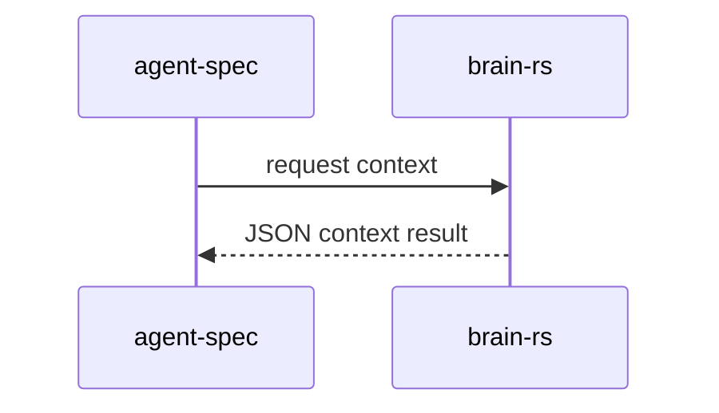

# Cross-Project Wiki Implementation Plan

> **For agentic workers:** REQUIRED SUB-SKILL: Use superpowers:subagent-driven-development (recommended) or superpowers:executing-plans to implement this plan task-by-task. Steps use checkbox (`- [ ]`) syntax for tracking.

**Goal:** Extend the code live wiki so a main project can record important dependent projects, their working mechanisms, and cross-project data flows as queryable, linted, traceable wiki knowledge.

**Architecture:** Keep `.agent-spec/wiki` as repo-local working memory, but add a first-class project-map layer beside the existing Rust package/module inventory. Cross-project facts come from maintained wiki articles under `projects/` and `flows/`; the CLI parses, validates, renders, and queries those articles deterministically. The CLI must not call an LLM, fetch remote repositories, or recursively scan external project trees unless a later explicit command adds that behavior.

**Tech Stack:** Rust 2024, existing `clap`, `serde`, `serde_json`, hand-written Markdown/frontmatter parsing in `src/spec_wiki`, existing live wiki source trace checks, Mermaid output, no new dependency, no network calls, no `serde_yaml`.

## Global Constraints

- Preserve current wiki semantics: `source_files` are repo-relative paths inside the current project and remain staleness inputs.
- Cross-project articles must use `external_sources` for paths, URLs, or repo identifiers outside the current project. `external_sources` are evidence labels and are not dereferenced by default.
- Do not validate external project files by walking outside the current repository unless the path is explicitly listed and the command is explicitly extended in a later task.
- Do not merge this with Rust `ArchitectureInventory`; the Rust inventory remains code-derived package/module metadata, while project map remains wiki-authored cross-project architecture.
- Every project id must be stable, lowercase/kebab-case, and unique within the wiki.
- Every flow must reference at least two known project ids.
- Every edge in the rendered project graph must be derived from a flow article or an explicit project relation, never inferred from prose.
- Requirements and specs referenced by a flow remain optional but, when present, resolve inside the current repository by KLL id and parseable repo-relative Task Contract path. Outside evidence uses `external_sources`.
- `wiki lint` and `wiki check` must report project-map errors as normal `WikiDiagnostic` values.
- `wiki lint` and `wiki check` must require exact `project-map.json` and `project-map.mmd` artifacts derived from the maintained articles.
- `wiki query` remains full-text search over articles; `wiki inspect-project` is the precise lookup surface for project ids and related flows.
- Generated artifacts live under `.agent-spec/wiki/architecture/`: `project-map.json` and `project-map.mmd`.
- Generated artifacts are derived output. Human-authored cross-project truth lives in `.agent-spec/wiki/projects/*.md` and `.agent-spec/wiki/flows/*.md`.
- No cloud sync, GitHub API, remote clone, or network validation belongs in this feature.

---

## Target File Structure

- Create: `knowledge/requirements/req-cross-project-wiki.md`
  - KLL requirement for cross-project wiki maps and data flows.

- Create: `specs/task-cross-project-wiki.spec.md`
  - Task Contract satisfying `REQ-CROSS-PROJECT-WIKI`.

- Create: `src/spec_wiki/project_map.rs`
  - Parses project/flow wiki articles, validates project graph references, and renders JSON/Mermaid project maps.

- Modify: `src/spec_wiki/model.rs`
  - Add serializable project-map structs if they need to be exported from the module facade.

- Modify: `src/spec_wiki/mod.rs`
  - Re-export project-map types and functions.

- Modify: `src/spec_wiki/live.rs`
  - Seed `projects/` and `flows/` directories on init.
  - Include project-map diagnostics in `lint_live_wiki` / `check_live_wiki`.
  - Link `_architecture.md` to `architecture/project-map.json` and `architecture/project-map.mmd` when present.

- Modify: `src/main.rs`
  - Add `wiki project-map` and `wiki inspect-project` subcommands.
  - Add focused tests for parser, renderer, lint integration, command parsing, and output.

- Modify: `skills/agent-spec-wiki/SKILL.md`
- Modify: `README.md`
- Modify: `AGENTS.md`
- Modify: `CHANGELOG.md`
  - Document how to author project and flow articles.

- Create: `fixtures/wiki-cross-project/`
  - Compact fixture with one main Rust project, one dependent project article, one data-flow article, and expected project-map output.

---

## Article Contracts

Project article:

```md
---
title: "brain-rs"
type: external-project
project_id: brain-rs
repo: /Users/example/Work/Projects/FW/rust-agents/brain-rs
role: "Long-term memory and context provider"
interfaces:
  - cli
  - json
protocols:
  - filesystem
  - stdio
status: active
source_files:
  - Cargo.toml
external_sources:
  - /Users/example/Work/Projects/FW/rust-agents/brain-rs/README.md
tags: [dependency, memory]
---
# brain-rs

## Responsibility

Provides durable memory/context functions consumed by the main project.
```

Flow article:

````md
---
title: "Main project to brain-rs context flow"
type: project-flow
flow_id: main-to-brain-context
projects:
  - agent-spec
  - brain-rs
kind: calls
protocols:
  - stdio
requirements:
  - REQ-CROSS-PROJECT-WIKI
specs:
  - specs/task-cross-project-wiki.spec.md
source_files:
  - src/main.rs
external_sources:
  - /Users/example/Work/Projects/FW/rust-agents/brain-rs/src/lib.rs
tags: [data-flow, memory]
---
# Main project to brain-rs context flow

## Mechanism

The main project calls the brain-rs command surface and receives structured JSON context.


````

## Task 1: Self-Hosting Requirement And Task Contract

**Files:**
- Create: `knowledge/requirements/req-cross-project-wiki.md`
- Create: `specs/task-cross-project-wiki.spec.md`

**Interfaces:**
- Consumes: Existing KLL requirement schema and Task Contract schema.
- Produces: Requirement id `REQ-CROSS-PROJECT-WIKI`; task spec satisfying that id.

- [x] **Step 1: Create the KLL requirement**

Create `knowledge/requirements/req-cross-project-wiki.md`:

```md
---
kind: requirement
id: REQ-CROSS-PROJECT-WIKI
title: "Cross-Project Wiki"
liveness: auto
tags: [wiki, architecture, data-flow, cross-project]
---

## Problem

The code live wiki records the current repository's modules, requirements,
specs, and trace evidence, but important systems often depend on other
first-class projects. Agents need a deterministic way to see those dependent
projects, the mechanism between them, and the data flow evidence without
treating external repositories as part of the current source tree.

## Requirements

[REQ-CROSS-PROJECT-WIKI-PROJECTS] The wiki MUST support maintained project articles under `.agent-spec/wiki/projects/` with stable project ids, repo labels, roles, interfaces, protocols, status, repo-local source files, and external source labels.

[REQ-CROSS-PROJECT-WIKI-FLOWS] The wiki MUST support maintained flow articles under `.agent-spec/wiki/flows/` that connect two or more project ids and record kind, protocols, requirements, specs, repo-local source files, and external source labels.

[REQ-CROSS-PROJECT-WIKI-MAP] The CLI MUST build a deterministic project-map JSON and Mermaid graph from project and flow articles.

[REQ-CROSS-PROJECT-WIKI-LINT] `wiki lint` and `wiki check` MUST report duplicate project ids, malformed project ids, unknown flow project refs, flows with fewer than two projects, and missing repo-local source files as diagnostics.

[REQ-CROSS-PROJECT-WIKI-INSPECT] The CLI MUST expose `wiki inspect-project <project-id>` to list the project article, related flows, protocols, requirements, specs, and external source labels.

[REQ-CROSS-PROJECT-WIKI-DOCS] README, AGENTS, and the agent-spec wiki skill MUST document the difference between repo-local `source_files` and non-dereferenced `external_sources`.

## Scenarios

Scenario: Project map renders external projects and flows
  Given wiki project and flow articles for `agent-spec` and `brain-rs`
  When the project map builder runs
  Then the JSON contains both projects, one flow, one derived edge, protocols, requirements, specs, and external source labels

Scenario: Project map lint rejects broken references
  Given a flow article references `missing-project`
  When live wiki lint runs
  Then diagnostics include `wiki-project-flow-unknown-project`

Scenario: Inspect project reports related flows
  Given a known project id appears in one project article and one flow article
  When `wiki inspect-project brain-rs --format json` runs
  Then the output contains the project article, related flow, protocols, requirements, specs, and external source labels

Scenario: Documentation explains source boundaries
  Given README, AGENTS, and the wiki skill
  When documentation tests inspect them
  Then they describe `source_files`, `external_sources`, project articles, flow articles, project-map JSON, Mermaid output, and no external repository scan by default
```

- [x] **Step 2: Create the Task Contract**

Create `specs/task-cross-project-wiki.spec.md`:

```md
spec: task
name: "Cross-Project Wiki"
tags: [wiki, architecture, data-flow, cross-project]
satisfies: [REQ-CROSS-PROJECT-WIKI]
depends: [task-code-live-wiki-deepening]
---

## Intent

Add deterministic cross-project wiki support so agents can inspect important
dependent projects, their mechanisms, and data flows without treating external
repositories as current-project source files.

## Decisions

- Add `src/spec_wiki/project_map.rs` for project-map parsing, validation, and rendering.
- Use `.agent-spec/wiki/projects/*.md` for project articles.
- Use `.agent-spec/wiki/flows/*.md` for cross-project mechanism/data-flow articles.
- Keep `source_files` repo-local and introduce `external_sources` as non-dereferenced labels.
- Add `wiki project-map` and `wiki inspect-project`.
- Do not add network calls, LLM calls, or external repository scans.

## Boundaries

### Allowed Changes
- src/spec_wiki/**
- src/main.rs
- README.md
- AGENTS.md
- CHANGELOG.md
- skills/agent-spec-wiki/SKILL.md
- knowledge/requirements/req-cross-project-wiki.md
- specs/task-cross-project-wiki.spec.md
- fixtures/wiki-cross-project/**

### Forbidden
- Do not add dependencies.
- Do not read external project files by default.
- Do not reinterpret `external_sources` as repo-local `source_files`.
- Do not make project map facts durable KLL truth.

## Completion Criteria

Scenario: Project map renders external projects and flows
  Test: test_project_map_builds_projects_flows_edges_and_external_sources
  Given wiki project and flow articles for `agent-spec` and `brain-rs`
  When `build_project_map` runs
  Then the map contains both projects, one flow, one edge, protocols, requirements, specs, and external source labels

Scenario: Project map lint rejects broken references
  Test: test_project_map_reports_unknown_flow_project
  Given a flow article references a project id with no project article
  When `build_project_map` runs
  Then diagnostics include `wiki-project-flow-unknown-project`

Scenario: Wiki lint includes project-map diagnostics
  Test: test_wiki_lint_reports_project_map_diagnostics
  Given a live wiki has a broken project flow
  When `lint_live_wiki` runs
  Then diagnostics include project-map diagnostics

Scenario: Wiki project-map command parses and renders
  Test: test_wiki_project_map_cli_parses_nested_subcommand
  Given CLI arguments for `wiki project-map`
  When Clap parses them
  Then the command contains code, wiki, format, out, and check fields

Scenario: Inspect project reports related flows
  Test: test_wiki_inspect_project_reports_related_flows
  Given a known project id appears in one project article and one flow article
  When `inspect_wiki_project` runs
  Then the report contains the project, related flow, protocols, requirements, specs, and external source labels

Scenario: Documentation explains cross-project wiki authoring
  Test: test_docs_describe_cross_project_wiki_authoring
  Given README, AGENTS, and the wiki skill
  When documentation tests inspect them
  Then they describe project articles, flow articles, `source_files`, `external_sources`, project-map JSON, Mermaid output, and no external repository scan by default
```

- [x] **Step 3: Verify parsing starts from a failing lifecycle**

Run:

```bash
cargo run --quiet -- lifecycle specs/task-cross-project-wiki.spec.md --code . --format json
```

Expected:

```text
The command fails or reports skipped tests because the named tests do not exist yet.
```

## Task 2: Project Map Model, Parser, And Renderer

**Files:**
- Create: `src/spec_wiki/project_map.rs`
- Modify: `src/spec_wiki/mod.rs`

**Interfaces:**
- Produces:
  - `pub fn build_project_map(root: &Path, wiki_dir: &Path) -> WikiProjectMap`
  - `pub fn render_project_map_mermaid(map: &WikiProjectMap) -> String`
  - `pub struct WikiProjectMap`
  - `pub struct WikiExternalProject`
  - `pub struct WikiProjectFlow`
  - `pub struct WikiProjectEdge`

- [x] **Step 1: Write parser and renderer tests**

Add to `src/spec_wiki/project_map.rs`:

```rust
#[cfg(test)]
#[allow(clippy::unwrap_used)]
mod tests {
    use super::*;
    use std::fs;

    fn fixture(prefix: &str) -> std::path::PathBuf {
        let dir = std::env::temp_dir().join(format!("{prefix}-{}", std::process::id()));
        let _ = fs::remove_dir_all(&dir);
        fs::create_dir_all(dir.join(".agent-spec/wiki/projects")).unwrap();
        fs::create_dir_all(dir.join(".agent-spec/wiki/flows")).unwrap();
        fs::write(dir.join("Cargo.toml"), "[package]\nname=\"agent-spec\"\nversion=\"0.1.0\"\nedition=\"2024\"\n").unwrap();
        dir
    }

    #[test]
    fn test_project_map_builds_projects_flows_edges_and_external_sources() {
        let dir = fixture("wiki-project-map");
        let wiki = dir.join(".agent-spec/wiki");
        fs::write(
            wiki.join("projects/agent-spec.md"),
            "---\ntitle: \"agent-spec\"\ntype: external-project\nproject_id: agent-spec\nrepo: .\nrole: \"main project\"\ninterfaces:\n  - cli\nprotocols:\n  - filesystem\nstatus: active\nsource_files:\n  - Cargo.toml\nexternal_sources:\n  - ./README.md\ntags:\n  - main\n---\n# agent-spec\n",
        ).unwrap();
        fs::write(
            wiki.join("projects/brain-rs.md"),
            "---\ntitle: \"brain-rs\"\ntype: external-project\nproject_id: brain-rs\nrepo: /Users/example/brain-rs\nrole: \"context provider\"\ninterfaces:\n  - cli\nprotocols:\n  - stdio\nstatus: active\nsource_files:\n  - Cargo.toml\nexternal_sources:\n  - /Users/example/brain-rs/README.md\ntags:\n  - dependency\n---\n# brain-rs\n",
        ).unwrap();
        fs::write(
            wiki.join("flows/main-to-brain.md"),
            "---\ntitle: \"Main to brain-rs context flow\"\ntype: project-flow\nflow_id: main-to-brain\nprojects:\n  - agent-spec\n  - brain-rs\nkind: calls\nprotocols:\n  - stdio\nrequirements:\n  - REQ-CROSS-PROJECT-WIKI\nspecs:\n  - specs/task-cross-project-wiki.spec.md\nsource_files:\n  - Cargo.toml\nexternal_sources:\n  - /Users/example/brain-rs/src/lib.rs\ntags:\n  - data-flow\n---\n# Main to brain-rs context flow\n",
        ).unwrap();

        let map = build_project_map(&dir, &wiki);

        assert_eq!(map.projects.len(), 2);
        assert_eq!(map.flows.len(), 1);
        assert_eq!(map.edges.len(), 1);
        assert!(map.projects.iter().any(|project| project.id == "brain-rs"));
        assert_eq!(map.edges[0].from, "agent-spec");
        assert_eq!(map.edges[0].to, "brain-rs");
        assert_eq!(map.edges[0].kind, "calls");
        assert!(map.flows[0].external_sources.contains(&"/Users/example/brain-rs/src/lib.rs".to_string()));
        assert!(map.diagnostics.is_empty(), "{:?}", map.diagnostics);

        let mermaid = render_project_map_mermaid(&map);
        assert!(mermaid.contains("agent-spec"));
        assert!(mermaid.contains("brain-rs"));
        assert!(mermaid.contains("calls"));

        let _ = fs::remove_dir_all(dir);
    }

    #[test]
    fn test_project_map_reports_unknown_flow_project() {
        let dir = fixture("wiki-project-map-broken");
        let wiki = dir.join(".agent-spec/wiki");
        fs::write(
            wiki.join("projects/agent-spec.md"),
            "---\ntitle: \"agent-spec\"\ntype: external-project\nproject_id: agent-spec\nrepo: .\nrole: \"main project\"\ninterfaces:\n  - cli\nprotocols:\n  - filesystem\nstatus: active\nsource_files:\n  - Cargo.toml\n---\n# agent-spec\n",
        ).unwrap();
        fs::write(
            wiki.join("flows/broken.md"),
            "---\ntitle: \"Broken\"\ntype: project-flow\nflow_id: broken\nprojects:\n  - agent-spec\n  - missing-project\nkind: calls\nprotocols:\n  - stdio\nsource_files:\n  - Cargo.toml\n---\n# Broken\n",
        ).unwrap();

        let map = build_project_map(&dir, &wiki);

        assert!(map.diagnostics.iter().any(|diagnostic| diagnostic.code == "wiki-project-flow-unknown-project"));
        let _ = fs::remove_dir_all(dir);
    }
}
```

- [x] **Step 2: Run tests to verify they fail**

Run:

```bash
cargo test project_map --quiet
```

Expected:

```text
Compilation fails because src/spec_wiki/project_map.rs and its public types/functions do not exist.
```

- [x] **Step 3: Implement project-map structs and parser**

Create `src/spec_wiki/project_map.rs` with:

```rust
use crate::spec_wiki::WikiDiagnostic;
use serde::{Deserialize, Serialize};
use std::collections::{BTreeMap, BTreeSet};
use std::path::{Path, PathBuf};

#[derive(Debug, Clone, Serialize, Deserialize, PartialEq, Eq)]
pub struct WikiProjectMap {
    pub version: u32,
    pub projects: Vec<WikiExternalProject>,
    pub flows: Vec<WikiProjectFlow>,
    pub edges: Vec<WikiProjectEdge>,
    pub diagnostics: Vec<WikiDiagnostic>,
}

#[derive(Debug, Clone, Serialize, Deserialize, PartialEq, Eq)]
pub struct WikiExternalProject {
    pub id: String,
    pub title: String,
    pub repo: String,
    pub role: String,
    pub interfaces: Vec<String>,
    pub protocols: Vec<String>,
    pub status: String,
    pub source_files: Vec<PathBuf>,
    pub external_sources: Vec<String>,
    pub path: PathBuf,
}

#[derive(Debug, Clone, Serialize, Deserialize, PartialEq, Eq)]
pub struct WikiProjectFlow {
    pub id: String,
    pub title: String,
    pub projects: Vec<String>,
    pub kind: String,
    pub protocols: Vec<String>,
    pub requirements: Vec<String>,
    pub specs: Vec<PathBuf>,
    pub source_files: Vec<PathBuf>,
    pub external_sources: Vec<String>,
    pub path: PathBuf,
}

#[derive(Debug, Clone, Serialize, Deserialize, PartialEq, Eq)]
pub struct WikiProjectEdge {
    pub from: String,
    pub to: String,
    pub kind: String,
    pub flow_id: String,
    pub protocols: Vec<String>,
}

pub fn build_project_map(root: &Path, wiki_dir: &Path) -> WikiProjectMap {
    let mut diagnostics = Vec::new();
    let mut projects = read_project_articles(root, wiki_dir, &mut diagnostics);
    let mut flows = read_flow_articles(root, wiki_dir, &mut diagnostics);

    projects.sort_by(|left, right| left.id.cmp(&right.id).then(left.path.cmp(&right.path)));
    flows.sort_by(|left, right| left.id.cmp(&right.id).then(left.path.cmp(&right.path)));

    validate_project_map(root, &projects, &flows, &mut diagnostics);
    let edges = derive_edges(&flows);

    diagnostics.sort_by(|left, right| {
        left.path
            .cmp(&right.path)
            .then(left.code.cmp(&right.code))
            .then(left.message.cmp(&right.message))
    });

    WikiProjectMap {
        version: 1,
        projects,
        flows,
        edges,
        diagnostics,
    }
}

fn read_project_articles(
    root: &Path,
    wiki_dir: &Path,
    diagnostics: &mut Vec<WikiDiagnostic>,
) -> Vec<WikiExternalProject> {
    read_markdown_articles(&wiki_dir.join("projects"))
        .into_iter()
        .filter_map(|path| parse_project_article(root, wiki_dir, &path, diagnostics))
        .collect()
}

fn read_flow_articles(
    root: &Path,
    wiki_dir: &Path,
    diagnostics: &mut Vec<WikiDiagnostic>,
) -> Vec<WikiProjectFlow> {
    read_markdown_articles(&wiki_dir.join("flows"))
        .into_iter()
        .filter_map(|path| parse_flow_article(root, wiki_dir, &path, diagnostics))
        .collect()
}
```

Implement helper functions in the same file:

```rust
fn read_markdown_articles(dir: &Path) -> Vec<PathBuf> {
    let Ok(entries) = std::fs::read_dir(dir) else {
        return Vec::new();
    };
    let mut out = entries
        .flatten()
        .map(|entry| entry.path())
        .filter(|path| path.extension().and_then(|ext| ext.to_str()) == Some("md"))
        .collect::<Vec<_>>();
    out.sort();
    out
}

fn parse_frontmatter(content: &str) -> BTreeMap<String, Vec<String>> {
    let mut map = BTreeMap::<String, Vec<String>>::new();
    let mut lines = content.lines();
    if lines.next() != Some("---") {
        return map;
    }
    let mut current_key = String::new();
    for line in lines {
        if line.trim() == "---" {
            break;
        }
        let trimmed = line.trim();
        if let Some(value) = trimmed.strip_prefix("- ") {
            if !current_key.is_empty() {
                map.entry(current_key.clone())
                    .or_default()
                    .push(unquote(value.trim()));
            }
            continue;
        }
        if let Some((key, value)) = trimmed.split_once(':') {
            current_key = key.trim().to_string();
            let value = value.trim();
            map.entry(current_key.clone()).or_default();
            if !value.is_empty() {
                map.entry(current_key.clone()).or_default().push(unquote(value));
            }
        }
    }
    map
}

fn one(map: &BTreeMap<String, Vec<String>>, key: &str) -> String {
    map.get(key)
        .and_then(|values| values.first())
        .cloned()
        .unwrap_or_default()
}

fn many(map: &BTreeMap<String, Vec<String>>, key: &str) -> Vec<String> {
    map.get(key).cloned().unwrap_or_default()
}

fn unquote(value: &str) -> String {
    value.trim().trim_matches('"').to_string()
}

fn rel_path(base: &Path, path: &Path) -> PathBuf {
    path.strip_prefix(base).unwrap_or(path).to_path_buf()
}

fn paths(values: Vec<String>) -> Vec<PathBuf> {
    values.into_iter().map(PathBuf::from).collect()
}
```

Implement parse/validate/render functions:

```rust
fn parse_project_article(
    root: &Path,
    wiki_dir: &Path,
    path: &Path,
    diagnostics: &mut Vec<WikiDiagnostic>,
) -> Option<WikiExternalProject> {
    let content = std::fs::read_to_string(path).ok()?;
    let fm = parse_frontmatter(&content);
    if one(&fm, "type") != "external-project" {
        return None;
    }
    let rel = rel_path(wiki_dir, path);
    let id = one(&fm, "project_id");
    if id.is_empty() {
        diagnostics.push(diag("wiki-project-id-missing", &rel, "project article is missing project_id"));
        return None;
    }
    Some(WikiExternalProject {
        id,
        title: one(&fm, "title"),
        repo: one(&fm, "repo"),
        role: one(&fm, "role"),
        interfaces: many(&fm, "interfaces"),
        protocols: many(&fm, "protocols"),
        status: one(&fm, "status"),
        source_files: paths(many(&fm, "source_files")),
        external_sources: many(&fm, "external_sources"),
        path: rel,
    })
}

fn parse_flow_article(
    root: &Path,
    wiki_dir: &Path,
    path: &Path,
    diagnostics: &mut Vec<WikiDiagnostic>,
) -> Option<WikiProjectFlow> {
    let content = std::fs::read_to_string(path).ok()?;
    let fm = parse_frontmatter(&content);
    if one(&fm, "type") != "project-flow" {
        return None;
    }
    let rel = rel_path(wiki_dir, path);
    let id = one(&fm, "flow_id");
    if id.is_empty() {
        diagnostics.push(diag("wiki-project-flow-id-missing", &rel, "flow article is missing flow_id"));
        return None;
    }
    Some(WikiProjectFlow {
        id,
        title: one(&fm, "title"),
        projects: many(&fm, "projects"),
        kind: one(&fm, "kind"),
        protocols: many(&fm, "protocols"),
        requirements: many(&fm, "requirements"),
        specs: paths(many(&fm, "specs")),
        source_files: paths(many(&fm, "source_files")),
        external_sources: many(&fm, "external_sources"),
        path: rel,
    })
}
```

Validation rules:

```rust
fn validate_project_map(
    root: &Path,
    projects: &[WikiExternalProject],
    flows: &[WikiProjectFlow],
    diagnostics: &mut Vec<WikiDiagnostic>,
) {
    let mut ids = BTreeMap::<String, PathBuf>::new();
    for project in projects {
        if !valid_project_id(&project.id) {
            diagnostics.push(diag("wiki-project-id-invalid", &project.path, "project_id must be lowercase kebab-case"));
        }
        if let Some(existing) = ids.insert(project.id.clone(), project.path.clone()) {
            diagnostics.push(diag("wiki-project-id-duplicate", &project.path, "project_id duplicates another project article"));
            diagnostics.push(diag("wiki-project-id-duplicate", &existing, "project_id duplicates another project article"));
        }
        validate_repo_local_sources(root, &project.path, &project.source_files, diagnostics);
    }
    let known = ids.keys().cloned().collect::<BTreeSet<_>>();
    for flow in flows {
        if flow.projects.len() < 2 {
            diagnostics.push(diag("wiki-project-flow-too-small", &flow.path, "project-flow must reference at least two projects"));
        }
        for project in &flow.projects {
            if !known.contains(project) {
                diagnostics.push(diag("wiki-project-flow-unknown-project", &flow.path, "project-flow references an unknown project id"));
            }
        }
        validate_repo_local_sources(root, &flow.path, &flow.source_files, diagnostics);
    }
}

fn valid_project_id(id: &str) -> bool {
    !id.is_empty()
        && id
            .chars()
            .all(|ch| ch.is_ascii_lowercase() || ch.is_ascii_digit() || ch == '-')
        && !id.starts_with('-')
        && !id.ends_with('-')
}

fn validate_repo_local_sources(
    root: &Path,
    article_path: &Path,
    source_files: &[PathBuf],
    diagnostics: &mut Vec<WikiDiagnostic>,
) {
    for source in source_files {
        if source.is_absolute() || source.components().any(|c| matches!(c, std::path::Component::ParentDir)) {
            diagnostics.push(diag("wiki-project-source-outside-root", article_path, "source_files must be repo-relative"));
            continue;
        }
        if !root.join(source).exists() {
            diagnostics.push(diag("wiki-project-source-missing", article_path, "source_files entry does not exist"));
        }
    }
}

fn derive_edges(flows: &[WikiProjectFlow]) -> Vec<WikiProjectEdge> {
    let mut out = Vec::new();
    for flow in flows {
        for pair in flow.projects.windows(2) {
            out.push(WikiProjectEdge {
                from: pair[0].clone(),
                to: pair[1].clone(),
                kind: if flow.kind.is_empty() { "depends_on".into() } else { flow.kind.clone() },
                flow_id: flow.id.clone(),
                protocols: flow.protocols.clone(),
            });
        }
    }
    out.sort_by(|left, right| left.from.cmp(&right.from).then(left.to.cmp(&right.to)).then(left.flow_id.cmp(&right.flow_id)));
    out
}

fn diag(code: &str, path: &Path, message: &str) -> WikiDiagnostic {
    WikiDiagnostic {
        code: code.into(),
        severity: "error".into(),
        path: Some(path.to_path_buf()),
        message: message.into(),
    }
}
```

Mermaid renderer:

```rust
pub fn render_project_map_mermaid(map: &WikiProjectMap) -> String {
    let mut out = String::from("flowchart LR\n");
    for project in &map.projects {
        out.push_str(&format!("  {}[\"{}\"]\n", mermaid_id(&project.id), project.id));
    }
    for edge in &map.edges {
        out.push_str(&format!(
            "  {} -->|{}| {}\n",
            mermaid_id(&edge.from),
            edge.kind,
            mermaid_id(&edge.to)
        ));
    }
    if map.projects.is_empty() {
        out.push_str("  none[\"No project articles\"]\n");
    }
    out
}

fn mermaid_id(value: &str) -> String {
    value
        .chars()
        .map(|ch| if ch.is_ascii_alphanumeric() { ch } else { '_' })
        .collect()
}
```

- [x] **Step 4: Export module**

Modify `src/spec_wiki/mod.rs`:

```rust
pub mod project_map;

pub use project_map::{
    build_project_map, render_project_map_mermaid, WikiExternalProject, WikiProjectEdge,
    WikiProjectFlow, WikiProjectMap,
};
```

- [x] **Step 5: Run tests**

Run:

```bash
cargo test project_map --quiet
```

Expected:

```text
project_map tests pass.
```

## Task 3: Live Wiki Lint, Init, And Architecture Artifacts

**Files:**
- Modify: `src/spec_wiki/live.rs`
- Modify: `src/main.rs`

**Interfaces:**
- Consumes: `build_project_map(root, wiki_dir) -> WikiProjectMap`
- Produces:
  - project-map diagnostics included in `lint_live_wiki`
  - init creates `projects/` and `flows/`
  - `write_project_map_artifacts(root, wiki_dir) -> Result<Vec<PathBuf>, Box<dyn std::error::Error>>`

- [x] **Step 1: Write lint integration test**

Add to `src/main.rs` tests:

```rust
#[test]
fn test_wiki_lint_reports_project_map_diagnostics() {
    let dir = make_temp_dir("wiki-project-map-lint");
    let wiki = dir.join(".agent-spec/wiki");
    fs::create_dir_all(wiki.join("projects")).unwrap();
    fs::create_dir_all(wiki.join("flows")).unwrap();
    fs::write(dir.join("Cargo.toml"), "[package]\nname=\"main\"\nversion=\"0.1.0\"\nedition=\"2024\"\n").unwrap();
    fs::write(
        wiki.join("_index.md"),
        "# Code Live Wiki\n\n",
    ).unwrap();
    fs::write(
        wiki.join("projects/main.md"),
        "---\ntitle: \"main\"\ntype: external-project\nproject_id: main\nrepo: .\nrole: \"main\"\ninterfaces:\n  - cli\nprotocols:\n  - filesystem\nstatus: active\nsource_files:\n  - Cargo.toml\n---\n# main\n",
    ).unwrap();
    fs::write(
        wiki.join("flows/broken.md"),
        "---\ntitle: \"Broken\"\ntype: project-flow\nflow_id: broken\nprojects:\n  - main\n  - missing\nkind: calls\nprotocols:\n  - stdio\nsource_files:\n  - Cargo.toml\n---\n# Broken\n",
    ).unwrap();

    let report = crate::spec_wiki::lint_live_wiki(&dir, &wiki);

    assert!(report
        .diagnostics
        .iter()
        .any(|diagnostic| diagnostic.code == "wiki-project-flow-unknown-project"));

    let _ = fs::remove_dir_all(dir);
}
```

- [x] **Step 2: Run test to verify it fails**

Run:

```bash
cargo test wiki_lint_reports_project_map_diagnostics --quiet
```

Expected:

```text
The test fails because lint_live_wiki does not include project-map diagnostics.
```

- [x] **Step 3: Add directories and diagnostics to live wiki**

Modify `init_live_wiki` directory list in `src/spec_wiki/live.rs`:

```rust
for dir in [
    "architecture",
    "modules",
    "concepts",
    "decisions",
    "learnings",
    "queries",
    "projects",
    "flows",
] {
    std::fs::create_dir_all(wiki_dir.join(dir))?;
}
```

In `lint_live_wiki`, after article linting:

```rust
let project_map = crate::spec_wiki::build_project_map(root, wiki_dir);
diagnostics.extend(project_map.diagnostics);
```

Add helper:

```rust
pub fn write_project_map_artifacts(
    root: &Path,
    wiki_dir: &Path,
) -> Result<Vec<PathBuf>, Box<dyn std::error::Error>> {
    let map = crate::spec_wiki::build_project_map(root, wiki_dir);
    let mut files = Vec::new();
    std::fs::create_dir_all(wiki_dir.join("architecture"))?;
    let json_path = PathBuf::from("architecture/project-map.json");
    let mermaid_path = PathBuf::from("architecture/project-map.mmd");
    std::fs::write(
        wiki_dir.join(&json_path),
        serde_json::to_string_pretty(&map)?,
    )?;
    std::fs::write(
        wiki_dir.join(&mermaid_path),
        crate::spec_wiki::render_project_map_mermaid(&map),
    )?;
    files.push(json_path);
    files.push(mermaid_path);
    Ok(files)
}
```

Update architecture article body to mention the project map:

```rust
"- Project map data: [architecture/project-map.json](architecture/project-map.json)\n- Project map diagram: [architecture/project-map.mmd](architecture/project-map.mmd)\n"
```

- [x] **Step 4: Export helper**

Modify `src/spec_wiki/mod.rs`:

```rust
pub use live::{
    write_project_map_artifacts,
};
```

- [x] **Step 5: Run tests**

Run:

```bash
cargo test wiki_lint_reports_project_map_diagnostics --quiet
cargo test wiki_live_init --quiet
```

Expected:

```text
Project-map lint integration passes and existing live wiki init tests pass.
```

## Task 4: CLI Commands

**Files:**
- Modify: `src/main.rs`
- Modify: `src/spec_wiki/project_map.rs`

**Interfaces:**
- Produces:
  - `wiki project-map [--code .] [--wiki .agent-spec/wiki] [--format json|mermaid] [--out <path> [--check]]`
  - `wiki inspect-project <project-id> [--code .] [--wiki .agent-spec/wiki] [--format text|json]`
  - `inspect_wiki_project(root: &Path, wiki_dir: &Path, project_id: &str) -> WikiProjectInspectReport`

- [x] **Step 1: Add CLI parsing tests**

Add to `src/main.rs` tests:

```rust
#[test]
fn test_wiki_project_map_cli_parses_nested_subcommand() {
    let cli = super::Cli::parse_from([
        "agent-spec",
        "wiki",
        "project-map",
        "--code",
        ".",
        "--wiki",
        ".agent-spec/wiki",
        "--format",
        "json",
        "--out",
        ".agent-spec/wiki/architecture/project-map.json",
        "--check",
    ]);

    match cli.command {
        super::Commands::Wiki {
            action: super::WikiCommands::ProjectMap {
                code,
                wiki,
                format,
                out,
                check,
            },
        } => {
            assert_eq!(code, PathBuf::from("."));
            assert_eq!(wiki, PathBuf::from(".agent-spec/wiki"));
            assert_eq!(format, "json");
            assert_eq!(out, Some(PathBuf::from(".agent-spec/wiki/architecture/project-map.json")));
            assert!(check);
        }
        _ => panic!("expected wiki project-map command"),
    }
}

#[test]
fn test_wiki_inspect_project_cli_parses_nested_subcommand() {
    let cli = super::Cli::parse_from([
        "agent-spec",
        "wiki",
        "inspect-project",
        "brain-rs",
        "--code",
        "fixtures/wiki-cross-project",
        "--wiki",
        ".agent-spec/wiki",
        "--format",
        "json",
    ]);

    match cli.command {
        super::Commands::Wiki {
            action: super::WikiCommands::InspectProject {
                project_id,
                code,
                wiki,
                format,
            },
        } => {
            assert_eq!(project_id, "brain-rs");
            assert_eq!(code, PathBuf::from("fixtures/wiki-cross-project"));
            assert_eq!(wiki, PathBuf::from(".agent-spec/wiki"));
            assert_eq!(format, "json");
        }
        _ => panic!("expected wiki inspect-project command"),
    }
}
```

- [x] **Step 2: Run tests to verify they fail**

Run:

```bash
cargo test wiki_project_map_cli --quiet
cargo test wiki_inspect_project_cli --quiet
```

Expected:

```text
Both tests fail because the subcommands do not exist.
```

- [x] **Step 3: Add subcommands**

Modify `enum WikiCommands` in `src/main.rs`:

```rust
/// Build or check the cross-project wiki map.
ProjectMap {
    #[arg(long, default_value = ".")]
    code: PathBuf,
    #[arg(long, default_value = ".agent-spec/wiki")]
    wiki: PathBuf,
    #[arg(long, default_value = "json")]
    format: String,
    #[arg(long)]
    out: Option<PathBuf>,
    #[arg(long, requires = "out")]
    check: bool,
},
/// Inspect a project id and show related project-map flows.
InspectProject {
    project_id: String,
    #[arg(long, default_value = ".")]
    code: PathBuf,
    #[arg(long, default_value = ".agent-spec/wiki")]
    wiki: PathBuf,
    #[arg(long, default_value = "text")]
    format: String,
},
```

Add match arms in `cmd_wiki` dispatch:

```rust
WikiCommands::ProjectMap {
    code,
    wiki,
    format,
    out,
    check,
} => cmd_wiki_project_map(&code, &wiki, &format, out.as_deref(), check),
WikiCommands::InspectProject {
    project_id,
    code,
    wiki,
    format,
} => cmd_wiki_inspect_project(&project_id, &code, &wiki, &format),
```

- [x] **Step 4: Implement command functions**

Add:

```rust
fn cmd_wiki_project_map(
    code: &Path,
    wiki: &Path,
    format: &str,
    out: Option<&Path>,
    check: bool,
) -> Result<(), Box<dyn std::error::Error>> {
    let map = crate::spec_wiki::build_project_map(code, wiki);
    let rendered = match format {
        "mermaid" => crate::spec_wiki::render_project_map_mermaid(&map),
        _ => serde_json::to_string_pretty(&map)?,
    };
    if let Some(out_path) = out {
        if check {
            let actual = std::fs::read_to_string(out_path).unwrap_or_default();
            if actual != rendered {
                return Err(format!("project map drifted: {}", out_path.display()).into());
            }
            return Ok(());
        }
        if let Some(parent) = out_path.parent() {
            std::fs::create_dir_all(parent)?;
        }
        std::fs::write(out_path, rendered)?;
        return Ok(());
    }
    print!("{rendered}");
    Ok(())
}

fn cmd_wiki_inspect_project(
    project_id: &str,
    code: &Path,
    wiki: &Path,
    format: &str,
) -> Result<(), Box<dyn std::error::Error>> {
    let report = crate::spec_wiki::inspect_wiki_project(code, wiki, project_id);
    match format {
        "json" => println!("{}", serde_json::to_string_pretty(&report)?),
        _ => {
            println!("wiki inspect-project: {}", report.project_id);
            if let Some(project) = &report.project {
                println!("  project {} ({})", project.id, project.path.display());
                println!("  repo {}", project.repo);
            }
            for flow in &report.flows {
                println!("  flow {} ({})", flow.id, flow.path.display());
                println!("    projects: {}", flow.projects.join(", "));
                println!("    protocols: {}", flow.protocols.join(", "));
            }
            print_wiki_diagnostics_text("wiki inspect-project", &report.diagnostics);
        }
    }
    Ok(())
}
```

- [x] **Step 5: Add inspect report and function**

In `src/spec_wiki/project_map.rs`:

```rust
#[derive(Debug, Clone, Serialize, Deserialize, PartialEq, Eq)]
pub struct WikiProjectInspectReport {
    pub project_id: String,
    pub project: Option<WikiExternalProject>,
    pub flows: Vec<WikiProjectFlow>,
    pub diagnostics: Vec<WikiDiagnostic>,
}

pub fn inspect_wiki_project(
    root: &Path,
    wiki_dir: &Path,
    project_id: &str,
) -> WikiProjectInspectReport {
    let map = build_project_map(root, wiki_dir);
    let project_id = project_id.to_ascii_lowercase();
    let project = map
        .projects
        .iter()
        .find(|project| project.id == project_id)
        .cloned();
    let flows = map
        .flows
        .iter()
        .filter(|flow| flow.projects.iter().any(|project| project == &project_id))
        .cloned()
        .collect::<Vec<_>>();
    let mut diagnostics = map.diagnostics;
    if project.is_none() {
        diagnostics.push(WikiDiagnostic {
            code: "wiki-project-not-found".into(),
            severity: "error".into(),
            path: None,
            message: format!("project id not found: {project_id}"),
        });
    }
    WikiProjectInspectReport {
        project_id,
        project,
        flows,
        diagnostics,
    }
}
```

Export the inspect report/function from `src/spec_wiki/mod.rs`.

- [x] **Step 6: Run tests**

Run:

```bash
cargo test wiki_project_map_cli --quiet
cargo test wiki_inspect_project_cli --quiet
cargo test project_map --quiet
```

Expected:

```text
All command parsing and project-map tests pass.
```

## Task 5: Fixture And Documentation

**Files:**
- Create: `fixtures/wiki-cross-project/Cargo.toml`
- Create: `fixtures/wiki-cross-project/.agent-spec/wiki/projects/agent-spec.md`
- Create: `fixtures/wiki-cross-project/.agent-spec/wiki/projects/brain-rs.md`
- Create: `fixtures/wiki-cross-project/.agent-spec/wiki/flows/main-to-brain.md`
- Modify: `README.md`
- Modify: `AGENTS.md`
- Modify: `skills/agent-spec-wiki/SKILL.md`
- Modify: `CHANGELOG.md`
- Modify: `src/main.rs`

**Interfaces:**
- Consumes: `build_project_map`, `inspect_wiki_project`
- Produces: documented user workflow and fixture-backed tests.

- [x] **Step 1: Add fixture**

Create `fixtures/wiki-cross-project/Cargo.toml`:

```toml
[package]
name = "wiki-cross-project-fixture"
version = "0.1.0"
edition = "2024"
```

Create `fixtures/wiki-cross-project/.agent-spec/wiki/projects/agent-spec.md`:

```md
---
title: "agent-spec"
type: external-project
project_id: agent-spec
repo: .
role: "main project"
interfaces:
  - cli
protocols:
  - filesystem
status: active
source_files:
  - Cargo.toml
external_sources:
  - ./README.md
tags: [main]
---
# agent-spec

## Responsibility

Owns requirements compilation, specs, lifecycle, and wiki checks.
```

Create `fixtures/wiki-cross-project/.agent-spec/wiki/projects/brain-rs.md`:

```md
---
title: "brain-rs"
type: external-project
project_id: brain-rs
repo: /Users/example/brain-rs
role: "context provider"
interfaces:
  - cli
protocols:
  - stdio
status: active
source_files:
  - Cargo.toml
external_sources:
  - /Users/example/brain-rs/README.md
tags: [dependency, memory]
---
# brain-rs

## Responsibility

Provides context data consumed by the main project.
```

Create `fixtures/wiki-cross-project/.agent-spec/wiki/flows/main-to-brain.md`:

```md
---
title: "Main to brain-rs context flow"
type: project-flow
flow_id: main-to-brain
projects:
  - agent-spec
  - brain-rs
kind: calls
protocols:
  - stdio
requirements:
  - REQ-CROSS-PROJECT-WIKI
specs:
  - specs/task-cross-project-wiki.spec.md
source_files:
  - Cargo.toml
external_sources:
  - /Users/example/brain-rs/src/lib.rs
tags: [data-flow, memory]
---
# Main to brain-rs context flow

## Mechanism

The main project calls brain-rs over stdio and receives structured context data.
```

- [x] **Step 2: Add fixture documentation test**

Add to `src/main.rs` tests:

```rust
#[test]
fn test_cross_project_wiki_fixture_builds_project_map() {
    let root = repo_root().join("fixtures/wiki-cross-project");
    let wiki = root.join(".agent-spec/wiki");

    let map = crate::spec_wiki::build_project_map(&root, &wiki);

    assert!(map.projects.iter().any(|project| project.id == "agent-spec"));
    assert!(map.projects.iter().any(|project| project.id == "brain-rs"));
    assert!(map.edges.iter().any(|edge| edge.from == "agent-spec" && edge.to == "brain-rs"));
    assert!(map.diagnostics.is_empty(), "{:?}", map.diagnostics);
}

#[test]
fn test_docs_describe_cross_project_wiki_authoring() {
    let readme = include_str!("../README.md");
    let agents = include_str!("../AGENTS.md");
    let skill = include_str!("../skills/agent-spec-wiki/SKILL.md");

    for content in [readme, agents, skill] {
        for term in [
            "project articles",
            "flow articles",
            "source_files",
            "external_sources",
            "project-map JSON",
            "Mermaid",
            "no external repository scan by default",
        ] {
            assert!(content.contains(term), "missing cross-project wiki term {term}");
        }
    }
}
```

- [x] **Step 3: Run tests to verify docs fail before updates**

Run:

```bash
cargo test cross_project_wiki_fixture --quiet
cargo test docs_describe_cross_project_wiki_authoring --quiet
```

Expected:

```text
The fixture test passes after parser implementation; the docs test fails until README, AGENTS, and skill text are updated.
```

- [x] **Step 4: Update README and AGENTS**

Add this section to both `README.md` and `AGENTS.md` under the code live wiki section:

````md
### Cross-Project Wiki

Use project articles when the main repository depends on another important
project. Project articles live under `.agent-spec/wiki/projects/*.md` and use
stable `project_id` values. Use flow articles under `.agent-spec/wiki/flows/*.md`
to document working mechanisms and data flow between projects.

`source_files` stay repo-local and participate in stale article checks.
`external_sources` record outside project paths, URLs, or repo identifiers as
evidence labels; agent-spec performs no external repository scan by default.

Run:

```bash
agent-spec wiki project-map --code . --wiki .agent-spec/wiki --format json --out .agent-spec/wiki/architecture/project-map.json
agent-spec wiki project-map --code . --wiki .agent-spec/wiki --format mermaid --out .agent-spec/wiki/architecture/project-map.mmd
agent-spec wiki inspect-project brain-rs --code . --wiki .agent-spec/wiki --format text
```

The project-map JSON and Mermaid output are derived artifacts. The maintained
truth remains the project articles and flow articles.
````

- [x] **Step 5: Update the wiki skill**

Add to `skills/agent-spec-wiki/SKILL.md`:

````md
## Cross-Project Wiki

Use project articles for important dependent projects and flow articles for
working mechanisms or data flow between projects.

- Project articles: `.agent-spec/wiki/projects/*.md`
- Flow articles: `.agent-spec/wiki/flows/*.md`
- `source_files`: repo-local files that drive stale checks
- `external_sources`: outside paths, URLs, or repo ids recorded as evidence
  labels; agent-spec performs no external repository scan by default

After editing project or flow articles, run:

```bash
agent-spec wiki project-map --code . --wiki .agent-spec/wiki --format json --out .agent-spec/wiki/architecture/project-map.json
agent-spec wiki project-map --code . --wiki .agent-spec/wiki --format mermaid --out .agent-spec/wiki/architecture/project-map.mmd
agent-spec wiki index --wiki .agent-spec/wiki
agent-spec wiki check --code . --wiki .agent-spec/wiki
```
````

- [x] **Step 6: Run docs tests**

Run:

```bash
cargo test cross_project_wiki_fixture --quiet
cargo test docs_describe_cross_project_wiki_authoring --quiet
```

Expected:

```text
Both tests pass.
```

## Task 6: Final Verification

**Files:**
- All files changed in Tasks 1-5.

**Interfaces:**
- Consumes: completed project-map implementation and docs.
- Produces: verified branch state.

- [x] **Step 1: Run formatting**

Run:

```bash
cargo fmt --check
```

Expected:

```text
No formatting diff.
```

- [x] **Step 2: Run focused tests**

Run:

```bash
cargo test project_map --quiet
cargo test wiki_project_map_cli --quiet
cargo test wiki_inspect_project --quiet
cargo test cross_project_wiki_fixture --quiet
cargo test docs_describe_cross_project_wiki_authoring --quiet
```

Expected:

```text
All focused tests pass.
```

- [x] **Step 3: Run full Rust test suite**

Run:

```bash
cargo test --quiet
```

Expected:

```text
All tests pass.
```

- [x] **Step 4: Run clippy**

Run:

```bash
cargo clippy --all-targets -- -D warnings
```

Expected:

```text
Clippy exits successfully with no warnings.
```

- [x] **Step 5: Run KLL and plan gates**

Run:

```bash
cargo run --quiet -- lint-knowledge --knowledge knowledge --gate
cargo run --quiet -- requirements plan --knowledge knowledge --specs specs --format json --gate
```

Expected:

```text
lint-knowledge exits successfully with no Error diagnostics.
requirements plan exits successfully with no gate-blocking diagnostics.
```

- [x] **Step 6: Run lifecycle for the new task spec**

Run:

```bash
cargo run --quiet -- lifecycle specs/task-cross-project-wiki.spec.md --code . --format json
```

Expected:

```text
The lifecycle output has "passed": true and every scenario verdict is pass.
```

- [x] **Step 7: Run docs lint**

Run:

```bash
bash scripts/docs-lint.sh
```

Expected:

```text
Built-in Chinese docs lint passes. If Harper, markdownlint-cli2, or lychee are not installed locally, the script warns and continues.
```

- [x] **Step 8: Check whitespace**

Run:

```bash
git diff --check
```

Expected:

```text
No whitespace errors.
```

## Self-Review Notes

- Spec coverage: The plan covers KLL requirement, task spec, project and flow article contracts, deterministic project-map JSON/Mermaid, lint/check integration, CLI commands, inspect-project, fixture, docs, and final verification.
- Unresolved-token scan: The plan contains no empty fill-ins and no model/network behavior in the CLI.
- Type consistency: Public names are stable across tasks: `WikiProjectMap`, `WikiExternalProject`, `WikiProjectFlow`, `WikiProjectEdge`, `build_project_map`, `render_project_map_mermaid`, and `inspect_wiki_project`.

## Post-Implementation Hardening

The completion review tightened the executable contract beyond the initial
task sketches above:

- `inspect_wiki_project` and `wiki inspect-project` use an explicit code root.
- `project-map --check` requires `--out` and rejects maps with error diagnostics.
- Flow ids are validated and unique; flow members must contain two distinct
  known project ids.
- Flow requirement ids and spec paths resolve inside the current repository;
  specs must be task-level Task Contracts and outside evidence remains opaque
  under `external_sources`.
- Repo-relative paths are canonical-boundary checked, all JSON paths (including
  diagnostics) are slash normalized, and Mermaid labels are escaped.
- Project/flow directory enumeration errors are diagnostics; maintained
  project/flow articles are regular files and symlinks are rejected.
- Project/flow fields are required and non-empty; malformed lines, duplicate
  keys, and incomplete articles are rejected before graph derivation.
- `wiki init --check` validates the target's maintained directories before
  creating its temporary comparison wiki.
- `wiki lint` and `wiki check` compare both derived project-map artifacts
  exactly, while `wiki init --check` preserves maintained project/flow inputs
  and rejects their diagnostics.
- The repository dogfoods the feature with maintained `agent-spec`, `codewiki`,
  and `symposium` articles plus two evidence-backed flows.
- The Task Contract now binds 20 scenarios covering these behaviors, including
  cross-CWD inspection, artifact drift, invalid references, directory failures,
  complete article schemas, real repository relationships, malformed article
  identity, and CLI check failures.

## Execution Handoff

Plan complete and saved to `docs/superpowers/plans/2026-07-09-cross-project-wiki.md`.

Two execution options:

1. **Subagent-Driven (recommended)** - dispatch a fresh subagent per task, review between tasks, fast iteration.
2. **Inline Execution** - execute tasks in this session using executing-plans, batch execution with checkpoints.
